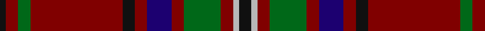

In pattern [KRGRKRBRGRYK](/patterns/krgrkrbrgryk/).

This was sourced from house-of-tartan.  It is a [12 stripes tartan](/stripes/stripes12/).

Original link http://www.house-of-tartan.scotland.net/house/TartanViewjs.asp?colr=Def&tnam=3330

## Thread count
K/4 DR8 G8 DR60 K8 DR8 DB16 DR8 G24 DR8 N4 K/8

## Palette
Each colour and its ΔE from the base-6 reference it is a variant of.

| Colour | Shade | Base | ΔE (OKLab) |
|---|---|---|---|
| DB | <code style="background-color:#1C0070;">#1C0070</code> `#1C0070` | B <code style="background-color:#2C4084;">#2C4084</code> | 0.14 |
| DR | <code style="background-color:#800000;">#800000</code> `#800000` | R <code style="background-color:#C80000;">#C80000</code> | 0.16 |
| G | <code style="background-color:#006818;">#006818</code> `#006818` | G <code style="background-color:#006400;">#006400</code> | 0.02 |
| K | <code style="background-color:#101010;">#101010</code> `#101010` | K <code style="background-color:#000000;">#000000</code> | 0.17 |
| N | <code style="background-color:#B8B8B8;">#B8B8B8</code> `#B8B8B8` | Y <code style="background-color:#E8C000;">#E8C000</code> | 0.17 |

## Nearest tartans

The nearest existing variants by ΔTartan distance.

1. [MacClure](/setts/s12/k8w4r8g24r8b16r8k8r60g8r8k4-b1c0070-g003820-k101010-r880000-wc0c0c0/) — ΔT 0.53
1. [Ainslie #2](/setts/s15/r24k8r8k16r8k8r24g72r8y4r8k8r40w4r8-g006818-k101010-r880000-wfcfcfc-yd09800/) — ΔT 0.94
1. [MacDonald of Glencoe](/setts/s13/g6r2ra4g4ra32w2b8ra6g26ra2b2r2ra6-b2c2c80-g285800-re87878-ra880000-w98c8e8/) — ΔT 0.95
1. [Brotherhood of Dirk, The](/setts/s11/r18k6r18k4b8k8ba8k6ba4k64y12-b576982-ba3d2e60-k1c1714-r89051b-yb7d38b/) — ΔT 1.03
1. [Leach (1995)](/setts/s9/r96w4k12w4g56r32k12b12w8-b6c0070-g006818-k101010-r880000-wc0c0c0/) — ΔT 1.12
1. [Michael from Appin (Personal)](/setts/s12/b8r48g4r6g38y4r4b16r4g4w4r4-b2c2c80-g285800-r880000-we0e0e0-ye8c000/) — ΔT 1.14
1. [Stewart of Bute Hunting](/setts/s10/b44g22k4g8k4g12k32b80b4w12-b680028-g006818-k101010-wc0c0c0/) — ΔT 1.14
1. [Chisholm VS](/setts/s10/r12y2r48b12g4k2g4k2g24r2-b000052-g11450d-k000000-raa0000-yaaaaaa/) — ΔT 1.15
1. [Waddell (Name)](/setts/s11/r6b4r48b16g4b4g4b4g20r6w4-b2c2c80-g285800-r880000-we0e0e0/) — ΔT 1.18
1. [Balnagowan (Harrods)](/setts/s14/y6g6r2y4r2g40k10g8k10g6r4g6ra14g4-g604000-k101010-rc80000-rab84c00-ye8c000/) — ΔT 1.18

## Neighbour map

Every grey dot is one of 15726 variants placed by the first two principal components of the ΔTartan feature space (44% of its variance). Red is this tartan; blue dots are its nearest — click one to open its page.

<svg viewBox="0 0 640 380" role="img" style="max-width:100%;height:auto;border:1px solid #e0e0e0;border-radius:4px;display:block" xmlns="http://www.w3.org/2000/svg"><image href="/nn/cloud.v1.png" width="640" height="380"/><a href="/setts/s12/k8w4r8g24r8b16r8k8r60g8r8k4-b1c0070-g003820-k101010-r880000-wc0c0c0/"><circle cx="337.5" cy="146.6" r="4" fill="#3465a4"><title>MacClure</title></circle></a><a href="/setts/s15/r24k8r8k16r8k8r24g72r8y4r8k8r40w4r8-g006818-k101010-r880000-wfcfcfc-yd09800/"><circle cx="300.1" cy="124.0" r="4" fill="#3465a4"><title>Ainslie #2</title></circle></a><a href="/setts/s13/g6r2ra4g4ra32w2b8ra6g26ra2b2r2ra6-b2c2c80-g285800-re87878-ra880000-w98c8e8/"><circle cx="317.6" cy="134.2" r="4" fill="#3465a4"><title>MacDonald of Glencoe</title></circle></a><a href="/setts/s11/r18k6r18k4b8k8ba8k6ba4k64y12-b576982-ba3d2e60-k1c1714-r89051b-yb7d38b/"><circle cx="316.4" cy="136.7" r="4" fill="#3465a4"><title>Brotherhood of Dirk, The</title></circle></a><a href="/setts/s9/r96w4k12w4g56r32k12b12w8-b6c0070-g006818-k101010-r880000-wc0c0c0/"><circle cx="328.3" cy="127.6" r="4" fill="#3465a4"><title>Leach (1995)</title></circle></a><a href="/setts/s12/b8r48g4r6g38y4r4b16r4g4w4r4-b2c2c80-g285800-r880000-we0e0e0-ye8c000/"><circle cx="267.3" cy="138.6" r="4" fill="#3465a4"><title>Michael from Appin (Personal)</title></circle></a><a href="/setts/s10/b44g22k4g8k4g12k32b80b4w12-b680028-g006818-k101010-wc0c0c0/"><circle cx="360.9" cy="157.6" r="4" fill="#3465a4"><title>Stewart of Bute Hunting</title></circle></a><a href="/setts/s10/r12y2r48b12g4k2g4k2g24r2-b000052-g11450d-k000000-raa0000-yaaaaaa/"><circle cx="347.6" cy="114.3" r="4" fill="#3465a4"><title>Chisholm VS</title></circle></a><a href="/setts/s11/r6b4r48b16g4b4g4b4g20r6w4-b2c2c80-g285800-r880000-we0e0e0/"><circle cx="314.5" cy="162.1" r="4" fill="#3465a4"><title>Waddell (Name)</title></circle></a><a href="/setts/s14/y6g6r2y4r2g40k10g8k10g6r4g6ra14g4-g604000-k101010-rc80000-rab84c00-ye8c000/"><circle cx="323.9" cy="122.3" r="4" fill="#3465a4"><title>Balnagowan (Harrods)</title></circle></a><circle cx="325.3" cy="142.0" r="5" fill="#c00000"/></svg>

ID: /setts/s12/k8y4r8g24r8b16r8k8r60g8r8k4-b1c0070-g006818-k101010-r800000-yb8b8b8/
