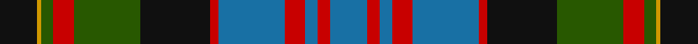

In pattern [BRBRBRKGRGYK](/stripes/brbrbrkgrgyk/).

This was sourced from tartans-authority.  It is a [12 stripe tartan](/stripes/stripes12/).

Original link http://www.tartansauthority.com/tartan-ferret/display/3716/

## Attestations

This cloth appears in 2 source records; the oldest owns this page.

- 1990 — Bowie, Black (Name) (tartans-authority, [record](http://www.tartansauthority.com/tartan-ferret/display/3716/))
- undated — Bowie, Black (register-of-tartans, [record](https://www.tartanregister.gov.uk/tartanDetails.aspx?ref=5268))

## Register references

External register numbers recorded for this tartan.

- Scottish Register of Tartans: [5268](https://www.tartanregister.gov.uk/tartanDetails.aspx?ref=5268)
- Scottish Tartans Authority (ITI): 3716

## Thread count
K/18 DY2 G6 R10 G32 K34 R4 B32 R10 B6 R6 B/18

## Palette
Each colour and its ΔE from the base-6 reference it is a variant of.

| Colour | Shade | Base | ΔE (OKLab) |
|---|---|---|---|
| B | <code style="background-color:#1870A4;">#1870A4</code> `#1870A4` | B <code style="background-color:#2A418A;">#2A418A</code> | 0.13 |
| DY | <code style="background-color:#D09800;">#D09800</code> `#D09800` | Y <code style="background-color:#F2BF00;">#F2BF00</code> | 0.12 |
| G | <code style="background-color:#285800;">#285800</code> `#285800` | G <code style="background-color:#006100;">#006100</code> | 0.03 |
| K | <code style="background-color:#101010;">#101010</code> `#101010` | K <code style="background-color:#000000;">#000000</code> | 0.17 |
| R | <code style="background-color:#C80000;">#C80000</code> `#C80000` | R <code style="background-color:#CC0000;">#CC0000</code> | 0.01 |

## Nearest tartans

The nearest existing variants by ΔTartan distance.

1. [Cameron of Erracht (Clan)](/setts/s11/g8r1g1r3g16k16r1db16r3db8ly2~x2/) — ΔT 0.63
1. [Wilson's No.232](/setts/s12/b18k7g5r4g7k1ly2~x2/) — ΔT 0.66
1. [MacLeod](/setts/s13/ly4k1db12k12g12k1r4k1g12k12db12k1ly2~x4/) — ΔT 0.78
1. [MacMillan Htg (1906) (Clan)](/setts/s10/db3ly1db12k4ly2k4dg8r2dg8r1~x4/) — ΔT 0.79
1. [MacDonell of Glengarry #2](/setts/s11/db8r4db12r1k12dg12r3dg2r1dg4w1~x2/) — ΔT 0.79
1. [MacKusick (Piper) #1 (Personal)](/setts/s13/db4k1db2k1db6m2k4m2k8lb2g12m2g4~x2/) — ΔT 0.80
1. [New Zealand (2003)](/setts/s10/k3db9k2lo5db1lo5k2dg15k1r3~x2/) — ΔT 0.81
1. [Logan #7](/setts/s11/r6db3r2db2r2db16k12g16r1k1ly2~x2/) — ΔT 0.87
1. [MacDonell of Glengarry #3](/setts/s11/db16r5db30r2k33g30r5g2r2g7w4/) — ΔT 0.89
1. [Bowie](/setts/s12/db9r3db3r5db16r2k17g16r5g3ly1g9~x2/) — ΔT 0.89

## Neighbour map

Every grey dot is one of 14299 variants placed by the first two principal components of the ΔTartan feature space (44% of its variance). Red is this tartan; blue dots are its nearest — click one to open its page.

<svg viewBox="0 0 640 380" role="img" style="max-width:100%;height:auto;border:1px solid #e0e0e0;border-radius:4px;display:block" xmlns="http://www.w3.org/2000/svg"><image href="/nn/cloud.v1.png" width="640" height="380"/><a href="/setts/s11/g8r1g1r3g16k16r1db16r3db8ly2~x2/"><circle cx="175.1" cy="156.4" r="4" fill="#3465a4"><title>Cameron of Erracht (Clan)</title></circle></a><a href="/setts/s12/b18k7g5r4g7k1ly2~x2/"><circle cx="163.2" cy="156.8" r="4" fill="#3465a4"><title>Wilson's No.232</title></circle></a><a href="/setts/s13/ly4k1db12k12g12k1r4k1g12k12db12k1ly2~x4/"><circle cx="136.6" cy="166.4" r="4" fill="#3465a4"><title>MacLeod</title></circle></a><a href="/setts/s10/db3ly1db12k4ly2k4dg8r2dg8r1~x4/"><circle cx="163.0" cy="179.1" r="4" fill="#3465a4"><title>MacMillan Htg (1906) (Clan)</title></circle></a><a href="/setts/s11/db8r4db12r1k12dg12r3dg2r1dg4w1~x2/"><circle cx="163.7" cy="174.7" r="4" fill="#3465a4"><title>MacDonell of Glengarry #2</title></circle></a><a href="/setts/s13/db4k1db2k1db6m2k4m2k8lb2g12m2g4~x2/"><circle cx="134.8" cy="164.6" r="4" fill="#3465a4"><title>MacKusick (Piper) #1 (Personal)</title></circle></a><a href="/setts/s10/k3db9k2lo5db1lo5k2dg15k1r3~x2/"><circle cx="162.3" cy="159.3" r="4" fill="#3465a4"><title>New Zealand (2003)</title></circle></a><a href="/setts/s11/r6db3r2db2r2db16k12g16r1k1ly2~x2/"><circle cx="171.3" cy="141.9" r="4" fill="#3465a4"><title>Logan #7</title></circle></a><a href="/setts/s11/db16r5db30r2k33g30r5g2r2g7w4/"><circle cx="182.0" cy="150.1" r="4" fill="#3465a4"><title>MacDonell of Glengarry #3</title></circle></a><a href="/setts/s12/db9r3db3r5db16r2k17g16r5g3ly1g9~x2/"><circle cx="129.1" cy="146.3" r="4" fill="#3465a4"><title>Bowie</title></circle></a><circle cx="151.2" cy="156.5" r="5" fill="#c00000"/></svg>

ID: /setts/s12/k9lo1dg3r5dg16k17r2b16r5b3r3b9~x2/
