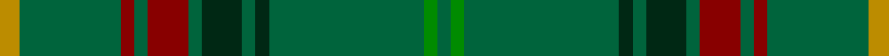

**Bands:** [YGRGRGGGGGGG](/stripes/ygrgrggggggg/) · **Stripes:** [LO G R G R G DG G DG G G G](/stripes/stripes12/) LO G R G R G DG G DG G G G

This was sourced from register-of-tartans.  It is a [12 band tartan](/bands/bands12/).

Original link https://www.tartanregister.gov.uk/tartanDetails.aspx?ref=11527

## Register references

External register numbers recorded for this tartan.

- Scottish Register of Tartans: [11527](https://www.tartanregister.gov.uk/tartanDetails.aspx?ref=11527)

## Thread count
DY/6 G30 DR4 G4 DR12 G4 DG12 G4 DG4 G46 Ga4 G/4

## Palette
Each colour and its ΔE from the base-6 reference it is a variant of.

| Colour | Shade | Base | ΔE (OKLab) |
|---|---|---|---|
| DG | <code style="background-color:#002814;">#002814</code> `#002814` | G <code style="background-color:#006100;">#006100</code> | 0.20 |
| DR | <code style="background-color:#880000;">#880000</code> `#880000` | R <code style="background-color:#CC0000;">#CC0000</code> | 0.15 |
| DY | <code style="background-color:#BC8C00;">#BC8C00</code> `#BC8C00` | Y <code style="background-color:#F2BF00;">#F2BF00</code> | 0.16 |
| G | <code style="background-color:#00643C;">#00643C</code> `#00643C` | G <code style="background-color:#006100;">#006100</code> | 0.05 |
| Ga | <code style="background-color:#008B00;">#008B00</code> `#008B00` | G <code style="background-color:#006100;">#006100</code> | 0.13 |

## Nearest tartans

The nearest existing variants by ΔTartan distance.

1. [St Andrews Links Corporate Tartan Tartan Number: 2391. Earliest known date: May 1997 Designed by Polly Wittering of the House of Edgar 1997. Corporate tartan for use on merchandise. Green lightened here to show the sett. See products available Copyright © Blair Urquhart, Comrie, 2015](/setts/s12/dt16g4dt3g3lo2g24r2~x2/) — ΔT 1.18
1. [Battle of the Somme Centenary](/setts/s9/r3g24k4g10g3g10r5dy3o3~x2/) — ΔT 1.46
1. [McCall, F.W. (Personal)](/setts/s9/dg6dy2m1dg15m3dy1dg15g6m1~x2/) — ΔT 1.55
1. [Ross Hunting Clan Tartan Tartan Number: 756. Earliest known date: 1850 The threadcount is based on a sample from the MacGregor-Hastie collection of the Scottish Tartans Society. This version originally showed the light green overcheck having six stripes. BU noted irregularities in the threadcount, and suggests that 4 light green stripes would produce a more plausible kilting fabric. BU created the original transcription. Earliest historical reference. Other sources give Smith Museum, Stirling as the source. See products available Copyright © Blair Urquhart, Comrie, 2015](/setts/s12/g6g3g3g4g4k5g3k5g28r2g4r2~x2/) — ΔT 1.67
1. [Glenlivet](/setts/s8/g18r6g75db6g13o35g12db6/) — ΔT 1.68
1. [Proctor (Name)](/setts/s14/dg39k2dg2k2dg2k3dt13k2lb4k2dt13k3dg24lo3~x2/) — ΔT 1.75
1. [Owen Welsh Name Tartan Tartan Number: 5750. Earliest known date: 2002 The tartan for this Welsh surname and its variations, Bowen, Ifan, is actually woven in Wales at the Cambrian Woollen Mill, weaving on the same site since 1830. This tartan differs from many traditional patterns in that the warp and weft differ, giving the finished worsted wool cloth more of a predominant stripe, vertically noticeable in the finished Kilt, or Cilt in Wales. See products available Copyright © Blair Urquhart, Comrie, 2015](/setts/s10/g3dt1g2r1g3db3g2db2g18dt2~x2/) — ΔT 1.75
1. [Ross Hunting Clan Tartan Tartan Number: 757. Earliest known date: 1908 Adam shows the six light green stripes in his publication of 1908 See products available Copyright © Blair Urquhart, Comrie, 2015](/setts/s14/g2g4g2g2g1g2g3k2g2k2g12r1g2r1~x2/) — ΔT 1.80
1. [Battle of the Somme Centenary](/setts/s9/r3dg24k4dg10g3dg10r5o3lr3~x2/) — ΔT 1.80
1. [Glenlivet Corporate Tartan Tartan Number: 193. Earliest known date: 1989 Designed for Glenlivet Distilleries Ltd, Strathspey. See products available Copyright © Blair Urquhart, Comrie, 2015](/setts/s8/g18r6g75db6g13dy35g12db6/) — ΔT 1.81

## Neighbour map

Every grey dot is one of 14299 variants placed by the first two principal components of the ΔTartan feature space (44% of its variance). Red is this tartan; blue dots are its nearest — click one to open its page.

<svg viewBox="0 0 640 380" role="img" style="max-width:100%;height:auto;border:1px solid #e0e0e0;border-radius:4px;display:block" xmlns="http://www.w3.org/2000/svg"><image href="/nn/cloud.v1.png" width="640" height="380"/><a href="/setts/s12/dt16g4dt3g3lo2g24r2~x2/"><circle cx="448.0" cy="201.1" r="4" fill="#3465a4"><title>St Andrews Links Corporate Tartan Tartan Number: 2391. Earliest known date: May 1997 Designed by Polly Wittering of the House of Edgar 1997. Corporate tartan for use on merchandise. Green lightened here to show the sett. See products available Copyright © Blair Urquhart, Comrie, 2015</title></circle></a><a href="/setts/s9/r3g24k4g10g3g10r5dy3o3~x2/"><circle cx="376.5" cy="208.8" r="4" fill="#3465a4"><title>Battle of the Somme Centenary</title></circle></a><a href="/setts/s9/dg6dy2m1dg15m3dy1dg15g6m1~x2/"><circle cx="476.3" cy="217.6" r="4" fill="#3465a4"><title>McCall, F.W. (Personal)</title></circle></a><a href="/setts/s12/g6g3g3g4g4k5g3k5g28r2g4r2~x2/"><circle cx="435.9" cy="179.8" r="4" fill="#3465a4"><title>Ross Hunting Clan Tartan Tartan Number: 756. Earliest known date: 1850 The threadcount is based on a sample from the MacGregor-Hastie collection of the Scottish Tartans Society. This version originally showed the light green overcheck having six stripes. BU noted irregularities in the threadcount, and suggests that 4 light green stripes would produce a more plausible kilting fabric. BU created the original transcription. Earliest historical reference. Other sources give Smith Museum, Stirling as the source. See products available Copyright © Blair Urquhart, Comrie, 2015</title></circle></a><a href="/setts/s8/g18r6g75db6g13o35g12db6/"><circle cx="472.6" cy="228.6" r="4" fill="#3465a4"><title>Glenlivet</title></circle></a><a href="/setts/s14/dg39k2dg2k2dg2k3dt13k2lb4k2dt13k3dg24lo3~x2/"><circle cx="386.4" cy="149.0" r="4" fill="#3465a4"><title>Proctor (Name)</title></circle></a><a href="/setts/s10/g3dt1g2r1g3db3g2db2g18dt2~x2/"><circle cx="536.7" cy="193.3" r="4" fill="#3465a4"><title>Owen Welsh Name Tartan Tartan Number: 5750. Earliest known date: 2002 The tartan for this Welsh surname and its variations, Bowen, Ifan, is actually woven in Wales at the Cambrian Woollen Mill, weaving on the same site since 1830. This tartan differs from many traditional patterns in that the warp and weft differ, giving the finished worsted wool cloth more of a predominant stripe, vertically noticeable in the finished Kilt, or Cilt in Wales. See products available Copyright © Blair Urquhart, Comrie, 2015</title></circle></a><a href="/setts/s14/g2g4g2g2g1g2g3k2g2k2g12r1g2r1~x2/"><circle cx="375.2" cy="192.9" r="4" fill="#3465a4"><title>Ross Hunting Clan Tartan Tartan Number: 757. Earliest known date: 1908 Adam shows the six light green stripes in his publication of 1908 See products available Copyright © Blair Urquhart, Comrie, 2015</title></circle></a><a href="/setts/s9/r3dg24k4dg10g3dg10r5o3lr3~x2/"><circle cx="365.5" cy="202.6" r="4" fill="#3465a4"><title>Battle of the Somme Centenary</title></circle></a><a href="/setts/s8/g18r6g75db6g13dy35g12db6/"><circle cx="498.3" cy="244.0" r="4" fill="#3465a4"><title>Glenlivet Corporate Tartan Tartan Number: 193. Earliest known date: 1989 Designed for Glenlivet Distilleries Ltd, Strathspey. See products available Copyright © Blair Urquhart, Comrie, 2015</title></circle></a><circle cx="435.7" cy="188.8" r="5" fill="#c00000"/></svg>

ID: /setts/s12/lo3g15r2g2r6g2dg6g2dg2g23g2g2~x2/
