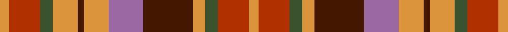

This page is one **sett** — a single exact thread-count. It belongs to the [tartan](/tartans/lo3r10dg4lo8do2lo8m11do16lo4dg4r10lo3/)
(the same proportion at any scale), whose colour order is pattern [YRGYBRYBYGRY](/stripes/yrgybrybygry/).

Sourced from register-of-tartans.  It is a [12 stripe tartan](/stripes/stripes12/).

Original link https://www.tartanregister.gov.uk/tartanDetails.aspx?ref=11413

## Register references

External register numbers recorded for this tartan.

- Scottish Register of Tartans: [11413](https://www.tartanregister.gov.uk/tartanDetails.aspx?ref=11413)

## Thread count
O/6 R20 G8 O16 DR4 O16 LP22 DR32 O8 G8 R20 O/6

## Palette

Palette: <strong>Tartan Register</strong> <small style="color:#888">(4 of 5 colours)</small>
<table><thead><tr><th>Colour</th><th>Threads</th><th>Shade</th><th>Base</th><th>OKLCh</th></tr></thead><tbody><tr><td>O/</td><td style="text-align:right;font-variant-numeric:tabular-nums">6</td><td><code style="background-color:#DC943C;">#DC943C</code> <small style="color:#888">#DC943C</small></td><td>Y <code style="background-color:#F2BF00;">#F2BF00</code></td><td><small style="color:#888">oklch(72.3% 0.133 67.9)</small></td></tr><tr><td>R</td><td style="text-align:right;font-variant-numeric:tabular-nums">20</td><td><code style="background-color:#B03000;">#B03000</code> <small style="color:#888">#B03000</small></td><td>R <code style="background-color:#CC0000;">#CC0000</code></td><td><small style="color:#888">oklch(50.3% 0.171 36.3)</small></td></tr><tr><td>G</td><td style="text-align:right;font-variant-numeric:tabular-nums">8</td><td><code style="background-color:#3B522F;">#3B522F</code> <small style="color:#888">#3B522F</small></td><td>G <code style="background-color:#006100;">#006100</code></td><td><small style="color:#888">oklch(41.0% 0.063 135.5)</small></td></tr><tr><td>O</td><td style="text-align:right;font-variant-numeric:tabular-nums">16</td><td><code style="background-color:#DC943C;">#DC943C</code> <small style="color:#888">#DC943C</small></td><td>Y <code style="background-color:#F2BF00;">#F2BF00</code></td><td><small style="color:#888">oklch(72.3% 0.133 67.9)</small></td></tr><tr><td>DR</td><td style="text-align:right;font-variant-numeric:tabular-nums">4</td><td><code style="background-color:#441800;">#441800</code> <small style="color:#888">#441800</small></td><td>B <code style="background-color:#2A418A;">#2A418A</code></td><td><small style="color:#888">oklch(27.3% 0.076 46.3)</small></td></tr><tr><td>O</td><td style="text-align:right;font-variant-numeric:tabular-nums">16</td><td><code style="background-color:#DC943C;">#DC943C</code> <small style="color:#888">#DC943C</small></td><td>Y <code style="background-color:#F2BF00;">#F2BF00</code></td><td><small style="color:#888">oklch(72.3% 0.133 67.9)</small></td></tr><tr><td>LP</td><td style="text-align:right;font-variant-numeric:tabular-nums">22</td><td><code style="background-color:#9C68A4;">#9C68A4</code> <small style="color:#888">#9C68A4</small></td><td>R <code style="background-color:#CC0000;">#CC0000</code></td><td><small style="color:#888">oklch(59.4% 0.107 322.0)</small></td></tr><tr><td>DR</td><td style="text-align:right;font-variant-numeric:tabular-nums">32</td><td><code style="background-color:#441800;">#441800</code> <small style="color:#888">#441800</small></td><td>B <code style="background-color:#2A418A;">#2A418A</code></td><td><small style="color:#888">oklch(27.3% 0.076 46.3)</small></td></tr><tr><td>O</td><td style="text-align:right;font-variant-numeric:tabular-nums">8</td><td><code style="background-color:#DC943C;">#DC943C</code> <small style="color:#888">#DC943C</small></td><td>Y <code style="background-color:#F2BF00;">#F2BF00</code></td><td><small style="color:#888">oklch(72.3% 0.133 67.9)</small></td></tr><tr><td>G</td><td style="text-align:right;font-variant-numeric:tabular-nums">8</td><td><code style="background-color:#3B522F;">#3B522F</code> <small style="color:#888">#3B522F</small></td><td>G <code style="background-color:#006100;">#006100</code></td><td><small style="color:#888">oklch(41.0% 0.063 135.5)</small></td></tr><tr><td>R</td><td style="text-align:right;font-variant-numeric:tabular-nums">20</td><td><code style="background-color:#B03000;">#B03000</code> <small style="color:#888">#B03000</small></td><td>R <code style="background-color:#CC0000;">#CC0000</code></td><td><small style="color:#888">oklch(50.3% 0.171 36.3)</small></td></tr><tr><td>O/</td><td style="text-align:right;font-variant-numeric:tabular-nums">6</td><td><code style="background-color:#DC943C;">#DC943C</code> <small style="color:#888">#DC943C</small></td><td>Y <code style="background-color:#F2BF00;">#F2BF00</code></td><td><small style="color:#888">oklch(72.3% 0.133 67.9)</small></td></tr></tbody></table>

## Nearest tartans

The nearest existing variants by ΔTartan distance, with this tartan at the top so the swatches line up against it.

ΔTartan

Tartan

Sett

—

<a href="/ttd/edit/#slug=lo3r10dg4lo8do2lo8m11do16lo4dg4r10lo3~x2">Hallowfield Wood</a> <a class="nn-out" href="/setts/s12/lo3r10dg4lo8do2lo8m11do16lo4dg4r10lo3~x2/" title="open its dictionary page">↗</a>

1.09

<a href="/ttd/edit/#slug=r3ly14y3ly3y3ly4y11dt11ri11r11ly1dt1~x2">Bridge of Weir Leather Co. (Corp)</a> <a class="nn-out" href="/setts/s12/r3ly14y3ly3y3ly4y11dt11ri11r11ly1dt1~x2/" title="open its dictionary page">↗</a>

1.36

<a href="/ttd/edit/#slug=y6m2y2m4y13k12lo13m4lo2m2lo6~x2">Glenmorangie (Corporate)</a> <a class="nn-out" href="/setts/s11/y6m2y2m4y13k12lo13m4lo2m2lo6~x2/" title="open its dictionary page">↗</a>

1.37

<a href="/ttd/edit/#slug=r5ly3r19do6ly5do6dg12db5dg12db3~x2">Roscommon, County</a> <a class="nn-out" href="/setts/s10/r5ly3r19do6ly5do6dg12db5dg12db3~x2/" title="open its dictionary page">↗</a>

1.42

<a href="/ttd/edit/#slug=g18ri6m4r6g20r6m4r6m4ri6db22r8ri6m4r5">MacDougall 6</a> <a class="nn-out" href="/setts/s15/g18ri6m4r6g20r6m4r6m4ri6db22r8ri6m4r5/" title="open its dictionary page">↗</a>

1.49

<a href="/ttd/edit/#slug=db21dp21ly21o2r21lo21ly21db2r2dp2o21~x2">Watret (Artefact)</a> <a class="nn-out" href="/setts/s11/db21dp21ly21o2r21lo21ly21db2r2dp2o21~x2/" title="open its dictionary page">↗</a>

1.53

<a href="/ttd/edit/#slug=g2lo9do6r3do2r3do2r10w2~x4">Tinkler (Corporate)</a> <a class="nn-out" href="/setts/s9/g2lo9do6r3do2r3do2r10w2~x4/" title="open its dictionary page">↗</a>

1.54

<a href="/ttd/edit/#slug=ly18r18dg30r12db55r42dg6r18dg6r42g44r12dg12">Unidentified Plaid 16</a> <a class="nn-out" href="/setts/s13/ly18r18dg30r12db55r42dg6r18dg6r42g44r12dg12/" title="open its dictionary page">↗</a>

1.57

<a href="/ttd/edit/#slug=dy3y2lo18k4r15k4dy6k4lo2y3~x2">Fitzsimmons Red (Name)</a> <a class="nn-out" href="/setts/s10/dy3y2lo18k4r15k4dy6k4lo2y3~x2/" title="open its dictionary page">↗</a>

1.59

<a href="/ttd/edit/#slug=dy18ly4t10w2r20ly5r2w2dy6~x2">Satchidananda (Personal)</a> <a class="nn-out" href="/setts/s9/dy18ly4t10w2r20ly5r2w2dy6~x2/" title="open its dictionary page">↗</a>

1.60

<a href="/ttd/edit/#slug=dg18ri6m4r6dg20r6m4r6m4ri6db22r8ri6m4r5">Unidentified #35</a> <a class="nn-out" href="/setts/s15/dg18ri6m4r6dg20r6m4r6m4ri6db22r8ri6m4r5/" title="open its dictionary page">↗</a>

## Neighbour map

Every grey dot is one of 14359 variants placed by the first two principal components of the ΔTartan feature space (44% of its variance). Red is this tartan; blue dots are its nearest — click one to open its page.

<svg viewBox="0 0 640 380" role="img" style="max-width:100%;height:auto;border:1px solid #e0e0e0;border-radius:4px;display:block" xmlns="http://www.w3.org/2000/svg"><image href="/nn/cloud.v1.png" width="640" height="380"/><a href="/setts/s12/r3ly14y3ly3y3ly4y11dt11ri11r11ly1dt1~x2/"><circle cx="135.6" cy="157.6" r="4" fill="#3465a4"><title>Bridge of Weir Leather Co. (Corp)</title></circle></a><a href="/setts/s11/y6m2y2m4y13k12lo13m4lo2m2lo6~x2/"><circle cx="142.5" cy="203.7" r="4" fill="#3465a4"><title>Glenmorangie (Corporate)</title></circle></a><a href="/setts/s10/r5ly3r19do6ly5do6dg12db5dg12db3~x2/"><circle cx="116.7" cy="209.3" r="4" fill="#3465a4"><title>Roscommon, County</title></circle></a><a href="/setts/s15/g18ri6m4r6g20r6m4r6m4ri6db22r8ri6m4r5/"><circle cx="113.8" cy="194.2" r="4" fill="#3465a4"><title>MacDougall 6</title></circle></a><a href="/setts/s11/db21dp21ly21o2r21lo21ly21db2r2dp2o21~x2/"><circle cx="54.9" cy="143.5" r="4" fill="#3465a4"><title>Watret (Artefact)</title></circle></a><a href="/setts/s9/g2lo9do6r3do2r3do2r10w2~x4/"><circle cx="159.0" cy="206.5" r="4" fill="#3465a4"><title>Tinkler (Corporate)</title></circle></a><a href="/setts/s13/ly18r18dg30r12db55r42dg6r18dg6r42g44r12dg12/"><circle cx="177.1" cy="173.1" r="4" fill="#3465a4"><title>Unidentified Plaid 16</title></circle></a><a href="/setts/s10/dy3y2lo18k4r15k4dy6k4lo2y3~x2/"><circle cx="156.2" cy="175.5" r="4" fill="#3465a4"><title>Fitzsimmons Red (Name)</title></circle></a><a href="/setts/s9/dy18ly4t10w2r20ly5r2w2dy6~x2/"><circle cx="151.5" cy="154.8" r="4" fill="#3465a4"><title>Satchidananda (Personal)</title></circle></a><a href="/setts/s15/dg18ri6m4r6dg20r6m4r6m4ri6db22r8ri6m4r5/"><circle cx="123.1" cy="197.0" r="4" fill="#3465a4"><title>Unidentified #35</title></circle></a><circle cx="110.3" cy="186.2" r="5" fill="#c00000"/></svg>

ID: /setts/s12/lo3r10dg4lo8do2lo8m11do16lo4dg4r10lo3~x2/
