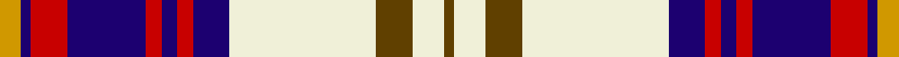

This page is one **sett** — a single exact thread-count. It belongs to the [tartan](/tartans/lo4db2r7db15r3db3r3db7w28dy7w6dy2/)
(the same proportion at any scale), whose colour order is pattern [GWGWBRBRBRBY](/stripes/gwgwbrbrbrby/).

Sourced from register-of-tartans.  It is a [12 stripe tartan](/stripes/stripes12/).

Original link https://www.tartanregister.gov.uk/tartanDetails.aspx?ref=4479

2 attestations — the source records this cloth was collapsed from (oldest owns this page)

<ul>
<li>01/01/1993 — Walker, Dress (Personal) (register-of-tartans, <a href="https://www.tartanregister.gov.uk/tartanDetails.aspx?ref=4479">record</a>)</li>
<li>1993 — Walker, Dress (Name) (tartans-authority, <a href="http://www.tartansauthority.com/tartan-ferret/display/2070/">record</a>)</li>
</ul>

## Register references

External register numbers recorded for this tartan.

- Scottish Register of Tartans: [4479](https://www.tartanregister.gov.uk/tartanDetails.aspx?ref=4479)
- Scottish Tartans Authority (ITI): 2070
- Scottish Tartans World Register: 2070

## Thread count
DY/8 DB4 Ra14 DB30 Ra6 DB6 Ra6 DB14 LY56 T14 LY12 T/4

## Palette

Palette: <strong>Tartan Register</strong> <small style="color:#888">(6 of 8 colours)</small>
<table><thead><tr><th>Colour</th><th>Threads</th><th>Shade</th><th>Base</th><th>OKLCh</th></tr></thead><tbody><tr><td>DY/</td><td style="text-align:right;font-variant-numeric:tabular-nums">8</td><td><code style="background-color:#D09800;">#D09800</code> <small style="color:#888">#D09800</small></td><td>Y <code style="background-color:#F2BF00;">#F2BF00</code></td><td><small style="color:#888">oklch(71.4% 0.147 82.1)</small></td></tr><tr><td>DB</td><td style="text-align:right;font-variant-numeric:tabular-nums">4</td><td><code style="background-color:#1C0070;">#1C0070</code> <small style="color:#888">#1C0070</small></td><td>B <code style="background-color:#2A418A;">#2A418A</code></td><td><small style="color:#888">oklch(26.3% 0.162 277.1)</small></td></tr><tr><td>Ra</td><td style="text-align:right;font-variant-numeric:tabular-nums">14</td><td><code style="background-color:#C80000;">#C80000</code> <small style="color:#888">#C80000</small></td><td>R <code style="background-color:#CC0000;">#CC0000</code></td><td><small style="color:#888">oklch(52.3% 0.215 29.2)</small></td></tr><tr><td>DB</td><td style="text-align:right;font-variant-numeric:tabular-nums">30</td><td><code style="background-color:#1C0070;">#1C0070</code> <small style="color:#888">#1C0070</small></td><td>B <code style="background-color:#2A418A;">#2A418A</code></td><td><small style="color:#888">oklch(26.3% 0.162 277.1)</small></td></tr><tr><td>Ra</td><td style="text-align:right;font-variant-numeric:tabular-nums">6</td><td><code style="background-color:#C80000;">#C80000</code> <small style="color:#888">#C80000</small></td><td>R <code style="background-color:#CC0000;">#CC0000</code></td><td><small style="color:#888">oklch(52.3% 0.215 29.2)</small></td></tr><tr><td>DB</td><td style="text-align:right;font-variant-numeric:tabular-nums">6</td><td><code style="background-color:#1C0070;">#1C0070</code> <small style="color:#888">#1C0070</small></td><td>B <code style="background-color:#2A418A;">#2A418A</code></td><td><small style="color:#888">oklch(26.3% 0.162 277.1)</small></td></tr><tr><td>Ra</td><td style="text-align:right;font-variant-numeric:tabular-nums">6</td><td><code style="background-color:#C80000;">#C80000</code> <small style="color:#888">#C80000</small></td><td>R <code style="background-color:#CC0000;">#CC0000</code></td><td><small style="color:#888">oklch(52.3% 0.215 29.2)</small></td></tr><tr><td>DB</td><td style="text-align:right;font-variant-numeric:tabular-nums">14</td><td><code style="background-color:#1C0070;">#1C0070</code> <small style="color:#888">#1C0070</small></td><td>B <code style="background-color:#2A418A;">#2A418A</code></td><td><small style="color:#888">oklch(26.3% 0.162 277.1)</small></td></tr><tr><td>LY</td><td style="text-align:right;font-variant-numeric:tabular-nums">56</td><td><code style="background-color:#F0F0D8;">#F0F0D8</code> <small style="color:#888">#F0F0D8</small></td><td>W <code style="background-color:#F7F7F7;">#F7F7F7</code></td><td><small style="color:#888">oklch(94.9% 0.032 107.0)</small></td></tr><tr><td>T</td><td style="text-align:right;font-variant-numeric:tabular-nums">14</td><td><code style="background-color:#604000;">#604000</code> <small style="color:#888">#604000</small></td><td>G <code style="background-color:#006100;">#006100</code></td><td><small style="color:#888">oklch(39.8% 0.083 76.8)</small></td></tr><tr><td>LY</td><td style="text-align:right;font-variant-numeric:tabular-nums">12</td><td><code style="background-color:#F0F0D8;">#F0F0D8</code> <small style="color:#888">#F0F0D8</small></td><td>W <code style="background-color:#F7F7F7;">#F7F7F7</code></td><td><small style="color:#888">oklch(94.9% 0.032 107.0)</small></td></tr><tr><td>T/</td><td style="text-align:right;font-variant-numeric:tabular-nums">4</td><td><code style="background-color:#604000;">#604000</code> <small style="color:#888">#604000</small></td><td>G <code style="background-color:#006100;">#006100</code></td><td><small style="color:#888">oklch(39.8% 0.083 76.8)</small></td></tr></tbody></table>

## Nearest tartans

The nearest existing variants by ΔTartan distance, with this tartan at the top so the swatches line up against it.

ΔTartan

Tartan

Sett

—

<a href="/ttd/edit/#slug=lo4db2r7db15r3db3r3db7w28dy7w6dy2~x2">Walker, Dress (Personal)</a> <a class="nn-out" href="/setts/s12/lo4db2r7db15r3db3r3db7w28dy7w6dy2~x2/" title="open its dictionary page">↗</a>

0.74

<a href="/ttd/edit/#slug=w6dg2w27k10n4k4n4k4n15r2n2r4~x2">Sutherland Dress, Old (Dance)</a> <a class="nn-out" href="/setts/s12/w6dg2w27k10n4k4n4k4n15r2n2r4~x2/" title="open its dictionary page">↗</a>

0.90

<a href="/ttd/edit/#slug=w5g2w23k7db4k3db3k3db11r2db2r3~x2">Sutherland, Dress</a> <a class="nn-out" href="/setts/s12/w5g2w23k7db4k3db3k3db11r2db2r3~x2/" title="open its dictionary page">↗</a>

0.95

<a href="/ttd/edit/#slug=db8r3db34b3k9w31r5w3r3w8~x2">Stewart of Appin, dress</a> <a class="nn-out" href="/setts/s10/db8r3db34b3k9w31r5w3r3w8~x2/" title="open its dictionary page">↗</a>

0.96

<a href="/ttd/edit/#slug=ly4dt2m7dt15m3dt3m3dt7w28m7w6m2">Walker Dress Family Tartan Tartan Number: 2070. Earliest known date: 1991 R.W.Hawks submitted this tartan via Phil Smith in January 1992. Hawks advised Oct. 1993 that he is agreeable for any Walkers to use this tartan. See products available Copyright © Blair Urquhart, Comrie, 2015</a> <a class="nn-out" href="/setts/s12/ly4dt2m7dt15m3dt3m3dt7w28m7w6m2/" title="open its dictionary page">↗</a>

0.97

<a href="/ttd/edit/#slug=r6db2p21w3dg19w26dg3w5~x2">Culloden, dress Ancient</a> <a class="nn-out" href="/setts/s8/r6db2p21w3dg19w26dg3w5~x2/" title="open its dictionary page">↗</a>

1.02

<a href="/ttd/edit/#slug=db8r3db34b3k9w31r5w3r3w8">Stuart/Stewart of Appin Dress</a> <a class="nn-out" href="/setts/s10/db8r3db34b3k9w31r5w3r3w8/" title="open its dictionary page">↗</a>

1.03

<a href="/ttd/edit/#slug=m18w2m2t3m2w2m4k10mi2w25k3~x2">MacKellar Dress, Cerise (Dance)</a> <a class="nn-out" href="/setts/s11/m18w2m2t3m2w2m4k10mi2w25k3~x2/" title="open its dictionary page">↗</a>

1.04

<a href="/ttd/edit/#slug=w5t2w2t3w17k6n2k2n2k2n14r3~x2">Unidentified (Fashion)</a> <a class="nn-out" href="/setts/s12/w5t2w2t3w17k6n2k2n2k2n14r3~x2/" title="open its dictionary page">↗</a>

1.06

<a href="/ttd/edit/#slug=ri2db2w2r1w2db10w1k2ri10w1ri2~x4">Bear Baars (Personal)</a> <a class="nn-out" href="/setts/s11/ri2db2w2r1w2db10w1k2ri10w1ri2~x4/" title="open its dictionary page">↗</a>

1.06

<a href="/ttd/edit/#slug=t12db2k4ly2k3r3k3r19w31db2w4k2~x2">MacLean, dress Burgundy</a> <a class="nn-out" href="/setts/s12/t12db2k4ly2k3r3k3r19w31db2w4k2~x2/" title="open its dictionary page">↗</a>

## Neighbour map

Every grey dot is one of 14359 variants placed by the first two principal components of the ΔTartan feature space (44% of its variance). Red is this tartan; blue dots are its nearest — click one to open its page.

<svg viewBox="0 0 640 380" role="img" style="max-width:100%;height:auto;border:1px solid #e0e0e0;border-radius:4px;display:block" xmlns="http://www.w3.org/2000/svg"><image href="/nn/cloud.v1.png" width="640" height="380"/><a href="/setts/s12/w6dg2w27k10n4k4n4k4n15r2n2r4~x2/"><circle cx="153.1" cy="113.7" r="4" fill="#3465a4"><title>Sutherland Dress, Old (Dance)</title></circle></a><a href="/setts/s12/w5g2w23k7db4k3db3k3db11r2db2r3~x2/"><circle cx="149.9" cy="118.1" r="4" fill="#3465a4"><title>Sutherland, Dress</title></circle></a><a href="/setts/s10/db8r3db34b3k9w31r5w3r3w8~x2/"><circle cx="165.1" cy="126.2" r="4" fill="#3465a4"><title>Stewart of Appin, dress</title></circle></a><a href="/setts/s12/ly4dt2m7dt15m3dt3m3dt7w28m7w6m2/"><circle cx="184.9" cy="128.2" r="4" fill="#3465a4"><title>Walker Dress Family Tartan Tartan Number: 2070. Earliest known date: 1991 R.W.Hawks submitted this tartan via Phil Smith in January 1992. Hawks advised Oct. 1993 that he is agreeable for any Walkers to use this tartan. See products available Copyright © Blair Urquhart, Comrie, 2015</title></circle></a><a href="/setts/s8/r6db2p21w3dg19w26dg3w5~x2/"><circle cx="154.7" cy="141.0" r="4" fill="#3465a4"><title>Culloden, dress Ancient</title></circle></a><a href="/setts/s10/db8r3db34b3k9w31r5w3r3w8/"><circle cx="168.5" cy="127.4" r="4" fill="#3465a4"><title>Stuart/Stewart of Appin Dress</title></circle></a><a href="/setts/s11/m18w2m2t3m2w2m4k10mi2w25k3~x2/"><circle cx="180.3" cy="105.7" r="4" fill="#3465a4"><title>MacKellar Dress, Cerise (Dance)</title></circle></a><a href="/setts/s12/w5t2w2t3w17k6n2k2n2k2n14r3~x2/"><circle cx="138.9" cy="133.3" r="4" fill="#3465a4"><title>Unidentified (Fashion)</title></circle></a><a href="/setts/s11/ri2db2w2r1w2db10w1k2ri10w1ri2~x4/"><circle cx="159.2" cy="120.5" r="4" fill="#3465a4"><title>Bear Baars (Personal)</title></circle></a><a href="/setts/s12/t12db2k4ly2k3r3k3r19w31db2w4k2~x2/"><circle cx="145.4" cy="74.5" r="4" fill="#3465a4"><title>MacLean, dress Burgundy</title></circle></a><circle cx="147.0" cy="107.6" r="5" fill="#c00000"/></svg>

ID: /setts/s12/lo4db2r7db15r3db3r3db7w28dy7w6dy2~x2/
