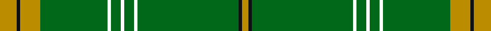

In pattern [YKGWGWGWGYKY](/stripes/ykgwgwgwgyky/).

This was sourced from tartans-authority.  It is a [12 stripe tartan](/stripes/stripes12/).

Original link http://www.tartansauthority.com/tartan-ferret/display/10511/

## Thread count
DY/10 K2 DY12 G40 W2 G6 W2 G6 W2 G60 K2 DY/4

## Palette
Each colour and the base-6 reference it is a variant of.

| Colour | Shade | Base |
|---|---|---|
| DY | <code style="background-color:#BC8C00;">#BC8C00</code> `oklch(66.8% 0.137 84.1)` <small>#BC8C00</small> | Y <code style="background-color:#F2BF00;">#F2BF00</code> |
| G | <code style="background-color:#006818;">#006818</code> `oklch(45.0% 0.142 145.0)` <small>#006818</small> | G <code style="background-color:#006100;">#006100</code> |
| K | <code style="background-color:#101010;">#101010</code> `oklch(17.3% 0.000 89.9)` <small>#101010</small> | K <code style="background-color:#000000;">#000000</code> |
| W | <code style="background-color:#FCFCFC;">#FCFCFC</code> `oklch(99.1% 0.000 89.9)` <small>#FCFCFC</small> | W <code style="background-color:#F7F7F7;">#F7F7F7</code> |

## Nearest tartans

The nearest existing variants by ΔTartan distance, with this tartan at the top so the swatches line up against it.

ΔTartan

Tartan

Sett

—

<a href="/ttd/edit/#slug=lo5k1lo6g20w1g3w1g3w1g30k1lo2~x2">Delta Lambda Phi (Corporate)</a> <a class="nn-out" href="/setts/s12/lo5k1lo6g20w1g3w1g3w1g30k1lo2~x2/" title="open its dictionary page">↗</a>

1.33

<a href="/ttd/edit/#slug=ly5k1ly6g20w1g3w1g3w1g30k1ly2~x2">Delta Lambda Phi</a> <a class="nn-out" href="/setts/s12/ly5k1ly6g20w1g3w1g3w1g30k1ly2~x2/" title="open its dictionary page">↗</a>

1.38

<a href="/ttd/edit/#slug=g25w1dg2w1g6k2w2dg3~x2">Marshall University</a> <a class="nn-out" href="/setts/s8/g25w1dg2w1g6k2w2dg3~x2/" title="open its dictionary page">↗</a>

1.38

<a href="/ttd/edit/#slug=db2k6db2g34w1g5w1g5w1g34ly1k13db1~x2">Stirling Castle (Corporate)</a> <a class="nn-out" href="/setts/s13/db2k6db2g34w1g5w1g5w1g34ly1k13db1~x2/" title="open its dictionary page">↗</a>

1.39

<a href="/ttd/edit/#slug=g3r1g2db1g3r3g2r2g18r2~x2">Owen (Welsh Name)</a> <a class="nn-out" href="/setts/s10/g3r1g2db1g3r3g2r2g18r2~x2/" title="open its dictionary page">↗</a>

1.50

<a href="/ttd/edit/#slug=dg24ly8dg1lo2dg3r3dg5r3dg3lo2dg1ly8dg24lo2~x2">St. Christopher</a> <a class="nn-out" href="/setts/s14/dg24ly8dg1lo2dg3r3dg5r3dg3lo2dg1ly8dg24lo2~x2/" title="open its dictionary page">↗</a>

1.59

<a href="/ttd/edit/#slug=g5w1g32db1g8db9g2w2r3db3w1~x2">Portosalvo</a> <a class="nn-out" href="/setts/s11/g5w1g32db1g8db9g2w2r3db3w1~x2/" title="open its dictionary page">↗</a>

1.59

<a href="/ttd/edit/#slug=g82k6g3k9r2k5g2ly2~x2">Crane of Cluny (Personal)</a> <a class="nn-out" href="/setts/s8/g82k6g3k9r2k5g2ly2~x2/" title="open its dictionary page">↗</a>

1.62

<a href="/ttd/edit/#slug=g51dp3g5lo3g5dp5g5dp5g5lo3~x2">Highland Hospice (Fashion)</a> <a class="nn-out" href="/setts/s10/g51dp3g5lo3g5dp5g5dp5g5lo3~x2/" title="open its dictionary page">↗</a>

1.65

<a href="/ttd/edit/#slug=o9g4w5g30r2g4r2g4r2g30w5g4o9g5~x2">Welsh Assembly</a> <a class="nn-out" href="/setts/s14/o9g4w5g30r2g4r2g4r2g30w5g4o9g5~x2/" title="open its dictionary page">↗</a>

1.66

<a href="/ttd/edit/#slug=g11dg6g6w1k2w1g6dg6g36k1ly3k1g5dg5~x2">Wexford, County</a> <a class="nn-out" href="/setts/s14/g11dg6g6w1k2w1g6dg6g36k1ly3k1g5dg5~x2/" title="open its dictionary page">↗</a>

## Neighbour map

Every grey dot is one of 14299 variants placed by the first two principal components of the ΔTartan feature space (44% of its variance). Red is this tartan; blue dots are its nearest — click one to open its page.

<svg viewBox="0 0 640 380" role="img" style="max-width:100%;height:auto;border:1px solid #e0e0e0;border-radius:4px;display:block" xmlns="http://www.w3.org/2000/svg"><image href="/nn/cloud.v1.png" width="640" height="380"/><a href="/setts/s12/ly5k1ly6g20w1g3w1g3w1g30k1ly2~x2/"><circle cx="475.9" cy="111.1" r="4" fill="#3465a4"><title>Delta Lambda Phi</title></circle></a><a href="/setts/s8/g25w1dg2w1g6k2w2dg3~x2/"><circle cx="472.2" cy="144.1" r="4" fill="#3465a4"><title>Marshall University</title></circle></a><a href="/setts/s13/db2k6db2g34w1g5w1g5w1g34ly1k13db1~x2/"><circle cx="479.3" cy="112.5" r="4" fill="#3465a4"><title>Stirling Castle (Corporate)</title></circle></a><a href="/setts/s10/g3r1g2db1g3r3g2r2g18r2~x2/"><circle cx="514.3" cy="170.0" r="4" fill="#3465a4"><title>Owen (Welsh Name)</title></circle></a><a href="/setts/s14/dg24ly8dg1lo2dg3r3dg5r3dg3lo2dg1ly8dg24lo2~x2/"><circle cx="428.1" cy="134.2" r="4" fill="#3465a4"><title>St. Christopher</title></circle></a><a href="/setts/s11/g5w1g32db1g8db9g2w2r3db3w1~x2/"><circle cx="442.9" cy="115.8" r="4" fill="#3465a4"><title>Portosalvo</title></circle></a><a href="/setts/s8/g82k6g3k9r2k5g2ly2~x2/"><circle cx="589.7" cy="132.9" r="4" fill="#3465a4"><title>Crane of Cluny (Personal)</title></circle></a><a href="/setts/s10/g51dp3g5lo3g5dp5g5dp5g5lo3~x2/"><circle cx="559.5" cy="179.0" r="4" fill="#3465a4"><title>Highland Hospice (Fashion)</title></circle></a><a href="/setts/s14/o9g4w5g30r2g4r2g4r2g30w5g4o9g5~x2/"><circle cx="420.6" cy="160.7" r="4" fill="#3465a4"><title>Welsh Assembly</title></circle></a><a href="/setts/s14/g11dg6g6w1k2w1g6dg6g36k1ly3k1g5dg5~x2/"><circle cx="481.7" cy="124.4" r="4" fill="#3465a4"><title>Wexford, County</title></circle></a><circle cx="514.6" cy="131.6" r="5" fill="#c00000"/></svg>

ID: /setts/s12/lo5k1lo6g20w1g3w1g3w1g30k1lo2~x2/
