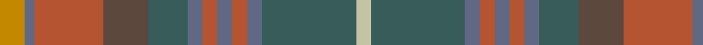

**Bands:** [YBRGGBRBRBGY](/stripes/ybrggbrbrbgy/) · **Stripes:** [LO N O DY DG N O N O N DG LY](/stripes/stripes12/) LO N O DY DG N O N O N DG LY

This was sourced from house-of-tartan.  It is a [12 band tartan](/bands/bands12/).

Original link http://www.house-of-tartan.scotland.net/house/TartanViewjs.asp?colr=Def&tnam=2269

## Thread count
DY/10 B4 LT28 Na18 N16 B6 LT6 B6 LT6 B6 N38 Nb/6

## Palette
Each colour and its ΔE from the base-6 reference it is a variant of.

| Colour | Shade | Base | ΔE (OKLab) |
|---|---|---|---|
| B | <code style="background-color:#606884;">#606884</code> `#606884` | B <code style="background-color:#2A418A;">#2A418A</code> | 0.15 |
| DY | <code style="background-color:#C48800;">#C48800</code> `#C48800` | Y <code style="background-color:#F2BF00;">#F2BF00</code> | 0.16 |
| LT | <code style="background-color:#B45430;">#B45430</code> `#B45430` | R <code style="background-color:#CC0000;">#CC0000</code> | 0.09 |
| N | <code style="background-color:#385C59;">#385C59</code> `#385C59` | G <code style="background-color:#006100;">#006100</code> | 0.12 |
| Na | <code style="background-color:#5C483C;">#5C483C</code> `#5C483C` | G <code style="background-color:#006100;">#006100</code> | 0.15 |
| Nb | <code style="background-color:#C4C4A4;">#C4C4A4</code> `#C4C4A4` | Y <code style="background-color:#F2BF00;">#F2BF00</code> | 0.13 |

## Nearest tartans

The nearest existing variants by ΔTartan distance.

1. [Allen - 2012 (Personal)](/setts/s14/do16r2do3r4do2n12dy18lb2dy18n12do12lo2r2lo2~x2/) — ΔT 1.27
1. [Hash House Harriers Hunting (Corp)](/setts/s13/g7dy1lb1dy1lo1dy7n7dy1n7dy7g7dy1r1~x4/) — ΔT 1.31
1. [Ben Murad (Personal)](/setts/s18/dg18r3dg3r15y13r14dg3r3dg18y5dg2o5dg3r2dg3n5dg2t5~x2/) — ΔT 1.39
1. [Limerick, County](/setts/s11/do6lo4do3dt2do5dt2do3dt2y14r3dt2~x2/) — ΔT 1.41
1. [MacVicar, McVicar, McVicker](/setts/s13/n12dy2ly2dy2n2dy10y12dy3y12dy10n11r2ly2~x2/) — ΔT 1.42
1. [Clarks No.1](/setts/s10/dt5t2dt11y2dt2y6o17o9dt1o1~x2/) — ΔT 1.46
1. [Stewart Camel (Lochcarron)](/setts/s14/y3dy3dg2dy6y7dg2y3dg2lo3dg5y3b3y20dy2~x2/) — ΔT 1.51
1. [Greyfriars](/setts/s11/b30o6dy16dp8dg10dp14dg24lo4dy10dp3dy28/) — ΔT 1.58
1. [Auld Scotland](/setts/s10/dr2lo12dr3lo3dr12y12n12y12y1ly2~x2/) — ΔT 1.60
1. [Gordonstoun #2](/setts/s22/g2r2g20r2y11r11lb2t11r2y19ly5y19r2t11lb2r11y11r2g20r2g2lb2~x2/) — ΔT 1.68

## Neighbour map

Every grey dot is one of 14313 variants placed by the first two principal components of the ΔTartan feature space (44% of its variance). Red is this tartan; blue dots are its nearest — click one to open its page.

<svg viewBox="0 0 640 380" role="img" style="max-width:100%;height:auto;border:1px solid #e0e0e0;border-radius:4px;display:block" xmlns="http://www.w3.org/2000/svg"><image href="/nn/cloud.v1.png" width="640" height="380"/><a href="/setts/s14/do16r2do3r4do2n12dy18lb2dy18n12do12lo2r2lo2~x2/"><circle cx="216.5" cy="194.3" r="4" fill="#3465a4"><title>Allen - 2012 (Personal)</title></circle></a><a href="/setts/s13/g7dy1lb1dy1lo1dy7n7dy1n7dy7g7dy1r1~x4/"><circle cx="217.9" cy="213.7" r="4" fill="#3465a4"><title>Hash House Harriers Hunting (Corp)</title></circle></a><a href="/setts/s18/dg18r3dg3r15y13r14dg3r3dg18y5dg2o5dg3r2dg3n5dg2t5~x2/"><circle cx="246.3" cy="180.4" r="4" fill="#3465a4"><title>Ben Murad (Personal)</title></circle></a><a href="/setts/s11/do6lo4do3dt2do5dt2do3dt2y14r3dt2~x2/"><circle cx="224.6" cy="228.0" r="4" fill="#3465a4"><title>Limerick, County</title></circle></a><a href="/setts/s13/n12dy2ly2dy2n2dy10y12dy3y12dy10n11r2ly2~x2/"><circle cx="200.8" cy="231.6" r="4" fill="#3465a4"><title>MacVicar, McVicar, McVicker</title></circle></a><a href="/setts/s10/dt5t2dt11y2dt2y6o17o9dt1o1~x2/"><circle cx="259.9" cy="186.5" r="4" fill="#3465a4"><title>Clarks No.1</title></circle></a><a href="/setts/s14/y3dy3dg2dy6y7dg2y3dg2lo3dg5y3b3y20dy2~x2/"><circle cx="250.9" cy="168.0" r="4" fill="#3465a4"><title>Stewart Camel (Lochcarron)</title></circle></a><a href="/setts/s11/b30o6dy16dp8dg10dp14dg24lo4dy10dp3dy28/"><circle cx="212.8" cy="230.7" r="4" fill="#3465a4"><title>Greyfriars</title></circle></a><a href="/setts/s10/dr2lo12dr3lo3dr12y12n12y12y1ly2~x2/"><circle cx="129.6" cy="188.8" r="4" fill="#3465a4"><title>Auld Scotland</title></circle></a><a href="/setts/s22/g2r2g20r2y11r11lb2t11r2y19ly5y19r2t11lb2r11y11r2g20r2g2lb2~x2/"><circle cx="175.9" cy="152.6" r="4" fill="#3465a4"><title>Gordonstoun #2</title></circle></a><circle cx="211.3" cy="193.9" r="5" fill="#c00000"/></svg>

ID: /setts/s12/lo5n2o14dy9dg8n3o3n3o3n3dg19ly3~x2/
