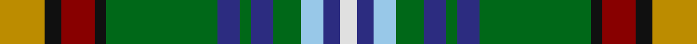

In pattern [WBWGBGBGKRKY](/stripes/wbwgbgbgkrky/).

This was sourced from tartans-authority.  It is a [12 stripe tartan](/stripes/stripes12/).

Original link http://www.tartansauthority.com/tartan-ferret/display/7451/

## Also known as

This cloth is also recorded under:

- Down County, Crest Range

## Attestations

This cloth appears in 2 source records; the oldest owns this page.

- 2004 — Down County Crest (Fashion) (tartans-authority, [record](http://www.tartansauthority.com/tartan-ferret/display/7451/))
- 01/05/2005 — Down County, Crest Range (register-of-tartans, [record](https://www.tartanregister.gov.uk/tartanDetails.aspx?ref=5401))

## Register references

External register numbers recorded for this tartan.

- Scottish Register of Tartans: [5401](https://www.tartanregister.gov.uk/tartanDetails.aspx?ref=5401)
- Scottish Tartans Authority (ITI): 7451
- Scottish Tartans World Register: 3082

## Thread count
DY/16 K6 DR12 K4 G40 DB8 G4 DB8 G10 LB8 DB6 LN/6

## Palette
Each colour and the base-6 reference it is a variant of.

| Colour | Shade | Base |
|---|---|---|
| DB | <code style="background-color:#2C2C80;">#2C2C80</code> `oklch(35.0% 0.138 276.6)` <small>#2C2C80</small> | B <code style="background-color:#2A418A;">#2A418A</code> |
| DR | <code style="background-color:#880000;">#880000</code> `oklch(39.4% 0.162 29.2)` <small>#880000</small> | R <code style="background-color:#CC0000;">#CC0000</code> |
| DY | <code style="background-color:#BC8C00;">#BC8C00</code> `oklch(66.8% 0.137 84.1)` <small>#BC8C00</small> | Y <code style="background-color:#F2BF00;">#F2BF00</code> |
| G | <code style="background-color:#006818;">#006818</code> `oklch(45.0% 0.142 145.0)` <small>#006818</small> | G <code style="background-color:#006100;">#006100</code> |
| K | <code style="background-color:#101010;">#101010</code> `oklch(17.3% 0.000 89.9)` <small>#101010</small> | K <code style="background-color:#000000;">#000000</code> |
| LB | <code style="background-color:#98C8E8;">#98C8E8</code> `oklch(81.0% 0.068 237.9)` <small>#98C8E8</small> | W <code style="background-color:#F7F7F7;">#F7F7F7</code> |
| LN | <code style="background-color:#E0E0E0;">#E0E0E0</code> `oklch(90.7% 0.000 89.9)` <small>#E0E0E0</small> | W <code style="background-color:#F7F7F7;">#F7F7F7</code> |

## Nearest tartans

The nearest existing variants by ΔTartan distance.

1. [Lyons](/setts/s10/t9db3g11k7g3k3g32r3w3r7~x2/) — ΔT 0.86
1. [Stevenson](/setts/s11/k6g20t2r6t2k20ly3db20g26r3db6~x2/) — ΔT 1.11
1. [Kumikyoku - Tone of Forest](/setts/s17/w5db3g12db3lb5db3k13db3r5db3ly2k11db3g5db3g25w2/) — ΔT 1.14
1. [Kelsey, William (Personal)](/setts/s12/g12r2g2r5g16db3o2k2o3db6k20ly3~x2/) — ΔT 1.17
1. [Wojtek Memorial Trust](/setts/s11/w3db15r6db3r3db4dg11g3dg3g28lb3~x2/) — ΔT 1.18
1. [Gordonstoun Corporate Tartan Tartan Number: 190. Earliest known date: 1966 The specimen in the cloth archive of the Scottish Tartans Society was supplied by Bullard in 1969. The original sindex card says it was supplied by Gordon Stewart in 1966. See products available Copyright © Blair Urquhart, Comrie, 2015](/setts/s12/ly3g15m2db8t2m8g8m2dg15m2dg2t2~x2/) — ΔT 1.20
1. [Wild Geese](/setts/s13/db8k1w5k1r5dg13k2g4k2g11dg20lo7dg5~x2/) — ΔT 1.21
1. [MacKellar](/setts/s12/g30w3g4ly5g4w3g6k14t3k14db18w4~x2/) — ΔT 1.22
1. [Kentucky, State of](/setts/s12/g13db11w2lb4r3ly3r3lb4w2db11g13k2~x2/) — ΔT 1.23
1. [Royal Pharmaceutical Society Commemorative Tartan Tartan Number: 2091. Earliest known date: 1991 Created by Kinloch Anderson of Edinburgh for the 150th Anniversary of the Royal Pharmaceutical Society of Great Britain which was held at Scone Palace, Perthshire in 1991. See products available Copyright © Blair Urquhart, Comrie, 2015](/setts/s10/do3db2g19db6g2db6lo14w2dp4w2~x2/) — ΔT 1.26

## Neighbour map

Every grey dot is one of 14299 variants placed by the first two principal components of the ΔTartan feature space (44% of its variance). Red is this tartan; blue dots are its nearest — click one to open its page.

<svg viewBox="0 0 640 380" role="img" style="max-width:100%;height:auto;border:1px solid #e0e0e0;border-radius:4px;display:block" xmlns="http://www.w3.org/2000/svg"><image href="/nn/cloud.v1.png" width="640" height="380"/><a href="/setts/s10/t9db3g11k7g3k3g32r3w3r7~x2/"><circle cx="149.3" cy="126.9" r="4" fill="#3465a4"><title>Lyons</title></circle></a><a href="/setts/s11/k6g20t2r6t2k20ly3db20g26r3db6~x2/"><circle cx="140.9" cy="138.9" r="4" fill="#3465a4"><title>Stevenson</title></circle></a><a href="/setts/s17/w5db3g12db3lb5db3k13db3r5db3ly2k11db3g5db3g25w2/"><circle cx="108.3" cy="98.7" r="4" fill="#3465a4"><title>Kumikyoku - Tone of Forest</title></circle></a><a href="/setts/s12/g12r2g2r5g16db3o2k2o3db6k20ly3~x2/"><circle cx="149.0" cy="144.6" r="4" fill="#3465a4"><title>Kelsey, William (Personal)</title></circle></a><a href="/setts/s11/w3db15r6db3r3db4dg11g3dg3g28lb3~x2/"><circle cx="145.9" cy="145.7" r="4" fill="#3465a4"><title>Wojtek Memorial Trust</title></circle></a><a href="/setts/s12/ly3g15m2db8t2m8g8m2dg15m2dg2t2~x2/"><circle cx="94.0" cy="156.1" r="4" fill="#3465a4"><title>Gordonstoun Corporate Tartan Tartan Number: 190. Earliest known date: 1966 The specimen in the cloth archive of the Scottish Tartans Society was supplied by Bullard in 1969. The original sindex card says it was supplied by Gordon Stewart in 1966. See products available Copyright © Blair Urquhart, Comrie, 2015</title></circle></a><a href="/setts/s13/db8k1w5k1r5dg13k2g4k2g11dg20lo7dg5~x2/"><circle cx="153.7" cy="107.7" r="4" fill="#3465a4"><title>Wild Geese</title></circle></a><a href="/setts/s12/g30w3g4ly5g4w3g6k14t3k14db18w4~x2/"><circle cx="127.9" cy="139.2" r="4" fill="#3465a4"><title>MacKellar</title></circle></a><a href="/setts/s12/g13db11w2lb4r3ly3r3lb4w2db11g13k2~x2/"><circle cx="68.2" cy="147.1" r="4" fill="#3465a4"><title>Kentucky, State of</title></circle></a><a href="/setts/s10/do3db2g19db6g2db6lo14w2dp4w2~x2/"><circle cx="129.1" cy="151.6" r="4" fill="#3465a4"><title>Royal Pharmaceutical Society Commemorative Tartan Tartan Number: 2091. Earliest known date: 1991 Created by Kinloch Anderson of Edinburgh for the 150th Anniversary of the Royal Pharmaceutical Society of Great Britain which was held at Scone Palace, Perthshire in 1991. See products available Copyright © Blair Urquhart, Comrie, 2015</title></circle></a><circle cx="120.3" cy="126.7" r="5" fill="#c00000"/></svg>

ID: /setts/s12/lo8k3r6k2g20db4g2db4g5lb4db3w3~x2/
