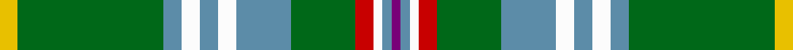

**Bands:** [YGBWBWBGRWBB](/stripes/ygbwbwbgrwbb/) · **Stripes:** [LY G T W T W T G R W T DP](/stripes/stripes12/) LY G T W T W T G R W T DP

This was sourced from register-of-tartans.  It is a [12 band tartan](/bands/bands12/).

Original link https://www.tartanregister.gov.uk/tartanDetails.aspx?ref=1276

## Register references

External register numbers recorded for this tartan.

- Scottish Register of Tartans: [1276](https://www.tartanregister.gov.uk/tartanDetails.aspx?ref=1276)
- Scottish Tartans Authority (ITI): 95
- Scottish Tartans World Register: 95

## Variants

Other setts woven to the same stripe pattern.

- [Fredericton (District)](/setts/s12/dp6t2w24r15g12t4w4t4w4t4g34ly4/)
- [Fredericton District Tartan Tartan Number: 96. Earliest known date: 1967 Fredericton, capital city of New Brunswick, takes its name from Prince Frederick, the second son of King George III. The tartan was designed and woven by the Loomcrofters of Frederickton who weave in their own homes on their own looms. (From 'District Tartans', G. Teall and P. Smith, 1992) See products available Copyright © Blair Urquhart, Comrie, 2015](/setts/s12/dp3t1w9r6g5t2w2t2w2t2g12ly2~x2/)

## Thread count
Y/12 G96 B12 W12 B12 W12 B36 G42 R12 W6 B6 P/6

## Palette
Each colour and its ΔE from the base-6 reference it is a variant of.

| Colour | Shade | Base | ΔE (OKLab) |
|---|---|---|---|
| B | <code style="background-color:#5C8CA8;">#5C8CA8</code> `#5C8CA8` | B <code style="background-color:#2A418A;">#2A418A</code> | 0.23 |
| G | <code style="background-color:#006818;">#006818</code> `#006818` | G <code style="background-color:#006100;">#006100</code> | 0.02 |
| P | <code style="background-color:#780078;">#780078</code> `#780078` | B <code style="background-color:#2A418A;">#2A418A</code> | 0.17 |
| R | <code style="background-color:#C80000;">#C80000</code> `#C80000` | R <code style="background-color:#CC0000;">#CC0000</code> | 0.01 |
| W | <code style="background-color:#FCFCFC;">#FCFCFC</code> `#FCFCFC` | W <code style="background-color:#F7F7F7;">#F7F7F7</code> | 0.01 |
| Y | <code style="background-color:#E8C000;">#E8C000</code> `#E8C000` | Y <code style="background-color:#F2BF00;">#F2BF00</code> | 0.02 |

## Nearest tartans

The nearest existing variants by ΔTartan distance.

1. [Fredericton](/setts/s12/ly2g16t2w2t2w2t6g7r2w1t1p1~x2/) — ΔT 0.59
1. [Rooney (Personal)](/setts/s18/y36g12y4g72k4g13k36r4k4ly4k36g13k4g72y4g12y36w4/) — ΔT 1.03
1. [Offally County Crest (Fashion)](/setts/s11/ly24k8lp4k6g76k8w14g4k9g12lo10/) — ΔT 1.14
1. [Malone, Keagan Allen (Personal)](/setts/s14/lr2g3lr2g12lo5g12w1dg16lo3w3g3dg2o2w1~x2/) — ΔT 1.17
1. [Canadian Caledonian, hunting](/setts/s11/db3k1g13ly1r1w1r6g3r1g3w1~x2/) — ΔT 1.19
1. [Heneghan (Personal)](/setts/s14/g16r3w1db2g4r2db4g2r1lo1ly1lo1db6g12~x4/) — ΔT 1.19
1. [Wcwm 972-1](/setts/s13/lb7k1do1o2g18lb2k1lo2k1lb6k1do1lb1~x4/) — ΔT 1.22
1. [Currie](/setts/s11/db16w3db1ly4g24r1g3r4g3r1t8~x2/) — ΔT 1.25
1. [Currie of Arran (Clan/family)](/setts/s11/b16w3b2ly4g24r2g4r5g4r2lb8~x2/) — ΔT 1.27
1. [Dinwiddie Clan Tartan Tartan Number: 3212. Earliest known date: 2001 The registered tartan of the Dinwiddie Clan. Dinwiddies are normally associated with the Maxwells, but Lord Lyon stated, in 1988, that Dinwiddies were a sept of no other clan. See products available Copyright © Blair Urquhart, Comrie, 2015](/setts/s10/ly4o2k2o42k13g25o6k2r4k2~x2/) — ΔT 1.28

## Neighbour map

Every grey dot is one of 14299 variants placed by the first two principal components of the ΔTartan feature space (44% of its variance). Red is this tartan; blue dots are its nearest — click one to open its page.

<svg viewBox="0 0 640 380" role="img" style="max-width:100%;height:auto;border:1px solid #e0e0e0;border-radius:4px;display:block" xmlns="http://www.w3.org/2000/svg"><image href="/nn/cloud.v1.png" width="640" height="380"/><a href="/setts/s12/ly2g16t2w2t2w2t6g7r2w1t1p1~x2/"><circle cx="252.6" cy="116.8" r="4" fill="#3465a4"><title>Fredericton</title></circle></a><a href="/setts/s18/y36g12y4g72k4g13k36r4k4ly4k36g13k4g72y4g12y36w4/"><circle cx="248.5" cy="99.6" r="4" fill="#3465a4"><title>Rooney (Personal)</title></circle></a><a href="/setts/s11/ly24k8lp4k6g76k8w14g4k9g12lo10/"><circle cx="236.4" cy="95.0" r="4" fill="#3465a4"><title>Offally County Crest (Fashion)</title></circle></a><a href="/setts/s14/lr2g3lr2g12lo5g12w1dg16lo3w3g3dg2o2w1~x2/"><circle cx="181.7" cy="109.3" r="4" fill="#3465a4"><title>Malone, Keagan Allen (Personal)</title></circle></a><a href="/setts/s11/db3k1g13ly1r1w1r6g3r1g3w1~x2/"><circle cx="259.7" cy="119.4" r="4" fill="#3465a4"><title>Canadian Caledonian, hunting</title></circle></a><a href="/setts/s14/g16r3w1db2g4r2db4g2r1lo1ly1lo1db6g12~x4/"><circle cx="276.3" cy="104.4" r="4" fill="#3465a4"><title>Heneghan (Personal)</title></circle></a><a href="/setts/s13/lb7k1do1o2g18lb2k1lo2k1lb6k1do1lb1~x4/"><circle cx="197.1" cy="81.0" r="4" fill="#3465a4"><title>Wcwm 972-1</title></circle></a><a href="/setts/s11/db16w3db1ly4g24r1g3r4g3r1t8~x2/"><circle cx="217.5" cy="104.0" r="4" fill="#3465a4"><title>Currie</title></circle></a><a href="/setts/s11/b16w3b2ly4g24r2g4r5g4r2lb8~x2/"><circle cx="163.7" cy="126.4" r="4" fill="#3465a4"><title>Currie of Arran (Clan/family)</title></circle></a><a href="/setts/s10/ly4o2k2o42k13g25o6k2r4k2~x2/"><circle cx="267.2" cy="115.2" r="4" fill="#3465a4"><title>Dinwiddie Clan Tartan Tartan Number: 3212. Earliest known date: 2001 The registered tartan of the Dinwiddie Clan. Dinwiddies are normally associated with the Maxwells, but Lord Lyon stated, in 1988, that Dinwiddies were a sept of no other clan. See products available Copyright © Blair Urquhart, Comrie, 2015</title></circle></a><circle cx="240.0" cy="109.7" r="5" fill="#c00000"/></svg>

ID: /setts/s12/ly2g16t2w2t2w2t6g7r2w1t1dp1~x6/
