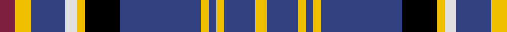

In pattern [RYBWYKBYBYBY](/stripes/rybwykbybyby/).

This was sourced from weddslist.  It is a [12 stripe tartan](/stripes/stripes12/).

Original link http://www.weddslist.com/cgi-bin/tartans/pg.pl?source=sts

## Thread count
DR/8 Y8 B18 LN6 Y4 K18 B42 Y4 B4 Y4 B16 Y/6

## Palette
Each colour and the base-6 reference it is a variant of.

| Colour | Shade | Base |
|---|---|---|
| B | <code style="background-color:#304080;">#304080</code> `oklch(39.4% 0.109 270.2)` <small>#304080</small> | B <code style="background-color:#2A418A;">#2A418A</code> |
| DR | <code style="background-color:#802040;">#802040</code> `oklch(40.8% 0.132 5.2)` <small>#802040</small> | R <code style="background-color:#CC0000;">#CC0000</code> |
| K | <code style="background-color:#000000;">#000000</code> `oklch(0.0% 0.000 0.0)` <small>#000000</small> | K <code style="background-color:#000000;">#000000</code> |
| LN | <code style="background-color:#E0E0E0;">#E0E0E0</code> `oklch(90.7% 0.000 89.9)` <small>#E0E0E0</small> | W <code style="background-color:#F7F7F7;">#F7F7F7</code> |
| Y | <code style="background-color:#F0C000;">#F0C000</code> `oklch(82.7% 0.169 90.5)` <small>#F0C000</small> | Y <code style="background-color:#F2BF00;">#F2BF00</code> |

## Nearest tartans

The nearest existing variants by ΔTartan distance, with this tartan at the top so the swatches line up against it.

ΔTartan

Tartan

Sett

—

<a href="/ttd/edit/#slug=m4ly4db9w3ly2k9db21ly2db2ly2db8ly3~x2">Ruxton, dress</a> <a class="nn-out" href="/setts/s12/m4ly4db9w3ly2k9db21ly2db2ly2db8ly3~x2/" title="open its dictionary page">↗</a>

0.33

<a href="/ttd/edit/#slug=r4ly4db9w3ly2k9db21ly2db2ly2db8ly3~x2">Ruxton Dress</a> <a class="nn-out" href="/setts/s12/r4ly4db9w3ly2k9db21ly2db2ly2db8ly3~x2/" title="open its dictionary page">↗</a>

1.01

<a href="/ttd/edit/#slug=db32r4db4ly4db9o9db4o16w7~x2">Nevada State American District Tartan Tartan Number: 3091. Earliest known date: 2001 Blue and Silver represent the state colours of Nevada. Red represents the Virgin Valley black fire opal, the official state precious gemstone, and the red rock formations of southern Nevada; Yellow represents sagebrush, the official state flower; White represents the name of this state meaning snow-covered; Other synbolic reference are made in the US Senate Bill No. 347. See products available Copyright © Blair Urquhart, Comrie, 2015</a> <a class="nn-out" href="/setts/s9/db32r4db4ly4db9o9db4o16w7~x2/" title="open its dictionary page">↗</a>

1.01

<a href="/ttd/edit/#slug=db32r4db4ly4db9lr9db4lr16w7~x2">Nevada State</a> <a class="nn-out" href="/setts/s9/db32r4db4ly4db9lr9db4lr16w7~x2/" title="open its dictionary page">↗</a>

1.08

<a href="/ttd/edit/#slug=r4b18r4t3r4k12r3b24k2ly3~x2">Keogh (Name)</a> <a class="nn-out" href="/setts/s10/r4b18r4t3r4k12r3b24k2ly3~x2/" title="open its dictionary page">↗</a>

1.11

<a href="/ttd/edit/#slug=ly7db5ly25db26lb4db4r3db4g4db26ly25db5~x2">O Savanao (District)</a> <a class="nn-out" href="/setts/s12/ly7db5ly25db26lb4db4r3db4g4db26ly25db5~x2/" title="open its dictionary page">↗</a>

1.21

<a href="/ttd/edit/#slug=t3k1t1db4t10r2k8db2t1k1t3~x2">Norwich No.020</a> <a class="nn-out" href="/setts/s11/t3k1t1db4t10r2k8db2t1k1t3~x2/" title="open its dictionary page">↗</a>

1.25

<a href="/ttd/edit/#slug=w5n3w3n20k15n10g2n2g3n2g3n6lp3n4lp5~x2">Thistle Dubh</a> <a class="nn-out" href="/setts/s15/w5n3w3n20k15n10g2n2g3n2g3n6lp3n4lp5~x2/" title="open its dictionary page">↗</a>

1.31

<a href="/ttd/edit/#slug=r3b22r3b3k14b14t3b3w2~x2">Fitzgerald (Family)</a> <a class="nn-out" href="/setts/s9/r3b22r3b3k14b14t3b3w2~x2/" title="open its dictionary page">↗</a>

1.35

<a href="/ttd/edit/#slug=w4k2b9k3m3k3m3k23g10k2m6w2~x2">Auld Lang Syne Blue</a> <a class="nn-out" href="/setts/s12/w4k2b9k3m3k3m3k23g10k2m6w2~x2/" title="open its dictionary page">↗</a>

1.38

<a href="/ttd/edit/#slug=r2db8k1g2k1g4k1g2k1db8ly2~x2">MacCainsh</a> <a class="nn-out" href="/setts/s11/r2db8k1g2k1g4k1g2k1db8ly2~x2/" title="open its dictionary page">↗</a>

## Neighbour map

Every grey dot is one of 14299 variants placed by the first two principal components of the ΔTartan feature space (44% of its variance). Red is this tartan; blue dots are its nearest — click one to open its page.

<svg viewBox="0 0 640 380" role="img" style="max-width:100%;height:auto;border:1px solid #e0e0e0;border-radius:4px;display:block" xmlns="http://www.w3.org/2000/svg"><image href="/nn/cloud.v1.png" width="640" height="380"/><a href="/setts/s12/r4ly4db9w3ly2k9db21ly2db2ly2db8ly3~x2/"><circle cx="248.9" cy="143.9" r="4" fill="#3465a4"><title>Ruxton Dress</title></circle></a><a href="/setts/s9/db32r4db4ly4db9o9db4o16w7~x2/"><circle cx="242.4" cy="174.4" r="4" fill="#3465a4"><title>Nevada State American District Tartan Tartan Number: 3091. Earliest known date: 2001 Blue and Silver represent the state colours of Nevada. Red represents the Virgin Valley black fire opal, the official state precious gemstone, and the red rock formations of southern Nevada; Yellow represents sagebrush, the official state flower; White represents the name of this state meaning snow-covered; Other synbolic reference are made in the US Senate Bill No. 347. See products available Copyright © Blair Urquhart, Comrie, 2015</title></circle></a><a href="/setts/s9/db32r4db4ly4db9lr9db4lr16w7~x2/"><circle cx="227.8" cy="165.3" r="4" fill="#3465a4"><title>Nevada State</title></circle></a><a href="/setts/s10/r4b18r4t3r4k12r3b24k2ly3~x2/"><circle cx="259.1" cy="154.5" r="4" fill="#3465a4"><title>Keogh (Name)</title></circle></a><a href="/setts/s12/ly7db5ly25db26lb4db4r3db4g4db26ly25db5~x2/"><circle cx="214.1" cy="147.1" r="4" fill="#3465a4"><title>O Savanao (District)</title></circle></a><a href="/setts/s11/t3k1t1db4t10r2k8db2t1k1t3~x2/"><circle cx="193.1" cy="156.9" r="4" fill="#3465a4"><title>Norwich No.020</title></circle></a><a href="/setts/s15/w5n3w3n20k15n10g2n2g3n2g3n6lp3n4lp5~x2/"><circle cx="229.9" cy="144.8" r="4" fill="#3465a4"><title>Thistle Dubh</title></circle></a><a href="/setts/s9/r3b22r3b3k14b14t3b3w2~x2/"><circle cx="287.7" cy="162.6" r="4" fill="#3465a4"><title>Fitzgerald (Family)</title></circle></a><a href="/setts/s12/w4k2b9k3m3k3m3k23g10k2m6w2~x2/"><circle cx="187.4" cy="137.7" r="4" fill="#3465a4"><title>Auld Lang Syne Blue</title></circle></a><a href="/setts/s11/r2db8k1g2k1g4k1g2k1db8ly2~x2/"><circle cx="199.6" cy="171.9" r="4" fill="#3465a4"><title>MacCainsh</title></circle></a><circle cx="245.4" cy="143.9" r="5" fill="#c00000"/></svg>

ID: /setts/s12/m4ly4db9w3ly2k9db21ly2db2ly2db8ly3~x2/
