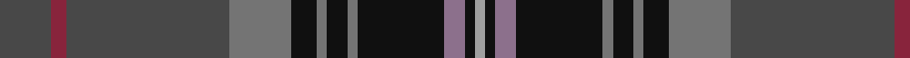

**Bands:** [BRBGKGKGKRKY](/stripes/brbgkgkgkrky/) · **Stripes:** [N R N Y K Y K Y K O K LR](/stripes/stripes12/) N R N Y K Y K Y K O K LR

This was sourced from house-of-tartan.  It is a [12 band tartan](/bands/bands12/).

Original link http://www.house-of-tartan.scotland.net/house/TartanViewjs.asp?colr=Def&tnam=10970

## Thread count
N/20 DR6 N64 Na24 K10 Na4 K8 Na4 K34 Nc8 K4 Nb/4

## Palette
Each colour and its ΔE from the base-6 reference it is a variant of.

| Colour | Shade | Base | ΔE (OKLab) |
|---|---|---|---|
| DR | <code style="background-color:#88243C;">#88243C</code> `#88243C` | R <code style="background-color:#CC0000;">#CC0000</code> | 0.14 |
| K | <code style="background-color:#101010;">#101010</code> `#101010` | K <code style="background-color:#000000;">#000000</code> | 0.17 |
| N | <code style="background-color:#484848;">#484848</code> `#484848` | B <code style="background-color:#2A418A;">#2A418A</code> | 0.12 |
| Na | <code style="background-color:#747474;">#747474</code> `#747474` | G <code style="background-color:#006100;">#006100</code> | 0.20 |
| Nb | <code style="background-color:#A0A0A0;">#A0A0A0</code> `#A0A0A0` | Y <code style="background-color:#F2BF00;">#F2BF00</code> | 0.21 |
| Nc | <code style="background-color:#8C708C;">#8C708C</code> `#8C708C` | R <code style="background-color:#CC0000;">#CC0000</code> | 0.21 |

## Nearest tartans

The nearest existing variants by ΔTartan distance.

1. [Capercaillie Corporate Tartan Tartan Number: 6857. Earliest known date: 2005 RSPB Scotland will receive a 7% royalty on all products made from the new tartan, created in the colours of the world's largest woodland grouse, in a deal struck with the leading tartan weavers Lochcarron. See products available Copyright © Blair Urquhart, Comrie, 2015](/setts/s14/n4o3n4o2n4dt8n30k4dt4k36n4r2k4w2/) — ΔT 0.84
1. [Hand, Edinburgh](/setts/s12/dg1k8n5k23n5db3n5dp3n5dg5n3w1~x2/) — ΔT 0.90
1. [Capercaillie](/setts/s14/do4o3do4o2do4db8do30k4db4k36do4r2k4w2/) — ΔT 1.05
1. [Telfer, Jamie of the Fair Dodhead](/setts/s11/b1db5dp6dg2dp1dg12r1dg2dp1r5lo1~x4/) — ΔT 1.05
1. [Boyle (Personal)](/setts/s10/db4db3r2db26k3db3g3db3g17lo3~x2/) — ΔT 1.09
1. [Real Mary King's Close, The](/setts/s9/k2r2k15o2k4o2n9do27w2~x2/) — ΔT 1.10
1. [Six Frigates (US)](/setts/s10/t3k1lo2k1db10k17db2t1dy1r1~x2/) — ΔT 1.14
1. [Ogg of Tarragann Hunting](/setts/s12/lo2dg2lo1dg10k6r1k14r1k14r1t6r2~x2/) — ΔT 1.15
1. [Loch Tay (District)](/setts/s11/lb3y3r2y16k2db24k2y16r2y3lo3~x2/) — ΔT 1.19
1. [Purves (2014)](/setts/s8/do4w1dg12k3db16r1db1r1~x2/) — ΔT 1.19

## Neighbour map

Every grey dot is one of 14313 variants placed by the first two principal components of the ΔTartan feature space (44% of its variance). Red is this tartan; blue dots are its nearest — click one to open its page.

<svg viewBox="0 0 640 380" role="img" style="max-width:100%;height:auto;border:1px solid #e0e0e0;border-radius:4px;display:block" xmlns="http://www.w3.org/2000/svg"><image href="/nn/cloud.v1.png" width="640" height="380"/><a href="/setts/s14/n4o3n4o2n4dt8n30k4dt4k36n4r2k4w2/"><circle cx="270.0" cy="118.5" r="4" fill="#3465a4"><title>Capercaillie Corporate Tartan Tartan Number: 6857. Earliest known date: 2005 RSPB Scotland will receive a 7% royalty on all products made from the new tartan, created in the colours of the world's largest woodland grouse, in a deal struck with the leading tartan weavers Lochcarron. See products available Copyright © Blair Urquhart, Comrie, 2015</title></circle></a><a href="/setts/s12/dg1k8n5k23n5db3n5dp3n5dg5n3w1~x2/"><circle cx="297.1" cy="147.1" r="4" fill="#3465a4"><title>Hand, Edinburgh</title></circle></a><a href="/setts/s14/do4o3do4o2do4db8do30k4db4k36do4r2k4w2/"><circle cx="285.9" cy="126.4" r="4" fill="#3465a4"><title>Capercaillie</title></circle></a><a href="/setts/s11/b1db5dp6dg2dp1dg12r1dg2dp1r5lo1~x4/"><circle cx="248.0" cy="174.6" r="4" fill="#3465a4"><title>Telfer, Jamie of the Fair Dodhead</title></circle></a><a href="/setts/s10/db4db3r2db26k3db3g3db3g17lo3~x2/"><circle cx="243.8" cy="156.7" r="4" fill="#3465a4"><title>Boyle (Personal)</title></circle></a><a href="/setts/s9/k2r2k15o2k4o2n9do27w2~x2/"><circle cx="229.5" cy="148.8" r="4" fill="#3465a4"><title>Real Mary King's Close, The</title></circle></a><a href="/setts/s10/t3k1lo2k1db10k17db2t1dy1r1~x2/"><circle cx="297.1" cy="137.0" r="4" fill="#3465a4"><title>Six Frigates (US)</title></circle></a><a href="/setts/s12/lo2dg2lo1dg10k6r1k14r1k14r1t6r2~x2/"><circle cx="228.6" cy="144.8" r="4" fill="#3465a4"><title>Ogg of Tarragann Hunting</title></circle></a><a href="/setts/s11/lb3y3r2y16k2db24k2y16r2y3lo3~x2/"><circle cx="266.5" cy="146.3" r="4" fill="#3465a4"><title>Loch Tay (District)</title></circle></a><a href="/setts/s8/do4w1dg12k3db16r1db1r1~x2/"><circle cx="256.0" cy="161.3" r="4" fill="#3465a4"><title>Purves (2014)</title></circle></a><circle cx="259.7" cy="142.9" r="5" fill="#c00000"/></svg>

ID: /setts/s12/n10r3n32y12k5y2k4y2k17o4k2lr2~x2/
