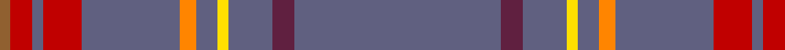

This page is one **sett** — a single exact thread-count. It belongs to the [tartan](/tartans/n38dr4n8y2n4o3n4n14r7n2r4lt2/)
(the same proportion at any scale), whose colour order is pattern [BBBYBYBBRBRR](/stripes/bbbybybbrbrr/).

Sourced from weddslist.  It is a [12 stripe tartan](/stripes/stripes12/).

Original link http://www.weddslist.com/cgi-bin/tartans/pg.pl?source=sts

## Thread count
N/76 DR8 N16 Y4 N8 O6 N8 N28 R14 N4 R8 LT/4

## Palette
Each colour and the base-6 reference it is a variant of.

| Colour | Shade | Base |
|---|---|---|
| DR | <code style="background-color:#602040;">#602040</code> `oklch(35.2% 0.100 352.4)` <small>#602040</small> | B <code style="background-color:#2A418A;">#2A418A</code> |
| LT | <code style="background-color:#906030;">#906030</code> `oklch(53.1% 0.089 63.7)` <small>#906030</small> | R <code style="background-color:#CC0000;">#CC0000</code> |
| N | <code style="background-color:#606080;">#606080</code> `oklch(50.2% 0.051 284.4)` <small>#606080</small> | B <code style="background-color:#2A418A;">#2A418A</code> |
| O | <code style="background-color:#FF8500;">#FF8500</code> `oklch(74.0% 0.183 55.1)` <small>#FF8500</small> | Y <code style="background-color:#F2BF00;">#F2BF00</code> |
| R | <code style="background-color:#C00000;">#C00000</code> `oklch(50.7% 0.208 29.2)` <small>#C00000</small> | R <code style="background-color:#CC0000;">#CC0000</code> |
| Y | <code style="background-color:#FFE000;">#FFE000</code> `oklch(90.5% 0.188 99.1)` <small>#FFE000</small> | Y <code style="background-color:#F2BF00;">#F2BF00</code> |

## Nearest tartans

The nearest existing variants by ΔTartan distance, with this tartan at the top so the swatches line up against it.

ΔTartan

Tartan

Sett

—

<a href="/ttd/edit/#slug=n38dp4n8ly2n4lo3n4n14r7n2r4o2~x2">Louth</a> <a class="nn-out" href="/setts/s12/n38dp4n8ly2n4lo3n4n14r7n2r4o2~x2/" title="open its dictionary page">↗</a>

1.20

<a href="/ttd/edit/#slug=o14db1o19w1o18k3o1n7db2n1lb1o4~x2">Orkney Magnus</a> <a class="nn-out" href="/setts/s12/o14db1o19w1o18k3o1n7db2n1lb1o4~x2/" title="open its dictionary page">↗</a>

1.63

<a href="/ttd/edit/#slug=db4lp2db2m4lp2db8lp2k2n43k2n43m2db8n2">Orkney Heather</a> <a class="nn-out" href="/setts/s14/db4lp2db2m4lp2db8lp2k2n43k2n43m2db8n2/" title="open its dictionary page">↗</a>

1.67

<a href="/ttd/edit/#slug=y40n3y8r2y2w2y10n6do2n2w2~x2">Spencer</a> <a class="nn-out" href="/setts/s11/y40n3y8r2y2w2y10n6do2n2w2~x2/" title="open its dictionary page">↗</a>

1.80

<a href="/ttd/edit/#slug=n48r4n6o2n2lr2n2r10b6n2b3lr2~x2">Gabrielle</a> <a class="nn-out" href="/setts/s12/n48r4n6o2n2lr2n2r10b6n2b3lr2~x2/" title="open its dictionary page">↗</a>

1.85

<a href="/ttd/edit/#slug=n46lo1do5lo1dg5lo1dp5lo1n16r1lo4~x2">Craven County Commemorative Tartan Tartan Number: 10679. Earliest known date: 21 August 2012 2012 marks the 300th year of Craven County, North Carolina, USA. The 300th Anniversary District 2 Committee, under the leadership of Chairperson, Kelly Beasley, voted for a Craven County Tartan to represent the large number of Craven County residents with Scottish heritage. The colours are drawn from the Craven County Coat of Arms, the waterways, rivers and streams, sky, colonial history, governors, royalty, the military, education, and the agricultural background of the county, as well as forestry, tobacco, indigo, and its many other crops. Brian Dodds designed the tartan, submitting four ideas of which the District 2 committee selected Pattern #2. The tartan has been approved by the Craven County 300th Anniversary Committee and the Craven County Board of Commissioners, with the Board signing a resolution on 16 April, 2012. Ila McIlwean White-Lewis volunteered to pay to register the tartan and to have sufficient tartan woven for a banner to be displayed in the Craven County Courthouse. See products available Copyright © Blair Urquhart, Comrie, 2015</a> <a class="nn-out" href="/setts/s11/n46lo1do5lo1dg5lo1dp5lo1n16r1lo4~x2/" title="open its dictionary page">↗</a>

1.86

<a href="/ttd/edit/#slug=dp4m2dp2dp4m2dp8m2n2o43n2o43dp2dp8o2">Orkney Heather</a> <a class="nn-out" href="/setts/s14/dp4m2dp2dp4m2dp8m2n2o43n2o43dp2dp8o2/" title="open its dictionary page">↗</a>

1.88

<a href="/ttd/edit/#slug=n43db2n2db1n1r11n2db2n1n1n20w4n7~x2">Highland Dusk (Fashion)</a> <a class="nn-out" href="/setts/s13/n43db2n2db1n1r11n2db2n1n1n20w4n7~x2/" title="open its dictionary page">↗</a>

1.91

<a href="/ttd/edit/#slug=n21k3n15k4o6k3n2r3n1lo2n1dp3n18k2n2k2~x2">Pounds (Name)</a> <a class="nn-out" href="/setts/s16/n21k3n15k4o6k3n2r3n1lo2n1dp3n18k2n2k2~x2/" title="open its dictionary page">↗</a>

1.95

<a href="/ttd/edit/#slug=b6r7dy49lo2dy22b10dy5k5dy8g4~x2">State Seal of Missouri (Fashion)</a> <a class="nn-out" href="/setts/s10/b6r7dy49lo2dy22b10dy5k5dy8g4~x2/" title="open its dictionary page">↗</a>

1.97

<a href="/ttd/edit/#slug=n6k1lo6k1n28w1k2w1n16w1r5~x2">Historic Caledonian Railway Enthusiasts', The</a> <a class="nn-out" href="/setts/s11/n6k1lo6k1n28w1k2w1n16w1r5~x2/" title="open its dictionary page">↗</a>

## Neighbour map

Every grey dot is one of 14299 variants placed by the first two principal components of the ΔTartan feature space (44% of its variance). Red is this tartan; blue dots are its nearest — click one to open its page.

<svg viewBox="0 0 640 380" role="img" style="max-width:100%;height:auto;border:1px solid #e0e0e0;border-radius:4px;display:block" xmlns="http://www.w3.org/2000/svg"><image href="/nn/cloud.v1.png" width="640" height="380"/><a href="/setts/s12/o14db1o19w1o18k3o1n7db2n1lb1o4~x2/"><circle cx="497.4" cy="140.1" r="4" fill="#3465a4"><title>Orkney Magnus</title></circle></a><a href="/setts/s14/db4lp2db2m4lp2db8lp2k2n43k2n43m2db8n2/"><circle cx="487.1" cy="128.6" r="4" fill="#3465a4"><title>Orkney Heather</title></circle></a><a href="/setts/s11/y40n3y8r2y2w2y10n6do2n2w2~x2/"><circle cx="538.7" cy="140.8" r="4" fill="#3465a4"><title>Spencer</title></circle></a><a href="/setts/s12/n48r4n6o2n2lr2n2r10b6n2b3lr2~x2/"><circle cx="489.2" cy="125.9" r="4" fill="#3465a4"><title>Gabrielle</title></circle></a><a href="/setts/s11/n46lo1do5lo1dg5lo1dp5lo1n16r1lo4~x2/"><circle cx="511.5" cy="88.9" r="4" fill="#3465a4"><title>Craven County Commemorative Tartan Tartan Number: 10679. Earliest known date: 21 August 2012 2012 marks the 300th year of Craven County, North Carolina, USA. The 300th Anniversary District 2 Committee, under the leadership of Chairperson, Kelly Beasley, voted for a Craven County Tartan to represent the large number of Craven County residents with Scottish heritage. The colours are drawn from the Craven County Coat of Arms, the waterways, rivers and streams, sky, colonial history, governors, royalty, the military, education, and the agricultural background of the county, as well as forestry, tobacco, indigo, and its many other crops. Brian Dodds designed the tartan, submitting four ideas of which the District 2 committee selected Pattern #2. The tartan has been approved by the Craven County 300th Anniversary Committee and the Craven County Board of Commissioners, with the Board signing a resolution on 16 April, 2012. Ila McIlwean White-Lewis volunteered to pay to register the tartan and to have sufficient tartan woven for a banner to be displayed in the Craven County Courthouse. See products available Copyright © Blair Urquhart, Comrie, 2015</title></circle></a><a href="/setts/s14/dp4m2dp2dp4m2dp8m2n2o43n2o43dp2dp8o2/"><circle cx="455.9" cy="103.8" r="4" fill="#3465a4"><title>Orkney Heather</title></circle></a><a href="/setts/s13/n43db2n2db1n1r11n2db2n1n1n20w4n7~x2/"><circle cx="584.0" cy="104.0" r="4" fill="#3465a4"><title>Highland Dusk (Fashion)</title></circle></a><a href="/setts/s16/n21k3n15k4o6k3n2r3n1lo2n1dp3n18k2n2k2~x2/"><circle cx="405.9" cy="119.7" r="4" fill="#3465a4"><title>Pounds (Name)</title></circle></a><a href="/setts/s10/b6r7dy49lo2dy22b10dy5k5dy8g4~x2/"><circle cx="476.5" cy="145.3" r="4" fill="#3465a4"><title>State Seal of Missouri (Fashion)</title></circle></a><a href="/setts/s11/n6k1lo6k1n28w1k2w1n16w1r5~x2/"><circle cx="476.0" cy="117.4" r="4" fill="#3465a4"><title>Historic Caledonian Railway Enthusiasts', The</title></circle></a><circle cx="509.5" cy="135.2" r="5" fill="#c00000"/></svg>

ID: /setts/s12/n38dp4n8ly2n4lo3n4n14r7n2r4o2~x2/
