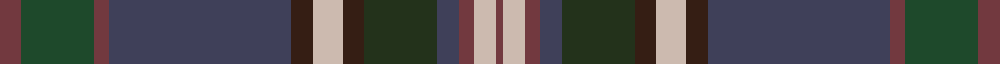

In pattern [BGBBBYBGBBYB](/stripes/bgbbbybgbbyb/).

This was sourced from register-of-tartans.  It is a [12 stripe tartan](/stripes/stripes12/).

Original link https://www.tartanregister.gov.uk/tartanDetails.aspx?ref=10267

## Register references

External register numbers recorded for this tartan.

- Scottish Register of Tartans: [10267](https://www.tartanregister.gov.uk/tartanDetails.aspx?ref=10267)

## Thread count
DR/6 DG20 DR4 N50 Ka6 Na8 Ka6 K20 N6 DR4 Na6 DR/2

## Palette
Each colour and its ΔE from the base-6 reference it is a variant of.

| Colour | Shade | Base | ΔE (OKLab) |
|---|---|---|---|
| DG | <code style="background-color:#1E492B;">#1E492B</code> `#1E492B` | G <code style="background-color:#006100;">#006100</code> | 0.10 |
| DR | <code style="background-color:#72393F;">#72393F</code> `#72393F` | B <code style="background-color:#2A418A;">#2A418A</code> | 0.17 |
| K | <code style="background-color:#23321B;">#23321B</code> `#23321B` | G <code style="background-color:#006100;">#006100</code> | 0.16 |
| Ka | <code style="background-color:#351E14;">#351E14</code> `#351E14` | B <code style="background-color:#2A418A;">#2A418A</code> | 0.21 |
| N | <code style="background-color:#3F4059;">#3F4059</code> `#3F4059` | B <code style="background-color:#2A418A;">#2A418A</code> | 0.09 |
| Na | <code style="background-color:#CCBAAF;">#CCBAAF</code> `#CCBAAF` | Y <code style="background-color:#F2BF00;">#F2BF00</code> | 0.15 |

## Nearest tartans

The nearest existing variants by ΔTartan distance.

1. [Buglass](/setts/s13/lo3n1lo1n16do2n2do2n3do12do26ly2do3lb2~x2/) — ΔT 0.88
1. [Isle of Skye District Tartan Tartan Number: 2155. Earliest known date: 1993 The tartan was instigated and registered by Mrs Rosemary Nicolson Samios in 1992, an Australian of Skye descent, now living in Skye. It was selected through a worldwide competition won by Angus MacLeod from Lewis. Angus, a weaver by trade, produced the first commercial quantities in the traditional kilt weight in 1993 at Lochcarron Weavers in North Strome. The colours of the tartan depict those of the island, often called the 'Misty Isle'. Worn by the Torphican and Bathgate pipe band. (A patented design No. 0600930) See products available Copyright © Blair Urquhart, Comrie, 2015](/setts/s11/dy20dp2dy2dp2dy3dp8dg9g8y8dg1lr2~x2/) — ΔT 1.13
1. [McMeeken](/setts/s10/o7dg20y2dg4k5db4k2db20k3w1~x2/) — ΔT 1.15
1. [Giants Causeway, The](/setts/s13/n38y8t3n20y44k2g6k2y5w2t10y2k6/) — ΔT 1.20
1. [Bowhunter (Fashion)](/setts/s12/dp3y10dp2db25dy3o4dy3g10db3dp2o3dp1~x2/) — ΔT 1.21
1. [Kelvin Family (Personal)](/setts/s12/db9k2db4k2dr6o3dy2db2dr11dy23t1k8~x2/) — ΔT 1.25
1. [Little-Dowse Wedding](/setts/s8/do31lo6lr3db36do8dg60lo7t7~x2/) — ΔT 1.27
1. [Heartlands (Fashion)](/setts/s11/db4b1dt20db2dt2db18dg2db2dg22m2dp4~x2/) — ΔT 1.35
1. [Scottish Parliament (Official)](/setts/s12/y45y3dt7dr2dt7y3y4w2do36w2y11dt4/) — ΔT 1.37
1. [Carson of Rusco (Personal)](/setts/s13/dt36m2k3lb2k8lb2k3m2dg11g6dg4g4dg20~x2/) — ΔT 1.39

## Neighbour map

Every grey dot is one of 14299 variants placed by the first two principal components of the ΔTartan feature space (44% of its variance). Red is this tartan; blue dots are its nearest — click one to open its page.

<svg viewBox="0 0 640 380" role="img" style="max-width:100%;height:auto;border:1px solid #e0e0e0;border-radius:4px;display:block" xmlns="http://www.w3.org/2000/svg"><image href="/nn/cloud.v1.png" width="640" height="380"/><a href="/setts/s13/lo3n1lo1n16do2n2do2n3do12do26ly2do3lb2~x2/"><circle cx="280.9" cy="121.9" r="4" fill="#3465a4"><title>Buglass</title></circle></a><a href="/setts/s11/dy20dp2dy2dp2dy3dp8dg9g8y8dg1lr2~x2/"><circle cx="227.8" cy="154.9" r="4" fill="#3465a4"><title>Isle of Skye District Tartan Tartan Number: 2155. Earliest known date: 1993 The tartan was instigated and registered by Mrs Rosemary Nicolson Samios in 1992, an Australian of Skye descent, now living in Skye. It was selected through a worldwide competition won by Angus MacLeod from Lewis. Angus, a weaver by trade, produced the first commercial quantities in the traditional kilt weight in 1993 at Lochcarron Weavers in North Strome. The colours of the tartan depict those of the island, often called the 'Misty Isle'. Worn by the Torphican and Bathgate pipe band. (A patented design No. 0600930) See products available Copyright © Blair Urquhart, Comrie, 2015</title></circle></a><a href="/setts/s10/o7dg20y2dg4k5db4k2db20k3w1~x2/"><circle cx="253.0" cy="169.8" r="4" fill="#3465a4"><title>McMeeken</title></circle></a><a href="/setts/s13/n38y8t3n20y44k2g6k2y5w2t10y2k6/"><circle cx="282.6" cy="136.4" r="4" fill="#3465a4"><title>Giants Causeway, The</title></circle></a><a href="/setts/s12/dp3y10dp2db25dy3o4dy3g10db3dp2o3dp1~x2/"><circle cx="239.8" cy="124.1" r="4" fill="#3465a4"><title>Bowhunter (Fashion)</title></circle></a><a href="/setts/s12/db9k2db4k2dr6o3dy2db2dr11dy23t1k8~x2/"><circle cx="242.7" cy="150.0" r="4" fill="#3465a4"><title>Kelvin Family (Personal)</title></circle></a><a href="/setts/s8/do31lo6lr3db36do8dg60lo7t7~x2/"><circle cx="254.0" cy="176.9" r="4" fill="#3465a4"><title>Little-Dowse Wedding</title></circle></a><a href="/setts/s11/db4b1dt20db2dt2db18dg2db2dg22m2dp4~x2/"><circle cx="246.8" cy="150.7" r="4" fill="#3465a4"><title>Heartlands (Fashion)</title></circle></a><a href="/setts/s12/y45y3dt7dr2dt7y3y4w2do36w2y11dt4/"><circle cx="330.5" cy="139.8" r="4" fill="#3465a4"><title>Scottish Parliament (Official)</title></circle></a><a href="/setts/s13/dt36m2k3lb2k8lb2k3m2dg11g6dg4g4dg20~x2/"><circle cx="234.4" cy="146.5" r="4" fill="#3465a4"><title>Carson of Rusco (Personal)</title></circle></a><circle cx="252.1" cy="132.9" r="5" fill="#c00000"/></svg>

ID: /setts/s12/n3dg10n2dt25do3lr4do3dg10dt3n2lr3n1~x2/
