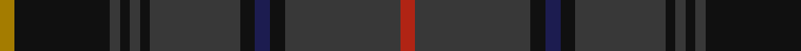

**Bands:** [RBKBKBKBKBKR](/stripes/rbkbkbkbkbkr/) · **Stripes:** [R DO K DB K DO K DO K DO K O](/stripes/stripes12/) R DO K DB K DO K DO K DO K O

This was sourced from register-of-tartans.  It is a [12 band tartan](/bands/bands12/).

Original link https://www.tartanregister.gov.uk/tartanDetails.aspx?ref=5772

## Attestations

This cloth appears in 2 source records; the oldest owns this page.

- 08/12/2008 — MacInnes Homecoming (register-of-tartans, [record](https://www.tartanregister.gov.uk/tartanDetails.aspx?ref=5772))
- Dec. 2008 — MacInnes Homecoming (Clan) (tartans-authority, [record](http://www.tartansauthority.com/tartan-ferret/display/7815/))

## Register references

External register numbers recorded for this tartan.

- Scottish Register of Tartans: [5772](https://www.tartanregister.gov.uk/tartanDetails.aspx?ref=5772)
- Scottish Tartans Authority (ITI): 7815

## Thread count
DY/6 K38 DN4 K4 DN4 K4 DN36 K6 DB6 K6 DN46 R/6

## Palette
Each colour and its ΔE from the base-6 reference it is a variant of.

| Colour | Shade | Base | ΔE (OKLab) |
|---|---|---|---|
| DB | <code style="background-color:#1C1C50;">#1C1C50</code> `#1C1C50` | B <code style="background-color:#2A418A;">#2A418A</code> | 0.14 |
| DN | <code style="background-color:#383838;">#383838</code> `#383838` | B <code style="background-color:#2A418A;">#2A418A</code> | 0.14 |
| DY | <code style="background-color:#A47C00;">#A47C00</code> `#A47C00` | R <code style="background-color:#CC0000;">#CC0000</code> | 0.20 |
| K | <code style="background-color:#101010;">#101010</code> `#101010` | K <code style="background-color:#000000;">#000000</code> | 0.17 |
| R | <code style="background-color:#B02414;">#B02414</code> `#B02414` | R <code style="background-color:#CC0000;">#CC0000</code> | 0.05 |

## Nearest tartans

The nearest existing variants by ΔTartan distance.

1. [Kingsbarns Golf Links](/setts/s10/dt8lo3k4g4k48dt48g4dt4r3k8/) — ΔT 1.33
1. [Lochcarron Mill (Corporate)](/setts/s15/k2do6k2do1k2do1k2do4k4k2do4k19r2k2r2~x4/) — ΔT 1.35
1. [Walker Hunting (Name)](/setts/s12/r4db2dg7db15dg3db3dg3db7dg28k7dg6k2~x2/) — ΔT 1.35
1. [Hardie](/setts/s10/dg9w2dg24dt37r3dt37dg24w2dg9m4~x2/) — ΔT 1.54
1. [New South Wales Waratah](/setts/s10/y12db2r2db2dt26dg2y3dg3y24r4~x2/) — ΔT 1.55
1. [Highland Granite](/setts/s10/do8y2do27k10n4k2n3k2n16do2~x2/) — ΔT 1.56
1. [Dublin, County](/setts/s12/dg3do3dg3do16dg3do3dg3dr5dg18r2dg8r3~x2/) — ΔT 1.59
1. [Spirit of Scotland](/setts/s11/dt19k4dt4db1dt1db1dt1dg5dp3k1dp4~x6/) — ΔT 1.60
1. [Peter of Lee (Chief) (Personal)](/setts/s14/db3k3db21dg29k2dg4r4dg4k2dg29db21k3db3ly3~x2/) — ΔT 1.61
1. [de Vere-Austin (Clan)](/setts/s11/dg14k8dg21k2lo5k2dg21k11db18k2r5~x2/) — ΔT 1.62

## Neighbour map

Every grey dot is one of 14313 variants placed by the first two principal components of the ΔTartan feature space (44% of its variance). Red is this tartan; blue dots are its nearest — click one to open its page.

<svg viewBox="0 0 640 380" role="img" style="max-width:100%;height:auto;border:1px solid #e0e0e0;border-radius:4px;display:block" xmlns="http://www.w3.org/2000/svg"><image href="/nn/cloud.v1.png" width="640" height="380"/><a href="/setts/s10/dt8lo3k4g4k48dt48g4dt4r3k8/"><circle cx="362.4" cy="184.5" r="4" fill="#3465a4"><title>Kingsbarns Golf Links</title></circle></a><a href="/setts/s15/k2do6k2do1k2do1k2do4k4k2do4k19r2k2r2~x4/"><circle cx="434.3" cy="191.6" r="4" fill="#3465a4"><title>Lochcarron Mill (Corporate)</title></circle></a><a href="/setts/s12/r4db2dg7db15dg3db3dg3db7dg28k7dg6k2~x2/"><circle cx="377.2" cy="211.5" r="4" fill="#3465a4"><title>Walker Hunting (Name)</title></circle></a><a href="/setts/s10/dg9w2dg24dt37r3dt37dg24w2dg9m4~x2/"><circle cx="353.4" cy="200.0" r="4" fill="#3465a4"><title>Hardie</title></circle></a><a href="/setts/s10/y12db2r2db2dt26dg2y3dg3y24r4~x2/"><circle cx="323.7" cy="184.2" r="4" fill="#3465a4"><title>New South Wales Waratah</title></circle></a><a href="/setts/s10/do8y2do27k10n4k2n3k2n16do2~x2/"><circle cx="386.0" cy="231.2" r="4" fill="#3465a4"><title>Highland Granite</title></circle></a><a href="/setts/s12/dg3do3dg3do16dg3do3dg3dr5dg18r2dg8r3~x2/"><circle cx="393.5" cy="249.3" r="4" fill="#3465a4"><title>Dublin, County</title></circle></a><a href="/setts/s11/dt19k4dt4db1dt1db1dt1dg5dp3k1dp4~x6/"><circle cx="418.7" cy="191.7" r="4" fill="#3465a4"><title>Spirit of Scotland</title></circle></a><a href="/setts/s14/db3k3db21dg29k2dg4r4dg4k2dg29db21k3db3ly3~x2/"><circle cx="331.1" cy="172.9" r="4" fill="#3465a4"><title>Peter of Lee (Chief) (Personal)</title></circle></a><a href="/setts/s11/dg14k8dg21k2lo5k2dg21k11db18k2r5~x2/"><circle cx="302.8" cy="233.1" r="4" fill="#3465a4"><title>de Vere-Austin (Clan)</title></circle></a><circle cx="386.0" cy="201.2" r="5" fill="#c00000"/></svg>

ID: /setts/s12/o3k19do2k2do2k2do18k3db3k3do23r3~x2/
