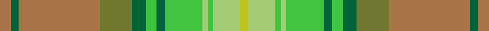

In pattern [RGRGGYGYYYYY](/stripes/rgrggygyyyyy/).

This was sourced from register-of-tartans.  It is a [12 stripe tartan](/stripes/stripes12/).

Original link https://www.tartanregister.gov.uk/tartanDetails.aspx?ref=3783

## Attestations

This cloth appears in 2 source records; the oldest owns this page.

- 01/01/2007 — Shrek (register-of-tartans, [record](https://www.tartanregister.gov.uk/tartanDetails.aspx?ref=3783))
- 2009 — Shrek (Fashion) (tartans-authority, [record](http://www.tartansauthority.com/tartan-ferret/display/7259/))

## Register references

External register numbers recorded for this tartan.

- Scottish Register of Tartans: [3783](https://www.tartanregister.gov.uk/tartanDetails.aspx?ref=3783)
- Scottish Tartans Authority (ITI): 7259

## Thread count
LT/8 G6 LT60 Gb24 G10 LGa8 G6 LGa28 LG4 LGa4 LG20 Y/6

## Palette
Each colour and the base-6 reference it is a variant of.

| Colour | Shade | Base |
|---|---|---|
| DY | <code style="background-color:#B09C00;">#B09C00</code> `oklch(68.9% 0.143 100.1)` <small>#B09C00</small> | Y <code style="background-color:#F2BF00;">#F2BF00</code> |
| G | <code style="background-color:#006438;">#006438</code> `oklch(44.2% 0.108 155.6)` <small>#006438</small> | G <code style="background-color:#006100;">#006100</code> |
| Ga | <code style="background-color:#087020;">#087020</code> `oklch(47.5% 0.144 145.4)` <small>#087020</small> | G <code style="background-color:#006100;">#006100</code> |
| Gb | <code style="background-color:#707830;">#707830</code> `oklch(55.0% 0.096 114.9)` <small>#707830</small> | G <code style="background-color:#006100;">#006100</code> |
| K | <code style="background-color:#283C24;">#283C24</code> `oklch(33.2% 0.048 140.3)` <small>#283C24</small> | G <code style="background-color:#006100;">#006100</code> |
| LG | <code style="background-color:#A4CC74;">#A4CC74</code> `oklch(79.6% 0.123 128.9)` <small>#A4CC74</small> | Y <code style="background-color:#F2BF00;">#F2BF00</code> |
| LGa | <code style="background-color:#40C440;">#40C440</code> `oklch(72.2% 0.206 143.1)` <small>#40C440</small> | Y <code style="background-color:#F2BF00;">#F2BF00</code> |
| LT | <code style="background-color:#A87448;">#A87448</code> `oklch(60.3% 0.089 60.2)` <small>#A87448</small> | R <code style="background-color:#CC0000;">#CC0000</code> |
| Y | <code style="background-color:#BCC41C;">#BCC41C</code> `oklch(78.8% 0.170 112.7)` <small>#BCC41C</small> | Y <code style="background-color:#F2BF00;">#F2BF00</code> |

## Nearest tartans

The nearest existing variants by ΔTartan distance.

1. [Braemar House Corporate Tartan Tartan Number: 908. Earliest known date: 1987 The Lords Kilmarnock are descended from both the Hays (the Earls of Errol), and the Stewarts and the design incorporates elements from the Hay-Leith tartan (the red section) and the Hunting Stewart (the green section) with minor alterations to each. The representation here follows the count registered with Lord Lyon on 7th March 1956. The Boyd family are closely associated with the town of Kilmarnock in the South West of the Scottish Lowlands. See products available Copyright © Blair Urquhart, Comrie, 2015](/setts/s7/g3dy2g12y12w1g1ly3~x2/) — ΔT 1.55
1. [Braemar House](/setts/s7/g3o2g12y12w1g1ly3~x2/) — ΔT 1.66
1. [O'Monaghan (Personal)](/setts/s10/y25w2t4lo7t4w2lo25w2t4lo7~x2/) — ΔT 1.75
1. [O'Monaghan (Personal)](/setts/s18/y25w2t4lo7t4w2lo25w2t4lo7~x2/) — ΔT 1.82
1. [Royal Pharmaceutical, Society](/setts/s9/o3lb2g19lb6g2lb6o14m4w2~x2/) — ΔT 1.87
1. [Keogh (Name?)](/setts/s8/g29k4g6lo4g28lo28k1lb5~x2/) — ΔT 1.92
1. [Green Thistle](/setts/s17/w3dg15lr12ly1lr1ly1lr1ly1lr1ly1lr1ly1lr1ly3ly3ly15w3~x2/) — ΔT 1.93
1. [State Seal of Mississippi (Fashion)](/setts/s9/y48o26lb5dy7lb10y3b7o10r3~x2/) — ΔT 1.96
1. [Bouguet, Adrian Dress (Personal)](/setts/s11/lb16g5lr20lb3g3lb3lr4y14lr2lb2r1~x2/) — ΔT 1.97
1. [Macallan (1980s) (Corporate)](/setts/s13/g16g3g4g6g24g2lo24lo3b24lo6b4lo3b16~x2/) — ΔT 1.98

## Neighbour map

Every grey dot is one of 14299 variants placed by the first two principal components of the ΔTartan feature space (44% of its variance). Red is this tartan; blue dots are its nearest — click one to open its page.

<svg viewBox="0 0 640 380" role="img" style="max-width:100%;height:auto;border:1px solid #e0e0e0;border-radius:4px;display:block" xmlns="http://www.w3.org/2000/svg"><image href="/nn/cloud.v1.png" width="640" height="380"/><a href="/setts/s7/g3dy2g12y12w1g1ly3~x2/"><circle cx="206.1" cy="188.6" r="4" fill="#3465a4"><title>Braemar House Corporate Tartan Tartan Number: 908. Earliest known date: 1987 The Lords Kilmarnock are descended from both the Hays (the Earls of Errol), and the Stewarts and the design incorporates elements from the Hay-Leith tartan (the red section) and the Hunting Stewart (the green section) with minor alterations to each. The representation here follows the count registered with Lord Lyon on 7th March 1956. The Boyd family are closely associated with the town of Kilmarnock in the South West of the Scottish Lowlands. See products available Copyright © Blair Urquhart, Comrie, 2015</title></circle></a><a href="/setts/s7/g3o2g12y12w1g1ly3~x2/"><circle cx="224.5" cy="198.7" r="4" fill="#3465a4"><title>Braemar House</title></circle></a><a href="/setts/s10/y25w2t4lo7t4w2lo25w2t4lo7~x2/"><circle cx="212.4" cy="171.2" r="4" fill="#3465a4"><title>O'Monaghan (Personal)</title></circle></a><a href="/setts/s18/y25w2t4lo7t4w2lo25w2t4lo7~x2/"><circle cx="214.5" cy="134.0" r="4" fill="#3465a4"><title>O'Monaghan (Personal)</title></circle></a><a href="/setts/s9/o3lb2g19lb6g2lb6o14m4w2~x2/"><circle cx="155.0" cy="164.4" r="4" fill="#3465a4"><title>Royal Pharmaceutical, Society</title></circle></a><a href="/setts/s8/g29k4g6lo4g28lo28k1lb5~x2/"><circle cx="194.8" cy="140.8" r="4" fill="#3465a4"><title>Keogh (Name?)</title></circle></a><a href="/setts/s17/w3dg15lr12ly1lr1ly1lr1ly1lr1ly1lr1ly1lr1ly3ly3ly15w3~x2/"><circle cx="202.7" cy="109.0" r="4" fill="#3465a4"><title>Green Thistle</title></circle></a><a href="/setts/s9/y48o26lb5dy7lb10y3b7o10r3~x2/"><circle cx="242.6" cy="140.2" r="4" fill="#3465a4"><title>State Seal of Mississippi (Fashion)</title></circle></a><a href="/setts/s11/lb16g5lr20lb3g3lb3lr4y14lr2lb2r1~x2/"><circle cx="194.0" cy="126.5" r="4" fill="#3465a4"><title>Bouguet, Adrian Dress (Personal)</title></circle></a><a href="/setts/s13/g16g3g4g6g24g2lo24lo3b24lo6b4lo3b16~x2/"><circle cx="174.3" cy="171.8" r="4" fill="#3465a4"><title>Macallan (1980s) (Corporate)</title></circle></a><circle cx="202.8" cy="145.4" r="5" fill="#c00000"/></svg>

ID: /setts/s12/o4g3o30y12g5lg4g3lg14lg2lg2lg10ly3~x2/
