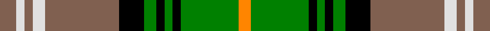

This page is one **sett** — a single exact thread-count. It belongs to the [tartan](/tartans/lt4ln2lt2ln3lt18k6g3k2g2k2g14o3/)
(the same proportion at any scale), whose colour order is pattern [RWRWRKGKGKGY](/stripes/rwrwrkgkgkgy/).

Sourced from weddslist.  It is a [12 stripe tartan](/stripes/stripes12/).

Original link http://www.weddslist.com/cgi-bin/tartans/pg.pl?source=sts

## Thread count
LT/8 LN4 LT4 LN6 LT36 K12 G6 K4 G4 K4 G28 O/6

## Palette
Each colour and the base-6 reference it is a variant of.

| Colour | Shade | Base |
|---|---|---|
| G | <code style="background-color:#008000;">#008000</code> `oklch(52.0% 0.177 142.5)` <small>#008000</small> | G <code style="background-color:#006100;">#006100</code> |
| K | <code style="background-color:#000000;">#000000</code> `oklch(0.0% 0.000 0.0)` <small>#000000</small> | K <code style="background-color:#000000;">#000000</code> |
| LN | <code style="background-color:#E0E0E0;">#E0E0E0</code> `oklch(90.7% 0.000 89.9)` <small>#E0E0E0</small> | W <code style="background-color:#F7F7F7;">#F7F7F7</code> |
| LT | <code style="background-color:#806050;">#806050</code> `oklch(51.7% 0.049 47.8)` <small>#806050</small> | R <code style="background-color:#CC0000;">#CC0000</code> |
| O | <code style="background-color:#FF8500;">#FF8500</code> `oklch(74.0% 0.183 55.1)` <small>#FF8500</small> | Y <code style="background-color:#F2BF00;">#F2BF00</code> |

## Nearest tartans

The nearest existing variants by ΔTartan distance, with this tartan at the top so the swatches line up against it.

ΔTartan

Tartan

Sett

—

<a href="/ttd/edit/#slug=o4w2o2w3o18k6g3k2g2k2g14lo3~x2">Dorcas, Check</a> <a class="nn-out" href="/setts/s12/o4w2o2w3o18k6g3k2g2k2g14lo3~x2/" title="open its dictionary page">↗</a>

0.77

<a href="/ttd/edit/#slug=w1k1ly1dg8k1lr1w8lr1k8lr1w1dg8lr1w1~x6">Praetorian, Green (Fashion)</a> <a class="nn-out" href="/setts/s14/w1k1ly1dg8k1lr1w8lr1k8lr1w1dg8lr1w1~x6/" title="open its dictionary page">↗</a>

0.79

<a href="/ttd/edit/#slug=g22r4g2r2g2r4g12k12r2db10r4db4ly3~x2">Cochrane, -1974</a> <a class="nn-out" href="/setts/s13/g22r4g2r2g2r4g12k12r2db10r4db4ly3~x2/" title="open its dictionary page">↗</a>

0.82

<a href="/ttd/edit/#slug=dy4w2dy2w3dy18k6g3k2g2k2g14lo3~x2">Dorcas Check</a> <a class="nn-out" href="/setts/s12/dy4w2dy2w3dy18k6g3k2g2k2g14lo3~x2/" title="open its dictionary page">↗</a>

0.99

<a href="/ttd/edit/#slug=db1r1db8k3g8r1g1r1g8k3w10r1w1~x4">Blair, dress</a> <a class="nn-out" href="/setts/s13/db1r1db8k3g8r1g1r1g8k3w10r1w1~x4/" title="open its dictionary page">↗</a>

1.02

<a href="/ttd/edit/#slug=g5dt2g17ly2db5ly2r5db17g2ly4~x2">Antrim Irish County Tartan Tartan Number: 2282. Earliest known date: 1993 One of a series of Irish District tartans designed by Polly Wittering of the House of Edgar, with colours reminiscent of the Country with soft warm colours dominating. See products available Copyright © Blair Urquhart, Comrie, 2015</a> <a class="nn-out" href="/setts/s10/g5dt2g17ly2db5ly2r5db17g2ly4~x2/" title="open its dictionary page">↗</a>

1.03

<a href="/ttd/edit/#slug=lb3k1g12k1g1k2g1k6lb12k1lo1~x4">MacCandlish Arisaid Green</a> <a class="nn-out" href="/setts/s11/lb3k1g12k1g1k2g1k6lb12k1lo1~x4/" title="open its dictionary page">↗</a>

1.04

<a href="/ttd/edit/#slug=dr6ly4dr3db2dr5db2dr3db2g15r3db2~x2">Limerick</a> <a class="nn-out" href="/setts/s11/dr6ly4dr3db2dr5db2dr3db2g15r3db2~x2/" title="open its dictionary page">↗</a>

1.07

<a href="/ttd/edit/#slug=r4g8db24k4w4k4g24k3g3k3g3w24g4~x2">MacInnes, dress</a> <a class="nn-out" href="/setts/s13/r4g8db24k4w4k4g24k3g3k3g3w24g4~x2/" title="open its dictionary page">↗</a>

1.10

<a href="/ttd/edit/#slug=w2lo14ly3k6w2k2w2k2g8lo6k2lo3w1~x2">O'Farrell (Name)</a> <a class="nn-out" href="/setts/s13/w2lo14ly3k6w2k2w2k2g8lo6k2lo3w1~x2/" title="open its dictionary page">↗</a>

1.11

<a href="/ttd/edit/#slug=o9k2o2r2g6k1ly1k1g6r3~x2">MacAart</a> <a class="nn-out" href="/setts/s10/o9k2o2r2g6k1ly1k1g6r3~x2/" title="open its dictionary page">↗</a>

## Neighbour map

Every grey dot is one of 14299 variants placed by the first two principal components of the ΔTartan feature space (44% of its variance). Red is this tartan; blue dots are its nearest — click one to open its page.

<svg viewBox="0 0 640 380" role="img" style="max-width:100%;height:auto;border:1px solid #e0e0e0;border-radius:4px;display:block" xmlns="http://www.w3.org/2000/svg"><image href="/nn/cloud.v1.png" width="640" height="380"/><a href="/setts/s14/w1k1ly1dg8k1lr1w8lr1k8lr1w1dg8lr1w1~x6/"><circle cx="127.4" cy="130.8" r="4" fill="#3465a4"><title>Praetorian, Green (Fashion)</title></circle></a><a href="/setts/s13/g22r4g2r2g2r4g12k12r2db10r4db4ly3~x2/"><circle cx="177.8" cy="144.7" r="4" fill="#3465a4"><title>Cochrane, -1974</title></circle></a><a href="/setts/s12/dy4w2dy2w3dy18k6g3k2g2k2g14lo3~x2/"><circle cx="171.7" cy="155.1" r="4" fill="#3465a4"><title>Dorcas Check</title></circle></a><a href="/setts/s13/db1r1db8k3g8r1g1r1g8k3w10r1w1~x4/"><circle cx="106.5" cy="133.1" r="4" fill="#3465a4"><title>Blair, dress</title></circle></a><a href="/setts/s10/g5dt2g17ly2db5ly2r5db17g2ly4~x2/"><circle cx="156.2" cy="161.6" r="4" fill="#3465a4"><title>Antrim Irish County Tartan Tartan Number: 2282. Earliest known date: 1993 One of a series of Irish District tartans designed by Polly Wittering of the House of Edgar, with colours reminiscent of the Country with soft warm colours dominating. See products available Copyright © Blair Urquhart, Comrie, 2015</title></circle></a><a href="/setts/s11/lb3k1g12k1g1k2g1k6lb12k1lo1~x4/"><circle cx="143.0" cy="127.3" r="4" fill="#3465a4"><title>MacCandlish Arisaid Green</title></circle></a><a href="/setts/s11/dr6ly4dr3db2dr5db2dr3db2g15r3db2~x2/"><circle cx="141.2" cy="174.8" r="4" fill="#3465a4"><title>Limerick</title></circle></a><a href="/setts/s13/r4g8db24k4w4k4g24k3g3k3g3w24g4~x2/"><circle cx="112.4" cy="138.5" r="4" fill="#3465a4"><title>MacInnes, dress</title></circle></a><a href="/setts/s13/w2lo14ly3k6w2k2w2k2g8lo6k2lo3w1~x2/"><circle cx="166.0" cy="129.9" r="4" fill="#3465a4"><title>O'Farrell (Name)</title></circle></a><a href="/setts/s10/o9k2o2r2g6k1ly1k1g6r3~x2/"><circle cx="147.0" cy="175.0" r="4" fill="#3465a4"><title>MacAart</title></circle></a><circle cx="150.5" cy="143.3" r="5" fill="#c00000"/></svg>

ID: /setts/s12/o4w2o2w3o18k6g3k2g2k2g14lo3~x2/
