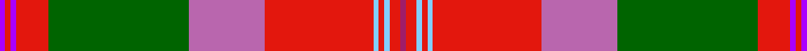

In pattern [BRBRGRRWRWRR](/stripes/brbrgrrwrwrr/).

This was sourced from register-of-tartans.  It is a [12 stripe tartan](/stripes/stripes12/).

Original link https://www.tartanregister.gov.uk/tartanDetails.aspx?ref=10247

## Register references

External register numbers recorded for this tartan.

- Scottish Register of Tartans: [10247](https://www.tartanregister.gov.uk/tartanDetails.aspx?ref=10247)

## Thread count
P/2 R2 P2 R12 G52 Pa28 R40 LB2 R2 LB2 R4 Ra/2

## Palette
Each colour and its ΔE from the base-6 reference it is a variant of.

| Colour | Shade | Base | ΔE (OKLab) |
|---|---|---|---|
| G | <code style="background-color:#006400;">#006400</code> `#006400` | G <code style="background-color:#006100;">#006100</code> | 0.01 |
| LB | <code style="background-color:#82CFFD;">#82CFFD</code> `#82CFFD` | W <code style="background-color:#F7F7F7;">#F7F7F7</code> | 0.18 |
| P | <code style="background-color:#AA00FF;">#AA00FF</code> `#AA00FF` | B <code style="background-color:#2A418A;">#2A418A</code> | 0.28 |
| Pa | <code style="background-color:#B966AE;">#B966AE</code> `#B966AE` | R <code style="background-color:#CC0000;">#CC0000</code> | 0.21 |
| R | <code style="background-color:#E3170D;">#E3170D</code> `#E3170D` | R <code style="background-color:#CC0000;">#CC0000</code> | 0.05 |
| Ra | <code style="background-color:#A01D69;">#A01D69</code> `#A01D69` | R <code style="background-color:#CC0000;">#CC0000</code> | 0.14 |

## Nearest tartans

The nearest existing variants by ΔTartan distance.

1. [Holyrood, Chair](/setts/s13/r34w1db10g10w1ly1g2t2w1db2t10r6w1~x2/) — ΔT 0.93
1. [MacLean of Duart #5](/setts/s11/t14k8ly2k3w4k3dg21r48t4r5k3~x2/) — ΔT 1.01
1. [Mehrtens variant (Personal)](/setts/s14/w4dt4r18o4r1o36k1o4k6r2k6r6ly4r2~x2/) — ΔT 1.01
1. [Mehrtens (Personal)](/setts/s16/w4dt4r18o4r1o36k1o4k6r2k6r6k2r6ly4r2~x2/) — ΔT 1.01
1. [Scobie (Name)](/setts/s12/dp1r1dp1r6g26dp14r20t1r1t1r2lr1~x2/) — ΔT 1.09
1. [MacGlashan Clan Tartan Tartan Number: 656. Earliest known date: 1982 Author an historian, Dr Philip Smith, lives in the USA and provides up to date information of new designs of tartan produced in the Americas. MacGlashan is associated with Clan MacKintosh or Clan Stewart. See products available Copyright © Blair Urquhart, Comrie, 2015](/setts/s16/r25do3w2lo25w3ly5r4do2r4ly5w3db4do5r6w1db1~x2/) — ΔT 1.11
1. [MacGlashan](/setts/s16/r25dr3w2o25w3ly5r4dr2r4ly5w3db4dr5r6w1db1~x2/) — ΔT 1.13
1. [Sommerville](/setts/s18/w2r3r6r48db4r2g16r5r3r5db20r5g3r5g54r3r5ly2~x2/) — ΔT 1.13
1. [Westwood (Fashion?)](/setts/s10/r15lo30k1w6k1lo2dg16t4r6w1~x2/) — ΔT 1.13
1. [MacLean of Duart #2](/setts/s11/t8k4ly1k2w3k2dg12r24t2r3k2~x2/) — ΔT 1.13

## Neighbour map

Every grey dot is one of 14299 variants placed by the first two principal components of the ΔTartan feature space (44% of its variance). Red is this tartan; blue dots are its nearest — click one to open its page.

<svg viewBox="0 0 640 380" role="img" style="max-width:100%;height:auto;border:1px solid #e0e0e0;border-radius:4px;display:block" xmlns="http://www.w3.org/2000/svg"><image href="/nn/cloud.v1.png" width="640" height="380"/><a href="/setts/s13/r34w1db10g10w1ly1g2t2w1db2t10r6w1~x2/"><circle cx="286.4" cy="56.8" r="4" fill="#3465a4"><title>Holyrood, Chair</title></circle></a><a href="/setts/s11/t14k8ly2k3w4k3dg21r48t4r5k3~x2/"><circle cx="233.6" cy="74.5" r="4" fill="#3465a4"><title>MacLean of Duart #5</title></circle></a><a href="/setts/s14/w4dt4r18o4r1o36k1o4k6r2k6r6ly4r2~x2/"><circle cx="249.8" cy="51.6" r="4" fill="#3465a4"><title>Mehrtens variant (Personal)</title></circle></a><a href="/setts/s16/w4dt4r18o4r1o36k1o4k6r2k6r6k2r6ly4r2~x2/"><circle cx="234.9" cy="45.4" r="4" fill="#3465a4"><title>Mehrtens (Personal)</title></circle></a><a href="/setts/s12/dp1r1dp1r6g26dp14r20t1r1t1r2lr1~x2/"><circle cx="279.9" cy="95.8" r="4" fill="#3465a4"><title>Scobie (Name)</title></circle></a><a href="/setts/s16/r25do3w2lo25w3ly5r4do2r4ly5w3db4do5r6w1db1~x2/"><circle cx="199.9" cy="58.2" r="4" fill="#3465a4"><title>MacGlashan Clan Tartan Tartan Number: 656. Earliest known date: 1982 Author an historian, Dr Philip Smith, lives in the USA and provides up to date information of new designs of tartan produced in the Americas. MacGlashan is associated with Clan MacKintosh or Clan Stewart. See products available Copyright © Blair Urquhart, Comrie, 2015</title></circle></a><a href="/setts/s16/r25dr3w2o25w3ly5r4dr2r4ly5w3db4dr5r6w1db1~x2/"><circle cx="206.0" cy="61.6" r="4" fill="#3465a4"><title>MacGlashan</title></circle></a><a href="/setts/s18/w2r3r6r48db4r2g16r5r3r5db20r5g3r5g54r3r5ly2~x2/"><circle cx="231.8" cy="55.1" r="4" fill="#3465a4"><title>Sommerville</title></circle></a><a href="/setts/s10/r15lo30k1w6k1lo2dg16t4r6w1~x2/"><circle cx="208.8" cy="86.7" r="4" fill="#3465a4"><title>Westwood (Fashion?)</title></circle></a><a href="/setts/s11/t8k4ly1k2w3k2dg12r24t2r3k2~x2/"><circle cx="206.0" cy="80.0" r="4" fill="#3465a4"><title>MacLean of Duart #2</title></circle></a><circle cx="245.9" cy="70.3" r="5" fill="#c00000"/></svg>

ID: /setts/s12/p1r1p1r6g26m14r20lt1r1lt1r2m1~x2/
