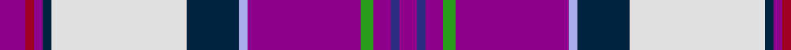

In pattern [BBBGBWBWBBRB](/stripes/bbbgbwbwbbrb/).

This was sourced from house-of-tartan.  It is a [12 stripe tartan](/stripes/stripes12/).

Original link http://www.house-of-tartan.scotland.net/house/TartanViewjs.asp?colr=Def&tnam=6553

## Thread count
P/12 DR4 P4 DN4 LN62 DN24 LP4 P52 G6 P8 DB4 P/8

## Palette
Each colour and its ΔE from the base-6 reference it is a variant of.

| Colour | Shade | Base | ΔE (OKLab) |
|---|---|---|---|
| DB | <code style="background-color:#2C2C80;">#2C2C80</code> `#2C2C80` | B <code style="background-color:#2A418A;">#2A418A</code> | 0.06 |
| DN | <code style="background-color:#002440;">#002440</code> `#002440` | B <code style="background-color:#2A418A;">#2A418A</code> | 0.16 |
| DR | <code style="background-color:#A00024;">#A00024</code> `#A00024` | R <code style="background-color:#CC0000;">#CC0000</code> | 0.10 |
| G | <code style="background-color:#289C18;">#289C18</code> `#289C18` | G <code style="background-color:#006100;">#006100</code> | 0.19 |
| LN | <code style="background-color:#E0E0E0;">#E0E0E0</code> `#E0E0E0` | W <code style="background-color:#F7F7F7;">#F7F7F7</code> | 0.07 |
| LP | <code style="background-color:#A8ACE8;">#A8ACE8</code> `#A8ACE8` | W <code style="background-color:#F7F7F7;">#F7F7F7</code> | 0.23 |
| P | <code style="background-color:#8C008C;">#8C008C</code> `#8C008C` | B <code style="background-color:#2A418A;">#2A418A</code> | 0.19 |

## Nearest tartans

The nearest existing variants by ΔTartan distance.

1. [MacDonald of Glencoe (Dance)](/setts/s12/dp6r2dp2db2w35db12o2dp25g3dp4db2dp4~x2/) — ΔT 0.90
1. [Lieuwen (2013)](/setts/s11/dp10db1dp2db1lg1db1lg2lp2lg1k1ly2~x10/) — ΔT 1.56
1. [Arctic](/setts/s12/b1w6lb1w1lb2r2g2k2w1b2db16w1~x4/) — ΔT 1.62
1. [MacLean of Duart Dress #5](/setts/s12/t12db2k4ly2k3m3k3m19w31db2w4k2~x2/) — ΔT 1.65
1. [Praetorian Imperator](/setts/s14/w1dp1ly1p8k1lb1w8lb1k8lb1w1p8lb1w1~x6/) — ΔT 1.66
1. [Scotland's Charity Air Ambulance](/setts/s9/w2b27k1g3k1n10k1r24w2~x2/) — ΔT 1.66
1. [Hogeboom (Toronto) (Personal)](/setts/s9/g4y3g9b14ly8b2r35lp2r3~x2/) — ΔT 1.67
1. [Selkirk High (Corporate)](/setts/s10/w3m18k18ly1r2b2r2ly1m18b2~x2/) — ΔT 1.70
1. [MacLean, dress Burgundy](/setts/s12/t12db2k4ly2k3r3k3r19w31db2w4k2~x2/) — ΔT 1.72
1. [Saltcoats (Fashion)](/setts/s12/dp5w1k1b14k1r12k1b14k1r5k1ly3~x2/) — ΔT 1.72

## Neighbour map

Every grey dot is one of 14299 variants placed by the first two principal components of the ΔTartan feature space (44% of its variance). Red is this tartan; blue dots are its nearest — click one to open its page.

<svg viewBox="0 0 640 380" role="img" style="max-width:100%;height:auto;border:1px solid #e0e0e0;border-radius:4px;display:block" xmlns="http://www.w3.org/2000/svg"><image href="/nn/cloud.v1.png" width="640" height="380"/><a href="/setts/s12/dp6r2dp2db2w35db12o2dp25g3dp4db2dp4~x2/"><circle cx="192.4" cy="72.9" r="4" fill="#3465a4"><title>MacDonald of Glencoe (Dance)</title></circle></a><a href="/setts/s11/dp10db1dp2db1lg1db1lg2lp2lg1k1ly2~x10/"><circle cx="214.7" cy="116.6" r="4" fill="#3465a4"><title>Lieuwen (2013)</title></circle></a><a href="/setts/s12/b1w6lb1w1lb2r2g2k2w1b2db16w1~x4/"><circle cx="144.6" cy="60.0" r="4" fill="#3465a4"><title>Arctic</title></circle></a><a href="/setts/s12/t12db2k4ly2k3m3k3m19w31db2w4k2~x2/"><circle cx="153.4" cy="75.2" r="4" fill="#3465a4"><title>MacLean of Duart Dress #5</title></circle></a><a href="/setts/s14/w1dp1ly1p8k1lb1w8lb1k8lb1w1p8lb1w1~x6/"><circle cx="106.8" cy="98.6" r="4" fill="#3465a4"><title>Praetorian Imperator</title></circle></a><a href="/setts/s9/w2b27k1g3k1n10k1r24w2~x2/"><circle cx="205.2" cy="76.1" r="4" fill="#3465a4"><title>Scotland's Charity Air Ambulance</title></circle></a><a href="/setts/s9/g4y3g9b14ly8b2r35lp2r3~x2/"><circle cx="227.5" cy="102.1" r="4" fill="#3465a4"><title>Hogeboom (Toronto) (Personal)</title></circle></a><a href="/setts/s10/w3m18k18ly1r2b2r2ly1m18b2~x2/"><circle cx="261.2" cy="102.3" r="4" fill="#3465a4"><title>Selkirk High (Corporate)</title></circle></a><a href="/setts/s12/t12db2k4ly2k3r3k3r19w31db2w4k2~x2/"><circle cx="146.3" cy="73.8" r="4" fill="#3465a4"><title>MacLean, dress Burgundy</title></circle></a><a href="/setts/s12/dp5w1k1b14k1r12k1b14k1r5k1ly3~x2/"><circle cx="217.8" cy="113.6" r="4" fill="#3465a4"><title>Saltcoats (Fashion)</title></circle></a><circle cx="175.6" cy="64.2" r="5" fill="#c00000"/></svg>

ID: /setts/s12/p6r2p2dt2w31dt12lb2p26g3p4db2p4~x2/
