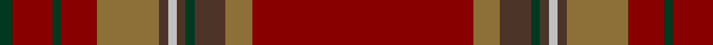

In pattern [GRGRGBWBGBGR](/patterns/grgrgbwbgbgr/).

This was sourced from register-of-tartans.  It is a [12 stripes tartan](/stripes/stripes12/).

Original link https://www.tartanregister.gov.uk/tartanDetails.aspx?ref=4178

## Attestations

This cloth appears in 2 source records; the oldest owns this page.

- 01/01/1996 — Tyrone, County (register-of-tartans, [record](https://www.tartanregister.gov.uk/tartanDetails.aspx?ref=4178))
- 1997 — Tyrone, County (District) (tartans-authority, [record](http://www.tartansauthority.com/tartan-ferret/display/2264/))

## Thread count
DG/6 DR18 DG4 DR16 LT28 T4 N4 T4 DG4 T14 LT12 DR/100

## Palette
Each colour and its ΔE from the base-6 reference it is a variant of.

| Colour | Shade | Base | ΔE (OKLab) |
|---|---|---|---|
| DG | <code style="background-color:#003820;">#003820</code> `#003820` | G <code style="background-color:#006400;">#006400</code> | 0.16 |
| DR | <code style="background-color:#880000;">#880000</code> `#880000` | R <code style="background-color:#C80000;">#C80000</code> | 0.14 |
| LT | <code style="background-color:#8C7038;">#8C7038</code> `#8C7038` | G <code style="background-color:#006400;">#006400</code> | 0.18 |
| N | <code style="background-color:#C0C0C0;">#C0C0C0</code> `#C0C0C0` | W <code style="background-color:#F4F4F0;">#F4F4F0</code> | 0.16 |
| T | <code style="background-color:#4C3428;">#4C3428</code> `#4C3428` | B <code style="background-color:#2C4084;">#2C4084</code> | 0.16 |

ID: /setts/s12/r100g12b14ga4b4w4b4g28r16ga4r18ga6-b4c3428-g8c7038-ga003820-r880000-wc0c0c0/
