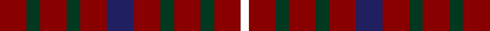

In pattern [KRGRGRBRGRGR](/stripes/krgrgrbrgrgr/).

This was sourced from register-of-tartans.  It is a [12 stripe tartan](/stripes/stripes12/).

Original link https://www.tartanregister.gov.uk/tartanDetails.aspx?ref=559

## Register references

External register numbers recorded for this tartan.

- Scottish Register of Tartans: [559](https://www.tartanregister.gov.uk/tartanDetails.aspx?ref=559)
- Scottish Tartans Authority (ITI): 3216
- Scottish Tartans World Register: 2970

## Thread count
DR/20 DG10 DR20 DG10 DR20 DB20 DR20 DG10 DR20 DG10 DR20 YY/6

## Palette
Each colour and the base-6 reference it is a variant of.

| Colour | Shade | Base |
|---|---|---|
| DB | <code style="background-color:#202060;">#202060</code> `oklch(28.9% 0.111 276.9)` <small>#202060</small> | B <code style="background-color:#2A418A;">#2A418A</code> |
| DG | <code style="background-color:#003820;">#003820</code> `oklch(30.0% 0.070 158.3)` <small>#003820</small> | G <code style="background-color:#006100;">#006100</code> |
| DR | <code style="background-color:#880000;">#880000</code> `oklch(39.4% 0.162 29.2)` <small>#880000</small> | R <code style="background-color:#CC0000;">#CC0000</code> |

## Nearest tartans

The nearest existing variants by ΔTartan distance, with this tartan at the top so the swatches line up against it.

ΔTartan

Tartan

Sett

—

<a href="/ttd/edit/#slug=r10dg5r10dg5r10db10r10dg5r10dg5r10k3~x2">Capricornica / Capricornia</a> <a class="nn-out" href="/setts/s12/r10dg5r10dg5r10db10r10dg5r10dg5r10k3~x2/" title="open its dictionary page">↗</a>

0.62

<a href="/ttd/edit/#slug=r10dg5r10dg5r10db10r10dg5r10dg5r10ly3~x2">Capricornica (Fashion)</a> <a class="nn-out" href="/setts/s12/r10dg5r10dg5r10db10r10dg5r10dg5r10ly3~x2/" title="open its dictionary page">↗</a>

2.42

<a href="/ttd/edit/#slug=r16t3r12k3r12k3r12lo3r12lo3~x2">Duffus Plaid, Lord</a> <a class="nn-out" href="/setts/s10/r16t3r12k3r12k3r12lo3r12lo3~x2/" title="open its dictionary page">↗</a>

2.50

<a href="/ttd/edit/#slug=r12dg14r4dg14r4dg14r4db8r5db8r12dg3r12~x2">Grant of Monymusk</a> <a class="nn-out" href="/setts/s13/r12dg14r4dg14r4dg14r4db8r5db8r12dg3r12~x2/" title="open its dictionary page">↗</a>

2.53

<a href="/ttd/edit/#slug=lr1r4dg1r1dg3r1dg3r1dg1r4ly1~x2">Bruce</a> <a class="nn-out" href="/setts/s11/lr1r4dg1r1dg3r1dg3r1dg1r4ly1~x2/" title="open its dictionary page">↗</a>

2.60

<a href="/ttd/edit/#slug=r3dg3r1db3r3~x12">Gow (Portrait)</a> <a class="nn-out" href="/setts/s5/r3dg3r1db3r3~x12/" title="open its dictionary page">↗</a>

2.61

<a href="/ttd/edit/#slug=r11k1k3r6k1r6k3r4k7r11db1r11k7db2k4~x2">James (Welsh Name)</a> <a class="nn-out" href="/setts/s15/r11k1k3r6k1r6k3r4k7r11db1r11k7db2k4~x2/" title="open its dictionary page">↗</a>

2.63

<a href="/ttd/edit/#slug=r5dg5lr1b2r5~x2">Menzies</a> <a class="nn-out" href="/setts/s5/r5dg5lr1b2r5~x2/" title="open its dictionary page">↗</a>

2.68

<a href="/ttd/edit/#slug=r9k1r5g6r4k2~x4">MacAn of Lurgyvallan (Hose)</a> <a class="nn-out" href="/setts/s6/r9k1r5g6r4k2~x4/" title="open its dictionary page">↗</a>

2.68

<a href="/ttd/edit/#slug=n11k4r4lo4n11~x4">Ikelman #3a (Personal)</a> <a class="nn-out" href="/setts/s5/n11k4r4lo4n11~x4/" title="open its dictionary page">↗</a>

2.70

<a href="/ttd/edit/#slug=r4k11n8dg2n8k13dg2k13r5k2~x2">Process Safety Solutions Ltd</a> <a class="nn-out" href="/setts/s10/r4k11n8dg2n8k13dg2k13r5k2~x2/" title="open its dictionary page">↗</a>

## Neighbour map

Every grey dot is one of 14299 variants placed by the first two principal components of the ΔTartan feature space (44% of its variance). Red is this tartan; blue dots are its nearest — click one to open its page.

<svg viewBox="0 0 640 380" role="img" style="max-width:100%;height:auto;border:1px solid #e0e0e0;border-radius:4px;display:block" xmlns="http://www.w3.org/2000/svg"><image href="/nn/cloud.v1.png" width="640" height="380"/><a href="/setts/s12/r10dg5r10dg5r10db10r10dg5r10dg5r10ly3~x2/"><circle cx="298.0" cy="294.0" r="4" fill="#3465a4"><title>Capricornica (Fashion)</title></circle></a><a href="/setts/s10/r16t3r12k3r12k3r12lo3r12lo3~x2/"><circle cx="324.9" cy="229.8" r="4" fill="#3465a4"><title>Duffus Plaid, Lord</title></circle></a><a href="/setts/s13/r12dg14r4dg14r4dg14r4db8r5db8r12dg3r12~x2/"><circle cx="231.1" cy="266.9" r="4" fill="#3465a4"><title>Grant of Monymusk</title></circle></a><a href="/setts/s11/lr1r4dg1r1dg3r1dg3r1dg1r4ly1~x2/"><circle cx="263.4" cy="239.9" r="4" fill="#3465a4"><title>Bruce</title></circle></a><a href="/setts/s5/r3dg3r1db3r3~x12/"><circle cx="240.9" cy="342.4" r="4" fill="#3465a4"><title>Gow (Portrait)</title></circle></a><a href="/setts/s15/r11k1k3r6k1r6k3r4k7r11db1r11k7db2k4~x2/"><circle cx="374.0" cy="205.4" r="4" fill="#3465a4"><title>James (Welsh Name)</title></circle></a><a href="/setts/s5/r5dg5lr1b2r5~x2/"><circle cx="275.5" cy="283.8" r="4" fill="#3465a4"><title>Menzies</title></circle></a><a href="/setts/s6/r9k1r5g6r4k2~x4/"><circle cx="421.7" cy="277.1" r="4" fill="#3465a4"><title>MacAn of Lurgyvallan (Hose)</title></circle></a><a href="/setts/s5/n11k4r4lo4n11~x4/"><circle cx="307.8" cy="315.3" r="4" fill="#3465a4"><title>Ikelman #3a (Personal)</title></circle></a><a href="/setts/s10/r4k11n8dg2n8k13dg2k13r5k2~x2/"><circle cx="294.1" cy="249.4" r="4" fill="#3465a4"><title>Process Safety Solutions Ltd</title></circle></a><circle cx="315.4" cy="304.2" r="5" fill="#c00000"/></svg>

ID: /setts/s12/r10dg5r10dg5r10db10r10dg5r10dg5r10k3~x2/
