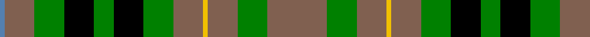

In pattern [BRGKGKGRYRGR](/patterns/brgkgkgryrgr/).

This was sourced from weddslist.  It is a [12 stripes tartan](/stripes/stripes12/).

Original link http://www.weddslist.com/cgi-bin/tartans/pg.pl?source=sts

## Thread count
B/2 LT12 G12 K12 G8 K12 G12 LT12 Y2 LT12 G12 LT/24

## Palette
Each colour and its ΔE from the base-6 reference it is a variant of.

| Colour | Shade | Base | ΔE (OKLab) |
|---|---|---|---|
| B | <code style="background-color:#5480B0;">#5480B0</code> `#5480B0` | B <code style="background-color:#2A418A;">#2A418A</code> | 0.19 |
| G | <code style="background-color:#008000;">#008000</code> `#008000` | G <code style="background-color:#006100;">#006100</code> | 0.10 |
| K | <code style="background-color:#000000;">#000000</code> `#000000` | K <code style="background-color:#000000;">#000000</code> | 0.00 |
| LT | <code style="background-color:#806050;">#806050</code> `#806050` | R <code style="background-color:#CC0000;">#CC0000</code> | 0.17 |
| Y | <code style="background-color:#F0C000;">#F0C000</code> `#F0C000` | Y <code style="background-color:#F2BF00;">#F2BF00</code> | 0.00 |

## Nearest tartans

The nearest existing variants by ΔTartan distance.

1. [Hibernian F.C.](/setts/s11/b3g6k9ga11w1ga11w1ga11k9g6b3~b800080-g003000-ga008000-k000000-we0e0e0~x4/) — ΔT 1.25
1. [Arrol Corporate Tartan Tartan Number: 1365. Earliest known date: c.1910 From James Johnston & Co. (Glasgow) pattern book covering 1863 to 1963. Designed early 20th century for Sir William Arrol, head of the engineering firm which built Forth Bridge, and of the Arrol-Johnston motor car company, but it is not clear whether it was intended as a corporate tartan or for his personal use. See products available Copyright © Blair Urquhart, Comrie, 2015](/setts/s9/r5b15k15g15w2g15k15g15w2~b2c2c80-g006818-k101010-rc80000-we0e0e0~x2/) — ΔT 1.35
1. [Arrol](/setts/s9/r5b15k15g15w2g15k15g15w2~b304080-g008000-k000000-rc00000-we0e0e0~x2/) — ΔT 1.45
1. [MacBride](/setts/s13/y3g15k15b15k2b15k15g15ba3g15k15g15y3~b304080-ba800070-g008000-k000000-yf0c000~x2/) — ΔT 1.51
1. [MacBride Family Tartan Tartan Number: 2153. Earliest known date: 1992 The family of MacBride, (from SaintBride or Brigid) are known to have been a sept of the MacDonalds. Head of the family, Mr Stuart C. MacBride, commissioned Mr Harry Lindley to create a MacBride tartan from the Ensigns Armorial recently granted by Lord Lyon. Mr MacBride is a member of the Weaver Incorporation of Aberdeen. Traditionally members of the family, as a courtesy, ask permission of the chief or head of the family before wearing his tartan. See products available Copyright © Blair Urquhart, Comrie, 2015](/setts/s13/y3g15k15b15k2b15k15g15r3g15k15g15y3~b2c2c80-g006818-k101010-rb468ac-ye8c000~x2/) — ΔT 1.53
1. [St Andrews Bay](/setts/s7/y30w4y20g20k20ya3k6~g006818-k101010-we0e0e0-ya08858-yad87c00~x2/) — ΔT 1.53
1. [Wilson's No.233](/setts/s12/b6k6g6w1g6k6g6w1g6k6b6ga1~b780078-g006818-ga5c6428-k101010-we0e0e0~x4/) — ΔT 1.55
1. [Kerry County, Crest Range](/setts/s10/r14b5g25b5w2g11b7w5g6r5~b080848-g005020-rc87814-we0e0e0~x2/) — ΔT 1.58
1. [MacDuff, hunting](/setts/s8/r8ra1r8g8k8b8r8ra2~b304080-g008000-k000000-r806050-rac00000~x2/) — ΔT 1.59
1. [Walker James](/setts/s10/r4k6b1g7k2g7b1k6r4g2~b5c8ca8-g006818-k101010-rc80000~x4/) — ΔT 1.59

## Neighbour map

Every grey dot is one of 15726 variants placed by the first two principal components of the ΔTartan feature space (44% of its variance). Red is this tartan; blue dots are its nearest — click one to open its page.

<svg viewBox="0 0 640 380" role="img" style="max-width:100%;height:auto;border:1px solid #e0e0e0;border-radius:4px;display:block" xmlns="http://www.w3.org/2000/svg"><image href="/nn/cloud.v1.png" width="640" height="380"/><a href="/setts/s11/b3g6k9ga11w1ga11w1ga11k9g6b3~b800080-g003000-ga008000-k000000-we0e0e0~x4/"><circle cx="151.9" cy="188.3" r="4" fill="#3465a4"><title>Hibernian F.C.</title></circle></a><a href="/setts/s9/r5b15k15g15w2g15k15g15w2~b2c2c80-g006818-k101010-rc80000-we0e0e0~x2/"><circle cx="162.5" cy="226.4" r="4" fill="#3465a4"><title>Arrol Corporate Tartan Tartan Number: 1365. Earliest known date: c.1910 From James Johnston &amp; Co. (Glasgow) pattern book covering 1863 to 1963. Designed early 20th century for Sir William Arrol, head of the engineering firm which built Forth Bridge, and of the Arrol-Johnston motor car company, but it is not clear whether it was intended as a corporate tartan or for his personal use. See products available Copyright © Blair Urquhart, Comrie, 2015</title></circle></a><a href="/setts/s9/r5b15k15g15w2g15k15g15w2~b304080-g008000-k000000-rc00000-we0e0e0~x2/"><circle cx="128.7" cy="215.2" r="4" fill="#3465a4"><title>Arrol</title></circle></a><a href="/setts/s13/y3g15k15b15k2b15k15g15ba3g15k15g15y3~b304080-ba800070-g008000-k000000-yf0c000~x2/"><circle cx="104.5" cy="203.0" r="4" fill="#3465a4"><title>MacBride</title></circle></a><a href="/setts/s13/y3g15k15b15k2b15k15g15r3g15k15g15y3~b2c2c80-g006818-k101010-rb468ac-ye8c000~x2/"><circle cx="141.5" cy="215.5" r="4" fill="#3465a4"><title>MacBride Family Tartan Tartan Number: 2153. Earliest known date: 1992 The family of MacBride, (from SaintBride or Brigid) are known to have been a sept of the MacDonalds. Head of the family, Mr Stuart C. MacBride, commissioned Mr Harry Lindley to create a MacBride tartan from the Ensigns Armorial recently granted by Lord Lyon. Mr MacBride is a member of the Weaver Incorporation of Aberdeen. Traditionally members of the family, as a courtesy, ask permission of the chief or head of the family before wearing his tartan. See products available Copyright © Blair Urquhart, Comrie, 2015</title></circle></a><a href="/setts/s7/y30w4y20g20k20ya3k6~g006818-k101010-we0e0e0-ya08858-yad87c00~x2/"><circle cx="197.2" cy="198.3" r="4" fill="#3465a4"><title>St Andrews Bay</title></circle></a><a href="/setts/s12/b6k6g6w1g6k6g6w1g6k6b6ga1~b780078-g006818-ga5c6428-k101010-we0e0e0~x4/"><circle cx="130.6" cy="226.9" r="4" fill="#3465a4"><title>Wilson's No.233</title></circle></a><a href="/setts/s10/r14b5g25b5w2g11b7w5g6r5~b080848-g005020-rc87814-we0e0e0~x2/"><circle cx="223.0" cy="184.7" r="4" fill="#3465a4"><title>Kerry County, Crest Range</title></circle></a><a href="/setts/s8/r8ra1r8g8k8b8r8ra2~b304080-g008000-k000000-r806050-rac00000~x2/"><circle cx="153.7" cy="229.5" r="4" fill="#3465a4"><title>MacDuff, hunting</title></circle></a><a href="/setts/s10/r4k6b1g7k2g7b1k6r4g2~b5c8ca8-g006818-k101010-rc80000~x4/"><circle cx="168.9" cy="229.9" r="4" fill="#3465a4"><title>Walker James</title></circle></a><circle cx="167.6" cy="192.6" r="5" fill="#c00000"/></svg>

ID: /setts/s12/r12g6r6y1r6g6k6g4k6g6r6b1~b5480b0-g008000-k000000-r806050-yf0c000~x2/
