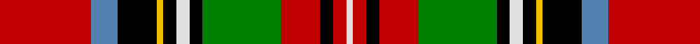

In pattern [RBKYKWKGRKRW](/stripes/rbkykwkgrkrw/).

This was sourced from weddslist.  It is a [12 stripe tartan](/stripes/stripes12/).

Original link http://www.weddslist.com/cgi-bin/tartans/pg.pl?source=sts

## Also known as

This cloth is also recorded under:

- Stewart, Prince Charles Edward

## Attestations

This cloth appears in 2 source records; the oldest owns this page.

- undated — Stewart, Prince Charles Edward (weddslist, [record](http://www.weddslist.com/cgi-bin/tartans/pg.pl?source=sts))
- undated — Stewart Prince Charles Edward Clan Tartan Tartan Number: 1371. Earliest known date: 1810-15 Also known as the Earl of Moray. A piece exists in the Highland Society of London collection (c.1815) in which the Yellow and White are in silk. The Prince' sett is identical with the Royal Stewart but for the much reduced red square. D.C.Stewart says, 'the tartan becomes richer to the point of congestion.' It is reputed to have been worn by the Prince at Holyrood. Worn by Kirkliston, Bowhill and Seafield, Kinross and District, Strathclyde Fire Brigade and Strathkelvin pipe bands. See products available Copyright © Blair Urquhart, Comrie, 2015 (house-of-tartan, [record](http://www.house-of-tartan.scotland.net/house/TartanViewjs.asp?colr=Def&tnam=1371))

## Thread count
R/28 B8 K12 Y2 K4 LN4 K4 G24 R12 K4 R4 LN/2

## Palette
Each colour and the base-6 reference it is a variant of.

| Colour | Shade | Base |
|---|---|---|
| B | <code style="background-color:#5480B0;">#5480B0</code> `oklch(58.8% 0.089 251.5)` <small>#5480B0</small> | B <code style="background-color:#2A418A;">#2A418A</code> |
| G | <code style="background-color:#008000;">#008000</code> `oklch(52.0% 0.177 142.5)` <small>#008000</small> | G <code style="background-color:#006100;">#006100</code> |
| K | <code style="background-color:#000000;">#000000</code> `oklch(0.0% 0.000 0.0)` <small>#000000</small> | K <code style="background-color:#000000;">#000000</code> |
| LN | <code style="background-color:#E0E0E0;">#E0E0E0</code> `oklch(90.7% 0.000 89.9)` <small>#E0E0E0</small> | W <code style="background-color:#F7F7F7;">#F7F7F7</code> |
| R | <code style="background-color:#C00000;">#C00000</code> `oklch(50.7% 0.208 29.2)` <small>#C00000</small> | R <code style="background-color:#CC0000;">#CC0000</code> |
| Y | <code style="background-color:#F0C000;">#F0C000</code> `oklch(82.7% 0.169 90.5)` <small>#F0C000</small> | Y <code style="background-color:#F2BF00;">#F2BF00</code> |

## Nearest tartans

The nearest existing variants by ΔTartan distance.

1. [Wilson's, No 226](/setts/s14/r25w4k4g25ly3k15t13r5t5r15g4r5k2g3~x2/) — ΔT 0.59
1. [Wilson's, No 90](/setts/s12/r19t13k16ly3k3w5k3g32k2r15t5r15~x2/) — ΔT 0.65
1. [MacLean of Duart 3](/setts/s11/t16k12ly4k4w6k4g32r50t6r8k3/) — ΔT 0.68
1. [Royal Stewart](/setts/s12/r20t14k17ly2k3w3k3g24r14k4r4w2~x2/) — ΔT 0.75
1. [MacLean](/setts/s12/db4lb1k3ly1dg1lb1k1dg8r12lb1r2k1~x2/) — ΔT 0.76
1. [MacLean of Duart 1](/setts/s11/t13k6ly2k3w4k3g22r31t3r4k2~x2/) — ΔT 0.80
1. [Wilson's No 181, (Stewart)](/setts/s15/r25t9k2t9k19ly3k3w5k3ly3g22r16g3r3g3~x2/) — ΔT 0.86
1. [Drummond - 1739 Lord John (Artefact)](/setts/s14/k20r6k4r6dg15w2y5w2dg15r30k4r5lb2r6~x2/) — ΔT 0.87
1. [Unnamed No 1](/setts/s11/r8t7k8ly2k1ly1g19k1r8t3r8~x2/) — ΔT 0.88
1. [Boyd](/setts/s12/w1k1r1g1r12k6db1k1db1k1g6ly1~x4/) — ΔT 0.91

## Neighbour map

Every grey dot is one of 14299 variants placed by the first two principal components of the ΔTartan feature space (44% of its variance). Red is this tartan; blue dots are its nearest — click one to open its page.

<svg viewBox="0 0 640 380" role="img" style="max-width:100%;height:auto;border:1px solid #e0e0e0;border-radius:4px;display:block" xmlns="http://www.w3.org/2000/svg"><image href="/nn/cloud.v1.png" width="640" height="380"/><a href="/setts/s14/r25w4k4g25ly3k15t13r5t5r15g4r5k2g3~x2/"><circle cx="126.3" cy="112.5" r="4" fill="#3465a4"><title>Wilson's, No 226</title></circle></a><a href="/setts/s12/r19t13k16ly3k3w5k3g32k2r15t5r15~x2/"><circle cx="123.1" cy="114.0" r="4" fill="#3465a4"><title>Wilson's, No 90</title></circle></a><a href="/setts/s11/t16k12ly4k4w6k4g32r50t6r8k3/"><circle cx="159.2" cy="94.4" r="4" fill="#3465a4"><title>MacLean of Duart 3</title></circle></a><a href="/setts/s12/r20t14k17ly2k3w3k3g24r14k4r4w2~x2/"><circle cx="100.5" cy="120.0" r="4" fill="#3465a4"><title>Royal Stewart</title></circle></a><a href="/setts/s12/db4lb1k3ly1dg1lb1k1dg8r12lb1r2k1~x2/"><circle cx="143.3" cy="100.3" r="4" fill="#3465a4"><title>MacLean</title></circle></a><a href="/setts/s11/t13k6ly2k3w4k3g22r31t3r4k2~x2/"><circle cx="146.9" cy="97.0" r="4" fill="#3465a4"><title>MacLean of Duart 1</title></circle></a><a href="/setts/s15/r25t9k2t9k19ly3k3w5k3ly3g22r16g3r3g3~x2/"><circle cx="97.1" cy="103.1" r="4" fill="#3465a4"><title>Wilson's No 181, (Stewart)</title></circle></a><a href="/setts/s14/k20r6k4r6dg15w2y5w2dg15r30k4r5lb2r6~x2/"><circle cx="179.9" cy="106.9" r="4" fill="#3465a4"><title>Drummond - 1739 Lord John (Artefact)</title></circle></a><a href="/setts/s11/r8t7k8ly2k1ly1g19k1r8t3r8~x2/"><circle cx="139.3" cy="110.4" r="4" fill="#3465a4"><title>Unnamed No 1</title></circle></a><a href="/setts/s12/w1k1r1g1r12k6db1k1db1k1g6ly1~x4/"><circle cx="157.7" cy="95.6" r="4" fill="#3465a4"><title>Boyd</title></circle></a><circle cx="144.8" cy="106.9" r="5" fill="#c00000"/></svg>

ID: /setts/s12/r14t4k6ly1k2w2k2g12r6k2r2w1~x2/
