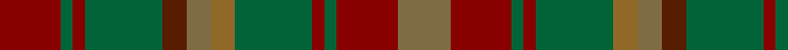

**Bands:** [GRGRGRGGGRGR](/stripes/grgrgrgggrgr/) · **Stripes:** [Y R G R G O Y DY G R G R](/stripes/stripes12/) Y R G R G O Y DY G R G R

This was sourced from tartans-authority.  It is a [12 band tartan](/bands/bands12/).

Original link http://www.tartansauthority.com/tartan-ferret/display/2034/

## Thread count
DR/30 G6 DR6 G38 T12 LTa12 LT12 G38 DR6 G6 DR30 LTa/26

## Palette
Each colour and its ΔE from the base-6 reference it is a variant of.

| Colour | Shade | Base | ΔE (OKLab) |
|---|---|---|---|
| DR | <code style="background-color:#880000;">#880000</code> `#880000` | R <code style="background-color:#CC0000;">#CC0000</code> | 0.15 |
| G | <code style="background-color:#006438;">#006438</code> `#006438` | G <code style="background-color:#006100;">#006100</code> | 0.05 |
| LT | <code style="background-color:#906828;">#906828</code> `#906828` | R <code style="background-color:#CC0000;">#CC0000</code> | 0.17 |
| LTa | <code style="background-color:#806C44;">#806C44</code> `#806C44` | G <code style="background-color:#006100;">#006100</code> | 0.17 |
| T | <code style="background-color:#581C00;">#581C00</code> `#581C00` | G <code style="background-color:#006100;">#006100</code> | 0.22 |

## Nearest tartans

The nearest existing variants by ΔTartan distance.

1. [MacVicar, McVicar, McVicker](/setts/s13/n12dy2ly2dy2n2dy10y12dy3y12dy10n11r2ly2~x2/) — ΔT 0.86
1. [Limerick, County](/setts/s11/do6lo4do3dt2do5dt2do3dt2y14r3dt2~x2/) — ΔT 0.90
1. [Pierce](/setts/s12/lo6o9dg24lo9o3lo3o3lo9dg14o24r4o6~x2/) — ΔT 1.20
1. [Lander (2013)](/setts/s15/lo18do3lo3do3lo3do16y16r2ly2r2y16do16lo17do3lo3~x2/) — ΔT 1.28
1. [Roscommon Irish County Tartan Tartan Number: 2246. Earliest known date: 1996 One of a series of Irish District tartans designed by Polly Wittering of the House of Edgar, with colours reminiscent of the Country with soft warm colours dominating. See products available Copyright © Blair Urquhart, Comrie, 2015](/setts/s10/o5lo3o19do6lo5do6dg12n5dg12n3~x2/) — ΔT 1.34
1. [MacAart (Personal)](/setts/s10/dy9k2dy2r2g6k1lo1k1g6r3~x4/) — ΔT 1.35
1. [Amazing Union (Personal)](/setts/s9/o2dy15dg12dy2dt12dy2dg12dy15r2~x4/) — ΔT 1.36
1. [Hash House Harriers Hunting (Corp)](/setts/s13/g7dy1lb1dy1lo1dy7n7dy1n7dy7g7dy1r1~x4/) — ΔT 1.41
1. [United Distillers Corporate Tartan Tartan Number: 2098. Earliest known date: 1989 An expression of evocative Scottish colours to reflect the corporate image of quality and style. (weft) lb4 b24 lb2 dg24 g24 r4 See products available Copyright © Blair Urquhart, Comrie, 2015](/setts/s10/dr12dy1dg12dy12ly2dy12dg12dy1dr12t2~x2/) — ΔT 1.44
1. [Turcan Connell](/setts/s18/dy27dt3dy8dt4dy8dt3dy14g8lr5dy5g14dt12lr6dt12dy15g9r4g9~x2/) — ΔT 1.46

## Neighbour map

Every grey dot is one of 14313 variants placed by the first two principal components of the ΔTartan feature space (44% of its variance). Red is this tartan; blue dots are its nearest — click one to open its page.

<svg viewBox="0 0 640 380" role="img" style="max-width:100%;height:auto;border:1px solid #e0e0e0;border-radius:4px;display:block" xmlns="http://www.w3.org/2000/svg"><image href="/nn/cloud.v1.png" width="640" height="380"/><a href="/setts/s13/n12dy2ly2dy2n2dy10y12dy3y12dy10n11r2ly2~x2/"><circle cx="200.8" cy="231.6" r="4" fill="#3465a4"><title>MacVicar, McVicar, McVicker</title></circle></a><a href="/setts/s11/do6lo4do3dt2do5dt2do3dt2y14r3dt2~x2/"><circle cx="224.6" cy="228.0" r="4" fill="#3465a4"><title>Limerick, County</title></circle></a><a href="/setts/s12/lo6o9dg24lo9o3lo3o3lo9dg14o24r4o6~x2/"><circle cx="274.7" cy="235.6" r="4" fill="#3465a4"><title>Pierce</title></circle></a><a href="/setts/s15/lo18do3lo3do3lo3do16y16r2ly2r2y16do16lo17do3lo3~x2/"><circle cx="222.4" cy="189.6" r="4" fill="#3465a4"><title>Lander (2013)</title></circle></a><a href="/setts/s10/o5lo3o19do6lo5do6dg12n5dg12n3~x2/"><circle cx="166.9" cy="233.6" r="4" fill="#3465a4"><title>Roscommon Irish County Tartan Tartan Number: 2246. Earliest known date: 1996 One of a series of Irish District tartans designed by Polly Wittering of the House of Edgar, with colours reminiscent of the Country with soft warm colours dominating. See products available Copyright © Blair Urquhart, Comrie, 2015</title></circle></a><a href="/setts/s10/dy9k2dy2r2g6k1lo1k1g6r3~x4/"><circle cx="217.3" cy="215.8" r="4" fill="#3465a4"><title>MacAart (Personal)</title></circle></a><a href="/setts/s9/o2dy15dg12dy2dt12dy2dg12dy15r2~x4/"><circle cx="270.9" cy="242.3" r="4" fill="#3465a4"><title>Amazing Union (Personal)</title></circle></a><a href="/setts/s13/g7dy1lb1dy1lo1dy7n7dy1n7dy7g7dy1r1~x4/"><circle cx="217.9" cy="213.7" r="4" fill="#3465a4"><title>Hash House Harriers Hunting (Corp)</title></circle></a><a href="/setts/s10/dr12dy1dg12dy12ly2dy12dg12dy1dr12t2~x2/"><circle cx="234.0" cy="226.1" r="4" fill="#3465a4"><title>United Distillers Corporate Tartan Tartan Number: 2098. Earliest known date: 1989 An expression of evocative Scottish colours to reflect the corporate image of quality and style. (weft) lb4 b24 lb2 dg24 g24 r4 See products available Copyright © Blair Urquhart, Comrie, 2015</title></circle></a><a href="/setts/s18/dy27dt3dy8dt4dy8dt3dy14g8lr5dy5g14dt12lr6dt12dy15g9r4g9~x2/"><circle cx="240.7" cy="212.0" r="4" fill="#3465a4"><title>Turcan Connell</title></circle></a><circle cx="228.5" cy="238.1" r="5" fill="#c00000"/></svg>

ID: /setts/s12/r15g3r3g19dy6y6o6g19r3g3r15y13~x2/
