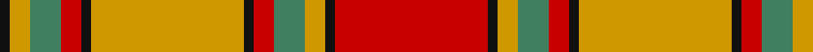

In pattern [KYGRKYKRGYKR](/patterns/kygrkykrgykr/).

This was sourced from register-of-tartans.  It is a [12 stripes tartan](/stripes/stripes12/).

Original link https://www.tartanregister.gov.uk/tartanDetails.aspx?ref=3754

## Register references

External register numbers recorded for this tartan.

- Scottish Register of Tartans: [3754](https://www.tartanregister.gov.uk/tartanDetails.aspx?ref=3754)
- Scottish Tartans Authority (ITI): 1627
- Scottish Tartans World Register: 1627

## Thread count
K/6 DY12 G18 R12 K6 DY90 K6 R12 G18 DY12 K6 R/90

## Palette
Each colour and its ΔE from the base-6 reference it is a variant of.

| Colour | Shade | Base | ΔE (OKLab) |
|---|---|---|---|
| DB | <code style="background-color:#2C2C80;">#2C2C80</code> `#2C2C80` | B <code style="background-color:#2A418A;">#2A418A</code> | 0.06 |
| DY | <code style="background-color:#D09800;">#D09800</code> `#D09800` | Y <code style="background-color:#F2BF00;">#F2BF00</code> | 0.12 |
| G | <code style="background-color:#408060;">#408060</code> `#408060` | G <code style="background-color:#006100;">#006100</code> | 0.14 |
| K | <code style="background-color:#101010;">#101010</code> `#101010` | K <code style="background-color:#000000;">#000000</code> | 0.17 |
| O | <code style="background-color:#DC943C;">#DC943C</code> `#DC943C` | Y <code style="background-color:#F2BF00;">#F2BF00</code> | 0.12 |
| R | <code style="background-color:#C80000;">#C80000</code> `#C80000` | R <code style="background-color:#CC0000;">#CC0000</code> | 0.01 |

## Nearest tartans

The nearest existing variants by ΔTartan distance.

1. [Scrimgeour of Glassary](/setts/s12/r32k3y6g10r6k3y32k3r6g10y6k3~g408060-k101010-rc80000-yd09800~x2/) — ΔT 0.90
1. [San Francisco](/setts/s14/r4y4r1y2r24w2b4w2r4b2y18b2y1w4~b141e46-rc80000-we0e0e0-yc89600~x2/) — ΔT 1.11
1. [Rourke-Frew (Ontario)](/setts/s11/b6ba3r2ba3r31ba6y2ba6y13ba2y2~b433a5a-ba311f11-rb62531-ye0a126~x2/) — ΔT 1.19
1. [Liama, The](/setts/s10/b2w20r2w2b3w3g3r8g26w2~b441800-g8c7038-rc80000-we8ccb8~x2/) — ΔT 1.30
1. [Scrymgeour (Clan)](/setts/s7/r15k1y2g3r2k1y15~g408060-k101010-rc80000-yd09800~x6/) — ΔT 1.41
1. [Crieff](/setts/s13/r4ra10g7ra70g7ra4b21ra4g85ra4g7ra10r4~b800080-g008000-rd03030-rac00000/) — ΔT 1.42
1. [Scrymgeour](/setts/s7/g15k1r2b3g2k1r15~b304080-g908000-k000000-rc00000~x6/) — ΔT 1.45
1. [MacKinnon 3](/setts/s14/w3r5g3b3r14g36r3b8g3r36g14ra3r5w3~b800080-g008000-rc00000-rad03030-we0e0e0~x2/) — ΔT 1.45
1. [Ballater Trade or 'Fancy' Tartan Tartan Number: 1708. Earliest known date: Modern Many new designs have been given district names to promote their Scottish connections. However, these names should not be confused with the District tartans which have earned their title through 'use and wont' and not a little history. See products available Copyright © Blair Urquhart, Comrie, 2015](/setts/s9/r12w2y3w2r3k5r2y18w2~k101010-rc80000-we0e0e0-ya08858~x2/) — ΔT 1.46
1. [Crieff District Tartan Tartan Number: 1636. Earliest known date: 1793 Wilson's accounts of 1793 mention the Crieff tartan with no details. A manuscript dated 1800 gives details of colour but it is not until the publication of the Key Pattern Book of 1819 that this sett is revealed in full. Crieff in Perthshire was the most famous of the cattle drovers 'trysts' prior to 1700. It is a very large sett which has been proportionately reduced for this illustration. The full threadcount: Light Red 4, Red 12, Green 8, R 140, G 8, R 4, Purple 42, R 4, G 170, R 4, G 8, R 12, LR 4. See products available Copyright © Blair Urquhart, Comrie, 2015](/setts/s13/r4ra10g7ra70g7ra4b21ra4g85ra4g7ra10r4~b780078-g006818-rd05054-rac80000/) — ΔT 1.52

## Neighbour map

Every grey dot is one of 15726 variants placed by the first two principal components of the ΔTartan feature space (44% of its variance). Red is this tartan; blue dots are its nearest — click one to open its page.

<svg viewBox="0 0 640 380" role="img" style="max-width:100%;height:auto;border:1px solid #e0e0e0;border-radius:4px;display:block" xmlns="http://www.w3.org/2000/svg"><image href="/nn/cloud.v1.png" width="640" height="380"/><a href="/setts/s12/r32k3y6g10r6k3y32k3r6g10y6k3~g408060-k101010-rc80000-yd09800~x2/"><circle cx="211.5" cy="149.5" r="4" fill="#3465a4"><title>Scrimgeour of Glassary</title></circle></a><a href="/setts/s14/r4y4r1y2r24w2b4w2r4b2y18b2y1w4~b141e46-rc80000-we0e0e0-yc89600~x2/"><circle cx="282.1" cy="93.3" r="4" fill="#3465a4"><title>San Francisco</title></circle></a><a href="/setts/s11/b6ba3r2ba3r31ba6y2ba6y13ba2y2~b433a5a-ba311f11-rb62531-ye0a126~x2/"><circle cx="265.4" cy="131.1" r="4" fill="#3465a4"><title>Rourke-Frew (Ontario)</title></circle></a><a href="/setts/s10/b2w20r2w2b3w3g3r8g26w2~b441800-g8c7038-rc80000-we8ccb8~x2/"><circle cx="247.5" cy="139.3" r="4" fill="#3465a4"><title>Liama, The</title></circle></a><a href="/setts/s7/r15k1y2g3r2k1y15~g408060-k101010-rc80000-yd09800~x6/"><circle cx="311.3" cy="162.5" r="4" fill="#3465a4"><title>Scrymgeour (Clan)</title></circle></a><a href="/setts/s13/r4ra10g7ra70g7ra4b21ra4g85ra4g7ra10r4~b800080-g008000-rd03030-rac00000/"><circle cx="327.1" cy="113.6" r="4" fill="#3465a4"><title>Crieff</title></circle></a><a href="/setts/s7/g15k1r2b3g2k1r15~b304080-g908000-k000000-rc00000~x6/"><circle cx="305.5" cy="167.2" r="4" fill="#3465a4"><title>Scrymgeour</title></circle></a><a href="/setts/s14/w3r5g3b3r14g36r3b8g3r36g14ra3r5w3~b800080-g008000-rc00000-rad03030-we0e0e0~x2/"><circle cx="257.4" cy="123.3" r="4" fill="#3465a4"><title>MacKinnon 3</title></circle></a><a href="/setts/s9/r12w2y3w2r3k5r2y18w2~k101010-rc80000-we0e0e0-ya08858~x2/"><circle cx="229.4" cy="166.9" r="4" fill="#3465a4"><title>Ballater Trade or 'Fancy' Tartan Tartan Number: 1708. Earliest known date: Modern Many new designs have been given district names to promote their Scottish connections. However, these names should not be confused with the District tartans which have earned their title through 'use and wont' and not a little history. See products available Copyright © Blair Urquhart, Comrie, 2015</title></circle></a><a href="/setts/s13/r4ra10g7ra70g7ra4b21ra4g85ra4g7ra10r4~b780078-g006818-rd05054-rac80000/"><circle cx="335.2" cy="116.5" r="4" fill="#3465a4"><title>Crieff District Tartan Tartan Number: 1636. Earliest known date: 1793 Wilson's accounts of 1793 mention the Crieff tartan with no details. A manuscript dated 1800 gives details of colour but it is not until the publication of the Key Pattern Book of 1819 that this sett is revealed in full. Crieff in Perthshire was the most famous of the cattle drovers 'trysts' prior to 1700. It is a very large sett which has been proportionately reduced for this illustration. The full threadcount: Light Red 4, Red 12, Green 8, R 140, G 8, R 4, Purple 42, R 4, G 170, R 4, G 8, R 12, LR 4. See products available Copyright © Blair Urquhart, Comrie, 2015</title></circle></a><circle cx="264.1" cy="124.6" r="5" fill="#c00000"/></svg>

ID: /setts/s12/r15k1y2g3r2k1y15k1r2g3y2k1~g408060-k101010-rc80000-yd09800~x6/
