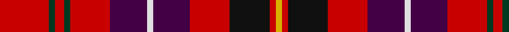

In pattern [RGRGRBWBRKRY](/patterns/rgrgrbwbrkry/).

This was sourced from register-of-tartans.  It is a [12 stripes tartan](/stripes/stripes12/).

Original link https://www.tartanregister.gov.uk/tartanDetails.aspx?ref=1816

## Attestations

This cloth appears in 2 source records; the oldest owns this page.

- 01/07/1996 — Ikelman #6 (Personal) (register-of-tartans, [record](https://www.tartanregister.gov.uk/tartanDetails.aspx?ref=1816))
- 1996 — Ikelman #6 (Personal) (tartans-authority, [record](http://www.tartansauthority.com/tartan-ferret/display/2183/))

## Thread count
R/32 DG4 R6 DG4 R26 DP24 LN4 DP24 R26 K26 R4 Y/4

## Palette
Each colour and its ΔE from the base-6 reference it is a variant of.

| Colour | Shade | Base | ΔE (OKLab) |
|---|---|---|---|
| DG | <code style="background-color:#003820;">#003820</code> `#003820` | G <code style="background-color:#006100;">#006100</code> | 0.15 |
| DP | <code style="background-color:#440044;">#440044</code> `#440044` | B <code style="background-color:#2A418A;">#2A418A</code> | 0.18 |
| K | <code style="background-color:#101010;">#101010</code> `#101010` | K <code style="background-color:#000000;">#000000</code> | 0.17 |
| LN | <code style="background-color:#E0E0E0;">#E0E0E0</code> `#E0E0E0` | W <code style="background-color:#F7F7F7;">#F7F7F7</code> | 0.07 |
| N | <code style="background-color:#C0C0C0;">#C0C0C0</code> `#C0C0C0` | W <code style="background-color:#F7F7F7;">#F7F7F7</code> | 0.17 |
| R | <code style="background-color:#C80000;">#C80000</code> `#C80000` | R <code style="background-color:#CC0000;">#CC0000</code> | 0.01 |
| Y | <code style="background-color:#D8B000;">#D8B000</code> `#D8B000` | Y <code style="background-color:#F2BF00;">#F2BF00</code> | 0.06 |

## Nearest tartans

The nearest existing variants by ΔTartan distance.

1. [Ikelman No. 6](/setts/s12/r16g2r3g2r13k12w2k12r13ka13r2y2~g008000-k000030-ka000000-rc00000-we0e0e0-yf0c000~x2/) — ΔT 1.35
1. [Chafee of Glenmary (Personal)](/setts/s14/b2r3k6y4r17r2b16r2b16b2r15r16r2r2~b000088-k000000-rc40000-y9c9c00~x2/) — ΔT 1.43
1. [Maynard](/setts/s13/y3r25g8r4b8w2b3w2b8r4k8r25y3~b2c2c80-g006818-k101010-rc80000-we0e0e0-ye8c000~x2/) — ΔT 1.44
1. [Ogilvie 4](/setts/s14/b13r5b12y4k5r20w4r10w4r20ba5y4b13r4~b304080-ba000050-k000000-rc00000-we0e0e0-yf0c000~x2/) — ΔT 1.47
1. [London Caledonian](/setts/s13/r8b2r14g2r2b6r2ga2r2ga11r2ba2r6~b440044-ba202060-g789484-ga003820-rc80000~x2/) — ΔT 1.47
1. [MIT1951](/setts/s10/r24ra5y7b2y4b14r11b3r3w4~b1c1c1c-rc8002c-ra901c38-we0e0e0-yb0b0b0~x2/) — ΔT 1.47
1. [MacPherson](/setts/s15/r12b2r12g8y1k6b4k1b1k1b4r12ya1k1r1~b4367ae-g11450d-k000000-raa0000-yaaaa00-yaaaaaaa~x2/) — ΔT 1.48
1. [Christie Family Tartan Tartan Number: 1355. Earliest known date: 1930 Two woven samples in the Society's collection, were presented by Messrs Stewart Christie of Edinburgh. Very little else is known about the origin of the design. The alternative sample replaces blue with azure, but is otherwise identical. The name Christie in Scotland is thought to derive from the Norse word 'Trusty' meaning swordsman. (c.f. thrust). Christies are traditionally associated with the Clan Farquharson. See products available Copyright © Blair Urquhart, Comrie, 2015](/setts/s13/r8b2k1b3k4y1k1w1k1g8r6w1r6~b2c2c80-g006818-k101010-rc80000-we0e0e0-ye8c000~x4/) — ΔT 1.48
1. [Ogilvie #2](/setts/s14/b13r5b12y4k5r20w4r10w4r20ba5y4b13r4~b2c4084-ba080848-k101010-rdc0000-we0e0e0-ye8c000~x2/) — ΔT 1.51
1. [Nicolson/MacNicol](/setts/s13/b2r11g2r11g21r2k9ba2b11r11g2r11b2~b2c4084-ba3c82af-g005020-k101010-rdc0000~x2/) — ΔT 1.54

## Neighbour map

Every grey dot is one of 15726 variants placed by the first two principal components of the ΔTartan feature space (44% of its variance). Red is this tartan; blue dots are its nearest — click one to open its page.

<svg viewBox="0 0 640 380" role="img" style="max-width:100%;height:auto;border:1px solid #e0e0e0;border-radius:4px;display:block" xmlns="http://www.w3.org/2000/svg"><image href="/nn/cloud.v1.png" width="640" height="380"/><a href="/setts/s12/r16g2r3g2r13k12w2k12r13ka13r2y2~g008000-k000030-ka000000-rc00000-we0e0e0-yf0c000~x2/"><circle cx="181.5" cy="151.1" r="4" fill="#3465a4"><title>Ikelman No. 6</title></circle></a><a href="/setts/s14/b2r3k6y4r17r2b16r2b16b2r15r16r2r2~b000088-k000000-rc40000-y9c9c00~x2/"><circle cx="228.1" cy="134.4" r="4" fill="#3465a4"><title>Chafee of Glenmary (Personal)</title></circle></a><a href="/setts/s13/y3r25g8r4b8w2b3w2b8r4k8r25y3~b2c2c80-g006818-k101010-rc80000-we0e0e0-ye8c000~x2/"><circle cx="256.2" cy="111.7" r="4" fill="#3465a4"><title>Maynard</title></circle></a><a href="/setts/s14/b13r5b12y4k5r20w4r10w4r20ba5y4b13r4~b304080-ba000050-k000000-rc00000-we0e0e0-yf0c000~x2/"><circle cx="145.4" cy="165.3" r="4" fill="#3465a4"><title>Ogilvie 4</title></circle></a><a href="/setts/s13/r8b2r14g2r2b6r2ga2r2ga11r2ba2r6~b440044-ba202060-g789484-ga003820-rc80000~x2/"><circle cx="297.2" cy="172.0" r="4" fill="#3465a4"><title>London Caledonian</title></circle></a><a href="/setts/s10/r24ra5y7b2y4b14r11b3r3w4~b1c1c1c-rc8002c-ra901c38-we0e0e0-yb0b0b0~x2/"><circle cx="231.8" cy="145.7" r="4" fill="#3465a4"><title>MIT1951</title></circle></a><a href="/setts/s15/r12b2r12g8y1k6b4k1b1k1b4r12ya1k1r1~b4367ae-g11450d-k000000-raa0000-yaaaa00-yaaaaaaa~x2/"><circle cx="247.4" cy="114.6" r="4" fill="#3465a4"><title>MacPherson</title></circle></a><a href="/setts/s13/r8b2k1b3k4y1k1w1k1g8r6w1r6~b2c2c80-g006818-k101010-rc80000-we0e0e0-ye8c000~x4/"><circle cx="161.4" cy="139.6" r="4" fill="#3465a4"><title>Christie Family Tartan Tartan Number: 1355. Earliest known date: 1930 Two woven samples in the Society's collection, were presented by Messrs Stewart Christie of Edinburgh. Very little else is known about the origin of the design. The alternative sample replaces blue with azure, but is otherwise identical. The name Christie in Scotland is thought to derive from the Norse word 'Trusty' meaning swordsman. (c.f. thrust). Christies are traditionally associated with the Clan Farquharson. See products available Copyright © Blair Urquhart, Comrie, 2015</title></circle></a><a href="/setts/s14/b13r5b12y4k5r20w4r10w4r20ba5y4b13r4~b2c4084-ba080848-k101010-rdc0000-we0e0e0-ye8c000~x2/"><circle cx="146.3" cy="162.7" r="4" fill="#3465a4"><title>Ogilvie #2</title></circle></a><a href="/setts/s13/b2r11g2r11g21r2k9ba2b11r11g2r11b2~b2c4084-ba3c82af-g005020-k101010-rdc0000~x2/"><circle cx="214.4" cy="156.6" r="4" fill="#3465a4"><title>Nicolson/MacNicol</title></circle></a><circle cx="213.8" cy="155.3" r="5" fill="#c00000"/></svg>

ID: /setts/s12/r16g2r3g2r13b12w2b12r13k13r2y2~b440044-g003820-k101010-rc80000-we0e0e0-yd8b000~x2/
