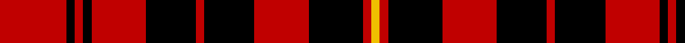

In pattern [RKRKRKRKRKRY](/patterns/rkrkrkrkrkry/).

This was sourced from weddslist.  It is a [12 stripes tartan](/stripes/stripes12/).

Original link http://www.weddslist.com/cgi-bin/tartans/pg.pl?source=sts

## Thread count
R/32 K4 R4 K4 R26 K24 R4 K24 R26 K26 R4 Y/4

## Palette
Each colour and its ΔE from the base-6 reference it is a variant of.

| Colour | Shade | Base | ΔE (OKLab) |
|---|---|---|---|
| K | <code style="background-color:#000000;">#000000</code> `#000000` | K <code style="background-color:#000000;">#000000</code> | 0.00 |
| R | <code style="background-color:#C00000;">#C00000</code> `#C00000` | R <code style="background-color:#CC0000;">#CC0000</code> | 0.03 |
| Y | <code style="background-color:#F0C000;">#F0C000</code> `#F0C000` | Y <code style="background-color:#F2BF00;">#F2BF00</code> | 0.00 |

## Nearest tartans

The nearest existing variants by ΔTartan distance.

1. [German National (US) (Fashion)](/setts/s12/r16k2r2k2r13k12r2k12r13k13r2y2~k101010-rc80000-ye8c000~x2/) — ΔT 1.05
1. [Border Reiver, The](/setts/s11/r5k5r2k1r1k1r2k5r5k1r2~k000000-rc00000~x4/) — ΔT 1.26
1. [Haig & Haig Whisky](/setts/s8/r26k18r7k4y4k4r7k18~k101010-rc80000-ye8c000~x2/) — ΔT 1.31
1. [MacDonald of Glencoe/Ardnamurchan](/setts/s7/r4k8r4k8r12k1y2~k000000-rc00000-yf0c000~x2/) — ΔT 1.35
1. [MacIain](/setts/s7/r4k8r4k8r12k1y2~k000000-rc80000-yffc800~x2/) — ΔT 1.37
1. [MacIver](/setts/s9/w1r9k2r2k12r2k2r9y1~k000000-rc00000-we0e0e0-yf0c000~x4/) — ΔT 1.37
1. [MacIain](/setts/s7/r4k8r4k8r12k1y2~k000000-raa0000-yaaaa00~x2/) — ΔT 1.38
1. [Malt, The](/setts/s12/k20r2k4r2k19ra17k10ra10k6ra5y2ra2~k101010-re3170d-raee4000-yeec900~x2/) — ΔT 1.40
1. [MacIver](/setts/s9/w3r27k5r5k32r5k5r27y3~k000000-rc00000-we0e0e0-yf0c000~x2/) — ΔT 1.41
1. [bodog.com Corporate Tartan Tartan Number: 6889. Earliest known date: 2006 Corporate brand name and colours, red, black and silver grey used to support brand identification. Company owner and executive is Scottish. First tartan to be name after a web site and first ever tartan for Costa Rica. See products available Copyright © Blair Urquhart, Comrie, 2015](/setts/s8/k25r25k10w3k10r25k25r3~k101010-rc80000-wc0c0c0~x2/) — ΔT 1.42

## Neighbour map

Every grey dot is one of 15726 variants placed by the first two principal components of the ΔTartan feature space (44% of its variance). Red is this tartan; blue dots are its nearest — click one to open its page.

<svg viewBox="0 0 640 380" role="img" style="max-width:100%;height:auto;border:1px solid #e0e0e0;border-radius:4px;display:block" xmlns="http://www.w3.org/2000/svg"><image href="/nn/cloud.v1.png" width="640" height="380"/><a href="/setts/s12/r16k2r2k2r13k12r2k12r13k13r2y2~k101010-rc80000-ye8c000~x2/"><circle cx="309.1" cy="206.6" r="4" fill="#3465a4"><title>German National (US) (Fashion)</title></circle></a><a href="/setts/s11/r5k5r2k1r1k1r2k5r5k1r2~k000000-rc00000~x4/"><circle cx="307.9" cy="251.1" r="4" fill="#3465a4"><title>Border Reiver, The</title></circle></a><a href="/setts/s8/r26k18r7k4y4k4r7k18~k101010-rc80000-ye8c000~x2/"><circle cx="283.2" cy="232.9" r="4" fill="#3465a4"><title>Haig &amp; Haig Whisky</title></circle></a><a href="/setts/s7/r4k8r4k8r12k1y2~k000000-rc00000-yf0c000~x2/"><circle cx="288.7" cy="219.4" r="4" fill="#3465a4"><title>MacDonald of Glencoe/Ardnamurchan</title></circle></a><a href="/setts/s7/r4k8r4k8r12k1y2~k000000-rc80000-yffc800~x2/"><circle cx="287.2" cy="217.8" r="4" fill="#3465a4"><title>MacIain</title></circle></a><a href="/setts/s9/w1r9k2r2k12r2k2r9y1~k000000-rc00000-we0e0e0-yf0c000~x4/"><circle cx="304.5" cy="168.5" r="4" fill="#3465a4"><title>MacIver</title></circle></a><a href="/setts/s7/r4k8r4k8r12k1y2~k000000-raa0000-yaaaa00~x2/"><circle cx="294.4" cy="224.5" r="4" fill="#3465a4"><title>MacIain</title></circle></a><a href="/setts/s12/k20r2k4r2k19ra17k10ra10k6ra5y2ra2~k101010-re3170d-raee4000-yeec900~x2/"><circle cx="306.3" cy="176.7" r="4" fill="#3465a4"><title>Malt, The</title></circle></a><a href="/setts/s9/w3r27k5r5k32r5k5r27y3~k000000-rc00000-we0e0e0-yf0c000~x2/"><circle cx="311.0" cy="170.0" r="4" fill="#3465a4"><title>MacIver</title></circle></a><a href="/setts/s8/k25r25k10w3k10r25k25r3~k101010-rc80000-wc0c0c0~x2/"><circle cx="313.8" cy="241.4" r="4" fill="#3465a4"><title>bodog.com Corporate Tartan Tartan Number: 6889. Earliest known date: 2006 Corporate brand name and colours, red, black and silver grey used to support brand identification. Company owner and executive is Scottish. First tartan to be name after a web site and first ever tartan for Costa Rica. See products available Copyright © Blair Urquhart, Comrie, 2015</title></circle></a><circle cx="289.9" cy="203.8" r="5" fill="#c00000"/></svg>

ID: /setts/s12/r16k2r2k2r13k12r2k12r13k13r2y2~k000000-rc00000-yf0c000~x2/
