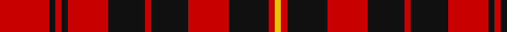

In pattern [RKRKRKRKRKRY](/patterns/rkrkrkrkrkry/).

This was sourced from tartans-authority.  It is a [12 stripes tartan](/stripes/stripes12/).

Original link http://www.tartansauthority.com/tartan-ferret/display/1095/

## Attestations

This cloth appears in 2 source records; the oldest owns this page.

- Aug. 1995 — German National (US) (Fashion) (tartans-authority, [record](http://www.tartansauthority.com/tartan-ferret/display/1095/))
- 01/07/1996 — German National (register-of-tartans, [record](https://www.tartanregister.gov.uk/tartanDetails.aspx?ref=1337))

## Thread count
R/32 K4 R4 K4 R26 K24 R4 K24 R26 K26 R4 Y/4

## Palette
Each colour and its ΔE from the base-6 reference it is a variant of.

| Colour | Shade | Base | ΔE (OKLab) |
|---|---|---|---|
| K | <code style="background-color:#101010;">#101010</code> `#101010` | K <code style="background-color:#000000;">#000000</code> | 0.17 |
| R | <code style="background-color:#C80000;">#C80000</code> `#C80000` | R <code style="background-color:#CC0000;">#CC0000</code> | 0.01 |
| Y | <code style="background-color:#E8C000;">#E8C000</code> `#E8C000` | Y <code style="background-color:#F2BF00;">#F2BF00</code> | 0.02 |

## Nearest tartans

The nearest existing variants by ΔTartan distance.

1. [Haig & Haig Whisky](/setts/s8/r26k18r7k4y4k4r7k18~k101010-rc80000-ye8c000~x2/) — ΔT 1.00
1. [Ikelman No. 5 (German National)](/setts/s12/r16k2r2k2r13k12r2k12r13k13r2y2~k000000-rc00000-yf0c000~x2/) — ΔT 1.05
1. [bodog.com Corporate Tartan Tartan Number: 6889. Earliest known date: 2006 Corporate brand name and colours, red, black and silver grey used to support brand identification. Company owner and executive is Scottish. First tartan to be name after a web site and first ever tartan for Costa Rica. See products available Copyright © Blair Urquhart, Comrie, 2015](/setts/s8/k25r25k10w3k10r25k25r3~k101010-rc80000-wc0c0c0~x2/) — ΔT 1.19
1. [MacIver (Clan)](/setts/s9/w2r12k3r3k16r3k3r12y2~k101010-rc80000-wfcfcfc-yd8b000~x2/) — ΔT 1.22
1. [MacKinnon Black (Personal)](/setts/s12/b3r4k5r12k24r3k10r26k12b3r6w3~b780078-k101010-rc80000-we0e0e0~x2/) — ΔT 1.23
1. [Brice](/setts/s10/k9r18w2k2w4k2w2r12k9r6~k101010-rc80000-wfcfcfc~x2/) — ΔT 1.25
1. [Border Reiver, The](/setts/s11/r5k5r2k1r1k1r2k5r5k1r2~k101010-rc80000~x4/) — ΔT 1.27
1. [MacKeane (Clan?)](/setts/s7/r4k8r4k8r12k1y1~k101010-rc80000-ye8c000~x2/) — ΔT 1.27
1. [Cameron of Locheil #3](/setts/s9/r24b8r23k4w4k4r10k32r8~b2c4084-k101010-rdc0000-we0e0e0/) — ΔT 1.31
1. [Hebrides South Uist #3](/setts/s18/g8r1k1r8g1r8k1r1k8r1k8r1k1r8g1r8k1r1~g006818-k101010-rc80000~x6/) — ΔT 1.32

## Neighbour map

Every grey dot is one of 15726 variants placed by the first two principal components of the ΔTartan feature space (44% of its variance). Red is this tartan; blue dots are its nearest — click one to open its page.

<svg viewBox="0 0 640 380" role="img" style="max-width:100%;height:auto;border:1px solid #e0e0e0;border-radius:4px;display:block" xmlns="http://www.w3.org/2000/svg"><image href="/nn/cloud.v1.png" width="640" height="380"/><a href="/setts/s8/r26k18r7k4y4k4r7k18~k101010-rc80000-ye8c000~x2/"><circle cx="283.2" cy="232.9" r="4" fill="#3465a4"><title>Haig &amp; Haig Whisky</title></circle></a><a href="/setts/s12/r16k2r2k2r13k12r2k12r13k13r2y2~k000000-rc00000-yf0c000~x2/"><circle cx="289.9" cy="203.8" r="4" fill="#3465a4"><title>Ikelman No. 5 (German National)</title></circle></a><a href="/setts/s8/k25r25k10w3k10r25k25r3~k101010-rc80000-wc0c0c0~x2/"><circle cx="313.8" cy="241.4" r="4" fill="#3465a4"><title>bodog.com Corporate Tartan Tartan Number: 6889. Earliest known date: 2006 Corporate brand name and colours, red, black and silver grey used to support brand identification. Company owner and executive is Scottish. First tartan to be name after a web site and first ever tartan for Costa Rica. See products available Copyright © Blair Urquhart, Comrie, 2015</title></circle></a><a href="/setts/s9/w2r12k3r3k16r3k3r12y2~k101010-rc80000-wfcfcfc-yd8b000~x2/"><circle cx="282.5" cy="188.1" r="4" fill="#3465a4"><title>MacIver (Clan)</title></circle></a><a href="/setts/s12/b3r4k5r12k24r3k10r26k12b3r6w3~b780078-k101010-rc80000-we0e0e0~x2/"><circle cx="257.6" cy="177.5" r="4" fill="#3465a4"><title>MacKinnon Black (Personal)</title></circle></a><a href="/setts/s10/k9r18w2k2w4k2w2r12k9r6~k101010-rc80000-wfcfcfc~x2/"><circle cx="280.2" cy="191.9" r="4" fill="#3465a4"><title>Brice</title></circle></a><a href="/setts/s11/r5k5r2k1r1k1r2k5r5k1r2~k101010-rc80000~x4/"><circle cx="329.7" cy="254.9" r="4" fill="#3465a4"><title>Border Reiver, The</title></circle></a><a href="/setts/s7/r4k8r4k8r12k1y1~k101010-rc80000-ye8c000~x2/"><circle cx="327.5" cy="219.9" r="4" fill="#3465a4"><title>MacKeane (Clan?)</title></circle></a><a href="/setts/s9/r24b8r23k4w4k4r10k32r8~b2c4084-k101010-rdc0000-we0e0e0/"><circle cx="280.8" cy="192.0" r="4" fill="#3465a4"><title>Cameron of Locheil #3</title></circle></a><a href="/setts/s18/g8r1k1r8g1r8k1r1k8r1k8r1k1r8g1r8k1r1~g006818-k101010-rc80000~x6/"><circle cx="303.2" cy="174.1" r="4" fill="#3465a4"><title>Hebrides South Uist #3</title></circle></a><circle cx="309.1" cy="206.6" r="5" fill="#c00000"/></svg>

ID: /setts/s12/r16k2r2k2r13k12r2k12r13k13r2y2~k101010-rc80000-ye8c000~x2/
