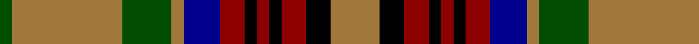

In pattern [GRGRBRKRKRKR](/patterns/grgrbrkrkrkr/).

This was sourced from register-of-tartans.  It is a [12 stripes tartan](/stripes/stripes12/).

Original link https://www.tartanregister.gov.uk/tartanDetails.aspx?ref=5000

## Attestations

This cloth appears in 2 source records; the oldest owns this page.

- 01/01/1995 — California Firefighters (Corporate) (register-of-tartans, [record](https://www.tartanregister.gov.uk/tartanDetails.aspx?ref=5000))
- 1995 — California Firefighters (Corporate) (tartans-authority, [record](http://www.tartansauthority.com/tartan-ferret/display/3787/))

## Thread count
G/4 LT36 G16 LT4 DB12 DR8 K4 DR4 K4 DR8 K8 LT/16

## Palette
Each colour and its ΔE from the base-6 reference it is a variant of.

| Colour | Shade | Base | ΔE (OKLab) |
|---|---|---|---|
| DB | <code style="background-color:#00008C;">#00008C</code> `#00008C` | B <code style="background-color:#2A418A;">#2A418A</code> | 0.13 |
| DR | <code style="background-color:#8C0000;">#8C0000</code> `#8C0000` | R <code style="background-color:#CC0000;">#CC0000</code> | 0.14 |
| G | <code style="background-color:#004C00;">#004C00</code> `#004C00` | G <code style="background-color:#006100;">#006100</code> | 0.07 |
| K | <code style="background-color:#000000;">#000000</code> `#000000` | K <code style="background-color:#000000;">#000000</code> | 0.00 |
| LT | <code style="background-color:#A0783C;">#A0783C</code> `#A0783C` | R <code style="background-color:#CC0000;">#CC0000</code> | 0.18 |

## Nearest tartans

The nearest existing variants by ΔTartan distance.

1. [Graham of Montrose Red](/setts/s9/w4k4r40g40k20w20r40k4w4-g006818-k101010-r880000-wa8ace8/) — ΔT 0.90
1. [Maguire](/setts/s13/g36r36k6r6b6r6b8r6k18r8g36w12k6-b2c2c80-g006818-k101010-rc80000-wfcfcfc/) — ΔT 0.93
1. [Cochrane (1974)](/setts/s13/g44r8g4r4g4r8g24k24r4b20r8b8y6-b2c4084-g005020-k101010-rdc0000-ye8c000/) — ΔT 0.96
1. [Glen Nevis](/setts/s12/r44w4r4w4r8k10r10k10g10ra4g26w4-g808080-k000000-r906030-ra802040-we0e0e0/) — ΔT 0.99
1. [Nicolson](/setts/s13/b4r22g4r22g42r4k18ba4b22r22g4r22b4-b304080-ba5480b0-g008000-k000000-rc00000/) — ΔT 1.00
1. [MacKinnon 12](/setts/s14/k8r6g4b4r12g30r4b8g4r30g14k4r8w4-b304080-g008000-k000000-rc00000-we0e0e0/) — ΔT 1.02
1. [Limerick](/setts/s11/b12y8b6ba4b10ba4b6ba4g30r6ba4-b401000-ba304080-g008000-rc00000-yf0c000/) — ΔT 1.03
1. [Mauchline](/setts/s14/g24k4w7g7y4r28g7k29g35ra7g7w4g4k17-g604000-k101010-r888888-rac80000-we0e0e0-ybc8c00/) — ΔT 1.03
1. [Confessore (Personal)](/setts/s15/k24g4k4g16y4r4y16r4y8g16k4g4k32w4k8-g5c6428-k101010-rc80000-we0e0e0-yfccc00/) — ΔT 1.04
1. [Cochrane LC](/setts/s13/g22r4g2r2g2r4g12k12r2b10r4b4y3-b000064-g004c00-k000000-rc80000-yffc800/) — ΔT 1.05

## Neighbour map

Every grey dot is one of 15726 variants placed by the first two principal components of the ΔTartan feature space (44% of its variance). Red is this tartan; blue dots are its nearest — click one to open its page.

<svg viewBox="0 0 640 380" role="img" style="max-width:100%;height:auto;border:1px solid #e0e0e0;border-radius:4px;display:block" xmlns="http://www.w3.org/2000/svg"><image href="/nn/cloud.v1.png" width="640" height="380"/><a href="/setts/s9/w4k4r40g40k20w20r40k4w4-g006818-k101010-r880000-wa8ace8/"><circle cx="196.6" cy="171.6" r="4" fill="#3465a4"><title>Graham of Montrose Red</title></circle></a><a href="/setts/s13/g36r36k6r6b6r6b8r6k18r8g36w12k6-b2c2c80-g006818-k101010-rc80000-wfcfcfc/"><circle cx="127.5" cy="166.4" r="4" fill="#3465a4"><title>Maguire</title></circle></a><a href="/setts/s13/g44r8g4r4g4r8g24k24r4b20r8b8y6-b2c4084-g005020-k101010-rdc0000-ye8c000/"><circle cx="205.2" cy="155.9" r="4" fill="#3465a4"><title>Cochrane (1974)</title></circle></a><a href="/setts/s12/r44w4r4w4r8k10r10k10g10ra4g26w4-g808080-k000000-r906030-ra802040-we0e0e0/"><circle cx="209.8" cy="135.8" r="4" fill="#3465a4"><title>Glen Nevis</title></circle></a><a href="/setts/s13/b4r22g4r22g42r4k18ba4b22r22g4r22b4-b304080-ba5480b0-g008000-k000000-rc00000/"><circle cx="199.1" cy="153.3" r="4" fill="#3465a4"><title>Nicolson</title></circle></a><a href="/setts/s14/k8r6g4b4r12g30r4b8g4r30g14k4r8w4-b304080-g008000-k000000-rc00000-we0e0e0/"><circle cx="175.7" cy="152.5" r="4" fill="#3465a4"><title>MacKinnon 12</title></circle></a><a href="/setts/s11/b12y8b6ba4b10ba4b6ba4g30r6ba4-b401000-ba304080-g008000-rc00000-yf0c000/"><circle cx="137.6" cy="173.3" r="4" fill="#3465a4"><title>Limerick</title></circle></a><a href="/setts/s14/g24k4w7g7y4r28g7k29g35ra7g7w4g4k17-g604000-k101010-r888888-rac80000-we0e0e0-ybc8c00/"><circle cx="170.8" cy="146.6" r="4" fill="#3465a4"><title>Mauchline</title></circle></a><a href="/setts/s15/k24g4k4g16y4r4y16r4y8g16k4g4k32w4k8-g5c6428-k101010-rc80000-we0e0e0-yfccc00/"><circle cx="165.9" cy="148.5" r="4" fill="#3465a4"><title>Confessore (Personal)</title></circle></a><a href="/setts/s13/g22r4g2r2g2r4g12k12r2b10r4b4y3-b000064-g004c00-k000000-rc80000-yffc800/"><circle cx="183.1" cy="149.8" r="4" fill="#3465a4"><title>Cochrane LC</title></circle></a><circle cx="171.1" cy="156.8" r="5" fill="#c00000"/></svg>

ID: /setts/s12/r16k8ra8k4ra4k4ra8b12r4g16r36g4-b00008c-g004c00-k000000-ra0783c-ra8c0000/
