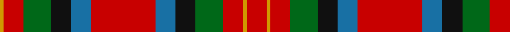

In pattern [RYRGKBRBKGRY](/patterns/ryrgkbrbkgry/).

This was sourced from register-of-tartans.  It is a [12 stripes tartan](/stripes/stripes12/).

Original link https://www.tartanregister.gov.uk/tartanDetails.aspx?ref=4033

## Thread count
DY/6 R32 G44 K32 B32 R104 B32 K32 G44 R32 DY6 R/32

## Palette
Each colour and its ΔE from the base-6 reference it is a variant of.

| Colour | Shade | Base | ΔE (OKLab) |
|---|---|---|---|
| B | <code style="background-color:#1870A4;">#1870A4</code> `#1870A4` | B <code style="background-color:#2A418A;">#2A418A</code> | 0.13 |
| DB | <code style="background-color:#202060;">#202060</code> `#202060` | B <code style="background-color:#2A418A;">#2A418A</code> | 0.11 |
| DR | <code style="background-color:#880000;">#880000</code> `#880000` | R <code style="background-color:#CC0000;">#CC0000</code> | 0.15 |
| DY | <code style="background-color:#D09800;">#D09800</code> `#D09800` | Y <code style="background-color:#F2BF00;">#F2BF00</code> | 0.12 |
| G | <code style="background-color:#006818;">#006818</code> `#006818` | G <code style="background-color:#006100;">#006100</code> | 0.02 |
| K | <code style="background-color:#101010;">#101010</code> `#101010` | K <code style="background-color:#000000;">#000000</code> | 0.17 |
| R | <code style="background-color:#C80000;">#C80000</code> `#C80000` | R <code style="background-color:#CC0000;">#CC0000</code> | 0.01 |

## Nearest tartans

The nearest existing variants by ΔTartan distance.

1. [Nicholson Clan Tartan Tartan Number: 498. Earliest known date: 1845-7 Nothing See products available Copyright © Blair Urquhart, Comrie, 2015](/setts/s13/b2r11g2r11g21r2k9ba2b11r11g2r11b2x2~b2c2c80-ba5c8ca8-g006818-k101010-rc80000/) — ΔT 0.93
1. [Nicolson/MacNicol](/setts/s13/b2r11g2r11g21r2k9ba2b11r11g2r11b2x2~b2c4084-ba3c82af-g005020-k101010-rdc0000/) — ΔT 0.96
1. [Unidentified Plaid 16](/setts/s13/y18r18g30r12b55r42g6r18g6r42ga44r12g12~b304080-g003000-ga008000-rc00000-yf0c000/) — ΔT 1.00
1. [Nicolson](/setts/s13/b2r11g2r11g21r2k9ba2b11r11g2r11b2x2~b304080-ba5480b0-g008000-k000000-rc00000/) — ΔT 1.00
1. [Unidentified Plaid #4](/setts/s13/y18r18g30r12b55r42g6r18g6r42ga44r12g12~b2c4084-g002814-ga005020-rdc0000-ye8c000/) — ΔT 1.06
1. [Sinclair](/setts/s10/r30g12k5w2b6r30b12w2k5g12x2~b2c2c80-g006818-k101010-rc80000-we0e0e0/) — ΔT 1.08
1. [Wilson's No.002](/setts/s14/r21g13y2b11ba9r11b2r11ba9b11y2g13r21w1x2~b440044-ba5c8ca8-g006818-rc80000-wfcfcfc-ye8c000/) — ΔT 1.10
1. [Indiana "Cardinal"](/setts/s8/b8y1g12r10ra2r6ra2r4x4~b2c4084-g005020-rdc0000-rabe7832-ye8c000/) — ΔT 1.13
1. [Hynde Artifact Tartan Tartan Number: 976. Earliest known date: 1744 Trews belonging to Sir John Hynde. See products available Copyright © Blair Urquhart, Comrie, 2015](/setts/s11/g14r1g14r7w1r7w1r7b5ba3w1x4~b202060-ba780078-g006818-rc80000-we0e0e0/) — ΔT 1.15
1. [Prince Charles Edward (Edinburgh)](/setts/s13/y3r3k5r2b9r7k1r3k1r7g7r2k2x2~b2c2c80-g006818-k101010-rc80000-ye8c000/) — ΔT 1.16

## Neighbour map

Every grey dot is one of 15726 variants placed by the first two principal components of the ΔTartan feature space (44% of its variance). Red is this tartan; blue dots are its nearest — click one to open its page.

<svg viewBox="0 0 640 380" role="img" style="max-width:100%;height:auto;border:1px solid #e0e0e0;border-radius:4px;display:block" xmlns="http://www.w3.org/2000/svg"><image href="/nn/cloud.v1.png" width="640" height="380"/><a href="/setts/s13/b2r11g2r11g21r2k9ba2b11r11g2r11b2x2~b2c2c80-ba5c8ca8-g006818-k101010-rc80000/"><circle cx="217.1" cy="159.4" r="4" fill="#3465a4"><title>Nicholson Clan Tartan Tartan Number: 498. Earliest known date: 1845-7 Nothing See products available Copyright © Blair Urquhart, Comrie, 2015</title></circle></a><a href="/setts/s13/b2r11g2r11g21r2k9ba2b11r11g2r11b2x2~b2c4084-ba3c82af-g005020-k101010-rdc0000/"><circle cx="214.4" cy="156.6" r="4" fill="#3465a4"><title>Nicolson/MacNicol</title></circle></a><a href="/setts/s13/y18r18g30r12b55r42g6r18g6r42ga44r12g12~b304080-g003000-ga008000-rc00000-yf0c000/"><circle cx="176.7" cy="171.6" r="4" fill="#3465a4"><title>Unidentified Plaid 16</title></circle></a><a href="/setts/s13/b2r11g2r11g21r2k9ba2b11r11g2r11b2x2~b304080-ba5480b0-g008000-k000000-rc00000/"><circle cx="199.7" cy="153.9" r="4" fill="#3465a4"><title>Nicolson</title></circle></a><a href="/setts/s13/y18r18g30r12b55r42g6r18g6r42ga44r12g12~b2c4084-g002814-ga005020-rdc0000-ye8c000/"><circle cx="171.7" cy="167.1" r="4" fill="#3465a4"><title>Unidentified Plaid #4</title></circle></a><a href="/setts/s10/r30g12k5w2b6r30b12w2k5g12x2~b2c2c80-g006818-k101010-rc80000-we0e0e0/"><circle cx="257.1" cy="146.1" r="4" fill="#3465a4"><title>Sinclair</title></circle></a><a href="/setts/s14/r21g13y2b11ba9r11b2r11ba9b11y2g13r21w1x2~b440044-ba5c8ca8-g006818-rc80000-wfcfcfc-ye8c000/"><circle cx="200.9" cy="123.4" r="4" fill="#3465a4"><title>Wilson's No.002</title></circle></a><a href="/setts/s8/b8y1g12r10ra2r6ra2r4x4~b2c4084-g005020-rdc0000-rabe7832-ye8c000/"><circle cx="211.6" cy="181.3" r="4" fill="#3465a4"><title>Indiana &quot;Cardinal&quot;</title></circle></a><a href="/setts/s11/g14r1g14r7w1r7w1r7b5ba3w1x4~b202060-ba780078-g006818-rc80000-we0e0e0/"><circle cx="233.1" cy="151.4" r="4" fill="#3465a4"><title>Hynde Artifact Tartan Tartan Number: 976. Earliest known date: 1744 Trews belonging to Sir John Hynde. See products available Copyright © Blair Urquhart, Comrie, 2015</title></circle></a><a href="/setts/s13/y3r3k5r2b9r7k1r3k1r7g7r2k2x2~b2c2c80-g006818-k101010-rc80000-ye8c000/"><circle cx="171.2" cy="168.9" r="4" fill="#3465a4"><title>Prince Charles Edward (Edinburgh)</title></circle></a><circle cx="212.9" cy="152.6" r="5" fill="#c00000"/></svg>

ID: /setts/s12/r16y3r16g22k16b16r52b16k16g22r16y3x2~b1870a4-g006818-k101010-rc80000-yd09800/
