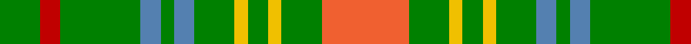

In pattern [GRGBGBGYGYGR](/patterns/grgbgbgygygr/).

This was sourced from weddslist.  It is a [12 stripes tartan](/stripes/stripes12/).

Original link http://www.weddslist.com/cgi-bin/tartans/pg.pl?source=sts

## Thread count
G/12 R6 G24 B6 G4 B6 G12 Y4 G6 Y4 G12 O/26

## Palette
Each colour and its ΔE from the base-6 reference it is a variant of.

| Colour | Shade | Base | ΔE (OKLab) |
|---|---|---|---|
| B | <code style="background-color:#5480B0;">#5480B0</code> `#5480B0` | B <code style="background-color:#2A418A;">#2A418A</code> | 0.19 |
| G | <code style="background-color:#008000;">#008000</code> `#008000` | G <code style="background-color:#006100;">#006100</code> | 0.10 |
| O | <code style="background-color:#F06030;">#F06030</code> `#F06030` | R <code style="background-color:#CC0000;">#CC0000</code> | 0.14 |
| R | <code style="background-color:#C00000;">#C00000</code> `#C00000` | R <code style="background-color:#CC0000;">#CC0000</code> | 0.03 |
| Y | <code style="background-color:#F0C000;">#F0C000</code> `#F0C000` | Y <code style="background-color:#F2BF00;">#F2BF00</code> | 0.00 |

## Nearest tartans

The nearest existing variants by ΔTartan distance.

1. [O'Brien Irish Family Tartan Tartan Number: 2225. Earliest known date: 1994 O'Brien is an Irish family tartan See products available Copyright © Blair Urquhart, Comrie, 2015](/setts/s12/y24g12ya4g6ya4g12b6g4b6g24r6g12-b5c8ca8-g006818-rc80000-yd87c00-yae8c000/) — ΔT 0.47
1. [O'Brien](/setts/s12/y26g12ya4g6ya4g12w6g4w6g24r6g12-g408060-rc80000-wa8ace8-yd87c00-yae8c000/) — ΔT 1.43
1. [Hall](/setts/s11/g12r6b12r6g24r6b12r6g24r6y3-b304080-g008000-rc00000-yf0c000/) — ΔT 1.49
1. [Newfoundland](/setts/s7/r8g6ra16w6ra8g36y6-g008000-rc00000-ra806050-we0e0e0-yf0c000/) — ΔT 1.50
1. [Balmoral Hotel Edinburgh](/setts/s13/g20b4g4b4g4ga12g12ga4g12ga12y12ya4y4-b64008c-g5c6428-ga005020-yf8e38c-ya9c9c00/) — ΔT 1.53
1. [Invertere (Daks #2)](/setts/s14/g28ga8b8ga54g6ga8y10ga8g6ga54b8ga8g28y10-b2c2c80-g289c18-ga604000-ye8c000/) — ΔT 1.55
1. [Dublin Irish County Tartan Tartan Number: 2250. Earliest known date: 1996 One of a series of Irish District tartans designed by Polly Wittering of the House of Edgar, with colours reminiscent of the Country with soft warm colours dominating. See products available Copyright © Blair Urquhart, Comrie, 2015](/setts/s12/r6y16r4y36b10y6ra6y6ra32y6ra6y6-b300438-r8c0020-ra906010-y6cac84/) — ΔT 1.61
1. [Wilson's, No 169](/setts/s9/g10r18g20w4g4y4g20r18g10-g008000-rc00000-we0e0e0-yf0c000/) — ΔT 1.65
1. [Newfoundland District Tartan Tartan Number: 1543. Earliest known date: 1972 The colours of the Newfoundland tartan are related to the 'Ode to Newfoundland', the second anthem of the province. Gold for the sun, green for the pine clad hill, white for the snow, brown for the minerals under the earth and red to denote her British origins. In 1972, the Minute of Provincial Affairs of the Province petitioned the Lord Lyon to record the tartan in the Writs section of the Lyon Court Books. This was done on the 3rd of September, 1973. See products available Copyright © Blair Urquhart, Comrie, 2015](/setts/s7/r8g6ga16w6ga8g36y6-g006818-ga604000-rc80000-we0e0e0-ye8c000/) — ΔT 1.66
1. [Bean Hunting](/setts/s7/b6r15g41r15b20g41ba6-b304080-ba5480b0-g008000-rc00000/) — ΔT 1.71

## Neighbour map

Every grey dot is one of 15726 variants placed by the first two principal components of the ΔTartan feature space (44% of its variance). Red is this tartan; blue dots are its nearest — click one to open its page.

<svg viewBox="0 0 640 380" role="img" style="max-width:100%;height:auto;border:1px solid #e0e0e0;border-radius:4px;display:block" xmlns="http://www.w3.org/2000/svg"><image href="/nn/cloud.v1.png" width="640" height="380"/><a href="/setts/s12/y24g12ya4g6ya4g12b6g4b6g24r6g12-b5c8ca8-g006818-rc80000-yd87c00-yae8c000/"><circle cx="257.2" cy="207.1" r="4" fill="#3465a4"><title>O'Brien Irish Family Tartan Tartan Number: 2225. Earliest known date: 1994 O'Brien is an Irish family tartan See products available Copyright © Blair Urquhart, Comrie, 2015</title></circle></a><a href="/setts/s12/y26g12ya4g6ya4g12w6g4w6g24r6g12-g408060-rc80000-wa8ace8-yd87c00-yae8c000/"><circle cx="279.3" cy="205.6" r="4" fill="#3465a4"><title>O'Brien</title></circle></a><a href="/setts/s11/g12r6b12r6g24r6b12r6g24r6y3-b304080-g008000-rc00000-yf0c000/"><circle cx="240.8" cy="213.4" r="4" fill="#3465a4"><title>Hall</title></circle></a><a href="/setts/s7/r8g6ra16w6ra8g36y6-g008000-rc00000-ra806050-we0e0e0-yf0c000/"><circle cx="223.2" cy="211.9" r="4" fill="#3465a4"><title>Newfoundland</title></circle></a><a href="/setts/s13/g20b4g4b4g4ga12g12ga4g12ga12y12ya4y4-b64008c-g5c6428-ga005020-yf8e38c-ya9c9c00/"><circle cx="162.6" cy="208.4" r="4" fill="#3465a4"><title>Balmoral Hotel Edinburgh</title></circle></a><a href="/setts/s14/g28ga8b8ga54g6ga8y10ga8g6ga54b8ga8g28y10-b2c2c80-g289c18-ga604000-ye8c000/"><circle cx="308.0" cy="178.2" r="4" fill="#3465a4"><title>Invertere (Daks #2)</title></circle></a><a href="/setts/s12/r6y16r4y36b10y6ra6y6ra32y6ra6y6-b300438-r8c0020-ra906010-y6cac84/"><circle cx="298.3" cy="186.5" r="4" fill="#3465a4"><title>Dublin Irish County Tartan Tartan Number: 2250. Earliest known date: 1996 One of a series of Irish District tartans designed by Polly Wittering of the House of Edgar, with colours reminiscent of the Country with soft warm colours dominating. See products available Copyright © Blair Urquhart, Comrie, 2015</title></circle></a><a href="/setts/s9/g10r18g20w4g4y4g20r18g10-g008000-rc00000-we0e0e0-yf0c000/"><circle cx="276.6" cy="247.1" r="4" fill="#3465a4"><title>Wilson's, No 169</title></circle></a><a href="/setts/s7/r8g6ga16w6ga8g36y6-g006818-ga604000-rc80000-we0e0e0-ye8c000/"><circle cx="218.2" cy="211.3" r="4" fill="#3465a4"><title>Newfoundland District Tartan Tartan Number: 1543. Earliest known date: 1972 The colours of the Newfoundland tartan are related to the 'Ode to Newfoundland', the second anthem of the province. Gold for the sun, green for the pine clad hill, white for the snow, brown for the minerals under the earth and red to denote her British origins. In 1972, the Minute of Provincial Affairs of the Province petitioned the Lord Lyon to record the tartan in the Writs section of the Lyon Court Books. This was done on the 3rd of September, 1973. See products available Copyright © Blair Urquhart, Comrie, 2015</title></circle></a><a href="/setts/s7/b6r15g41r15b20g41ba6-b304080-ba5480b0-g008000-rc00000/"><circle cx="283.4" cy="243.9" r="4" fill="#3465a4"><title>Bean Hunting</title></circle></a><circle cx="250.8" cy="196.2" r="5" fill="#c00000"/></svg>

ID: /setts/s12/r26g12y4g6y4g12b6g4b6g24ra6g12-b5480b0-g008000-rf06030-rac00000-yf0c000/
