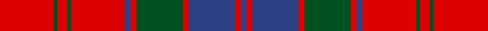

In pattern [BRBRGRBRGRGR](/stripes/brbrgrbrgrgr/).

This was sourced from register-of-tartans.  It is a [12 stripe tartan](/stripes/stripes12/).

Original link https://www.tartanregister.gov.uk/tartanDetails.aspx?ref=3526

## Register references

External register numbers recorded for this tartan.

- Scottish Register of Tartans: [3526](https://www.tartanregister.gov.uk/tartanDetails.aspx?ref=3526)
- Scottish Tartans World Register: 2003

## Thread count
R/56 G4 R10 G4 R56 B6 R6 G48 R6 B48 R6 B/6

## Palette
Each colour and the base-6 reference it is a variant of.

| Colour | Shade | Base |
|---|---|---|
| B | <code style="background-color:#2C4084;">#2C4084</code> `oklch(39.4% 0.117 268.3)` <small>#2C4084</small> | B <code style="background-color:#2A418A;">#2A418A</code> |
| G | <code style="background-color:#005020;">#005020</code> `oklch(37.7% 0.105 149.6)` <small>#005020</small> | G <code style="background-color:#006100;">#006100</code> |
| R | <code style="background-color:#DC0000;">#DC0000</code> `oklch(56.2% 0.230 29.2)` <small>#DC0000</small> | R <code style="background-color:#CC0000;">#CC0000</code> |

## Nearest tartans

The nearest existing variants by ΔTartan distance.

1. [Harry (Welsh Name)](/setts/s10/dt6o3dt3o15r7dt7r5dt17r46o4/) — ΔT 0.58
1. [Robertson Curtain](/setts/s13/r3dg2r19db2r3dg20r3db20r3db2r19dg2r3~x4/) — ΔT 0.59
1. [Robertson 1819](/setts/s13/r3g3r35db3r3db35r3g35r3db3r35g3r3~x2/) — ΔT 0.78
1. [Robertson #3](/setts/s13/r1dg1r9dg1r1db9r1dg9r1db1r9dg1r1~x4/) — ΔT 0.81
1. [Robertson 1](/setts/s13/r4g4r35dp4r4dp35r4g35r4dp4r35g4r4/) — ΔT 0.84
1. [Robertson, Curtain](/setts/s13/r3g2r19db2r3db20r3g20r3db2r19g2r3~x4/) — ΔT 0.88
1. [Bruce Old](/setts/s14/r45db4r4dg48r4db4r4db15r4db4r40dg4r4dg30/) — ΔT 0.89
1. [Cameron of Locheil](/setts/s13/db4r1db1r18db10r1dg1r6dg10r6w1r4db1~x2/) — ΔT 0.98
1. [Robertson D](/setts/s13/r3dg1r15db2r2dg15r2db15r2db2r15dg1r3~x2/) — ΔT 0.99
1. [Cameron of Locheil](/setts/s13/db4r1db1r18db10r1g1r6g10r6w1r4db1~x2/) — ΔT 1.00

## Neighbour map

Every grey dot is one of 14299 variants placed by the first two principal components of the ΔTartan feature space (44% of its variance). Red is this tartan; blue dots are its nearest — click one to open its page.

<svg viewBox="0 0 640 380" role="img" style="max-width:100%;height:auto;border:1px solid #e0e0e0;border-radius:4px;display:block" xmlns="http://www.w3.org/2000/svg"><image href="/nn/cloud.v1.png" width="640" height="380"/><a href="/setts/s10/dt6o3dt3o15r7dt7r5dt17r46o4/"><circle cx="338.5" cy="162.9" r="4" fill="#3465a4"><title>Harry (Welsh Name)</title></circle></a><a href="/setts/s13/r3dg2r19db2r3dg20r3db20r3db2r19dg2r3~x4/"><circle cx="315.3" cy="172.9" r="4" fill="#3465a4"><title>Robertson Curtain</title></circle></a><a href="/setts/s13/r3g3r35db3r3db35r3g35r3db3r35g3r3~x2/"><circle cx="319.5" cy="160.5" r="4" fill="#3465a4"><title>Robertson 1819</title></circle></a><a href="/setts/s13/r1dg1r9dg1r1db9r1dg9r1db1r9dg1r1~x4/"><circle cx="307.8" cy="173.2" r="4" fill="#3465a4"><title>Robertson #3</title></circle></a><a href="/setts/s13/r4g4r35dp4r4dp35r4g35r4dp4r35g4r4/"><circle cx="308.8" cy="174.6" r="4" fill="#3465a4"><title>Robertson 1</title></circle></a><a href="/setts/s13/r3g2r19db2r3db20r3g20r3db2r19g2r3~x4/"><circle cx="320.2" cy="178.8" r="4" fill="#3465a4"><title>Robertson, Curtain</title></circle></a><a href="/setts/s14/r45db4r4dg48r4db4r4db15r4db4r40dg4r4dg30/"><circle cx="319.3" cy="160.5" r="4" fill="#3465a4"><title>Bruce Old</title></circle></a><a href="/setts/s13/db4r1db1r18db10r1dg1r6dg10r6w1r4db1~x2/"><circle cx="337.4" cy="133.8" r="4" fill="#3465a4"><title>Cameron of Locheil</title></circle></a><a href="/setts/s13/r3dg1r15db2r2dg15r2db15r2db2r15dg1r3~x2/"><circle cx="321.2" cy="155.5" r="4" fill="#3465a4"><title>Robertson D</title></circle></a><a href="/setts/s13/db4r1db1r18db10r1g1r6g10r6w1r4db1~x2/"><circle cx="344.2" cy="140.8" r="4" fill="#3465a4"><title>Cameron of Locheil</title></circle></a><circle cx="343.6" cy="163.0" r="5" fill="#c00000"/></svg>

ID: /setts/s12/r28dg2r5dg2r28db3r3dg24r3db24r3db3~x2/
