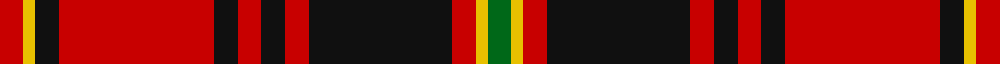

In pattern [GYRKRKRKRKYR](/stripes/gyrkrkrkrkyr/).

This was sourced from tartans-authority.  It is a [12 stripe tartan](/stripes/stripes12/).

Original link http://www.tartansauthority.com/tartan-ferret/display/1021/

## Attestations

This cloth appears in 3 source records; the oldest owns this page.

- 1970 — Hallingdal (District) (tartans-authority, [record](http://www.tartansauthority.com/tartan-ferret/display/1021/))
- undated — Hallingdal (weddslist, [record](http://www.weddslist.com/cgi-bin/tartans/pg.pl?source=sts))
- undated — Hallingdal District Tartan Tartan Number: 1021. Earliest known date: 1970 Hallingdal is a secluded valley in central Norway. This pattern was produced around 1970 and is similar but not identical to much older specimens. Erik Paulsen (MSTS) says that in Hallingdal there is a living tradition of tartan, but he can find no concrete evidence of Scottish influence in this area. Plain weave. See products available Copyright © Blair Urquhart, Comrie, 2015 (house-of-tartan, [record](http://www.house-of-tartan.scotland.net/house/TartanViewjs.asp?colr=Def&tnam=1021))

## Thread count
R/4 Y2 K4 R26 K4 R4 K4 R4 K24 R4 Y2 G/4

## Palette
Each colour and the base-6 reference it is a variant of.

| Colour | Shade | Base |
|---|---|---|
| G | <code style="background-color:#006818;">#006818</code> `oklch(45.0% 0.142 145.0)` <small>#006818</small> | G <code style="background-color:#006100;">#006100</code> |
| K | <code style="background-color:#101010;">#101010</code> `oklch(17.3% 0.000 89.9)` <small>#101010</small> | K <code style="background-color:#000000;">#000000</code> |
| R | <code style="background-color:#C80000;">#C80000</code> `oklch(52.3% 0.215 29.2)` <small>#C80000</small> | R <code style="background-color:#CC0000;">#CC0000</code> |
| Y | <code style="background-color:#E8C000;">#E8C000</code> `oklch(81.9% 0.168 93.7)` <small>#E8C000</small> | Y <code style="background-color:#F2BF00;">#F2BF00</code> |

## Nearest tartans

The nearest existing variants by ΔTartan distance.

1. [Unidentified No 3 #2](/setts/s15/r5k1r2k2r16t2r2k9r2dg2r2dg13r2k2r4~x2/) — ΔT 0.97
1. [First Special Service Force](/setts/s13/r8k14r6ly6r34k10r6w6r6k64r44db9r6/) — ΔT 0.98
1. [Grant, Kilt](/setts/s15/r5k1r2k2r16t2r2k9r2g2r2g13r2k2r4~x2/) — ΔT 1.04
1. [First Special Services Forces (Mil)](/setts/s13/r4k9r3ly3r18k4r2w2r2k36r24db4r3~x2/) — ΔT 1.04
1. [MacKillop (Scottish Tartan Society)](/setts/s10/dg4r2k2r20t1k7r2dg10r3k2~x2/) — ΔT 1.05
1. [Scoepaig, fragment](/setts/s10/k10t1k1r10t1k1t1r10g6r2~x2/) — ΔT 1.10
1. [State Seal of Alabama (Fashion)](/setts/s9/r60lo4k22g5k25t8k4r4k4~x2/) — ΔT 1.14
1. [Grant D](/setts/s15/r3db1r1g10r1g1r1db3r1lb1r12db1r1db1r3~x2/) — ΔT 1.14
1. [MacKinnon Black (Personal)](/setts/s12/dp3r4k5r12k24r3k10r26k12dp3r6w3~x2/) — ΔT 1.15
1. [Grant](/setts/s15/r16k6r6dg46r6dg5r6k12r6t6r48k6r6k6r16/) — ΔT 1.16

## Neighbour map

Every grey dot is one of 14299 variants placed by the first two principal components of the ΔTartan feature space (44% of its variance). Red is this tartan; blue dots are its nearest — click one to open its page.

<svg viewBox="0 0 640 380" role="img" style="max-width:100%;height:auto;border:1px solid #e0e0e0;border-radius:4px;display:block" xmlns="http://www.w3.org/2000/svg"><image href="/nn/cloud.v1.png" width="640" height="380"/><a href="/setts/s15/r5k1r2k2r16t2r2k9r2dg2r2dg13r2k2r4~x2/"><circle cx="296.1" cy="128.0" r="4" fill="#3465a4"><title>Unidentified No 3 #2</title></circle></a><a href="/setts/s13/r8k14r6ly6r34k10r6w6r6k64r44db9r6/"><circle cx="267.6" cy="126.8" r="4" fill="#3465a4"><title>First Special Service Force</title></circle></a><a href="/setts/s15/r5k1r2k2r16t2r2k9r2g2r2g13r2k2r4~x2/"><circle cx="276.1" cy="123.1" r="4" fill="#3465a4"><title>Grant, Kilt</title></circle></a><a href="/setts/s13/r4k9r3ly3r18k4r2w2r2k36r24db4r3~x2/"><circle cx="295.6" cy="103.9" r="4" fill="#3465a4"><title>First Special Services Forces (Mil)</title></circle></a><a href="/setts/s10/dg4r2k2r20t1k7r2dg10r3k2~x2/"><circle cx="306.8" cy="135.4" r="4" fill="#3465a4"><title>MacKillop (Scottish Tartan Society)</title></circle></a><a href="/setts/s10/k10t1k1r10t1k1t1r10g6r2~x2/"><circle cx="248.1" cy="160.9" r="4" fill="#3465a4"><title>Scoepaig, fragment</title></circle></a><a href="/setts/s9/r60lo4k22g5k25t8k4r4k4~x2/"><circle cx="279.5" cy="128.1" r="4" fill="#3465a4"><title>State Seal of Alabama (Fashion)</title></circle></a><a href="/setts/s15/r3db1r1g10r1g1r1db3r1lb1r12db1r1db1r3~x2/"><circle cx="319.8" cy="126.6" r="4" fill="#3465a4"><title>Grant D</title></circle></a><a href="/setts/s12/dp3r4k5r12k24r3k10r26k12dp3r6w3~x2/"><circle cx="258.6" cy="174.0" r="4" fill="#3465a4"><title>MacKinnon Black (Personal)</title></circle></a><a href="/setts/s15/r16k6r6dg46r6dg5r6k12r6t6r48k6r6k6r16/"><circle cx="301.8" cy="144.0" r="4" fill="#3465a4"><title>Grant</title></circle></a><circle cx="295.8" cy="137.5" r="5" fill="#c00000"/></svg>

ID: /setts/s12/r2ly1k2r13k2r2k2r2k12r2ly1g2~x2/
