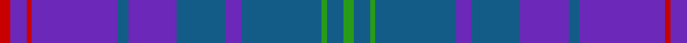

In pattern [GBGBBBBBBRBR](/stripes/gbgbbbbbbrbr/).

This was sourced from tartans-authority.  It is a [12 stripe tartan](/stripes/stripes12/).

Original link http://www.tartansauthority.com/tartan-ferret/display/8137/

## Thread count
R/4 P6 R2 P32 B4 P18 B18 P6 B30 G2 B6 G/4

## Palette
Each colour and the base-6 reference it is a variant of.

| Colour | Shade | Base |
|---|---|---|
| B | <code style="background-color:#145C88;">#145C88</code> `oklch(45.5% 0.098 241.7)` <small>#145C88</small> | B <code style="background-color:#2A418A;">#2A418A</code> |
| G | <code style="background-color:#289C18;">#289C18</code> `oklch(60.6% 0.191 141.6)` <small>#289C18</small> | G <code style="background-color:#006100;">#006100</code> |
| P | <code style="background-color:#6C28B8;">#6C28B8</code> `oklch(46.0% 0.208 299.2)` <small>#6C28B8</small> | B <code style="background-color:#2A418A;">#2A418A</code> |
| R | <code style="background-color:#C80000;">#C80000</code> `oklch(52.3% 0.215 29.2)` <small>#C80000</small> | R <code style="background-color:#CC0000;">#CC0000</code> |

## Nearest tartans

The nearest existing variants by ΔTartan distance, with this tartan at the top so the swatches line up against it.

ΔTartan

Tartan

Sett

—

<a href="/ttd/edit/#slug=r2p3r1p16n2p9n9p3n15g1n3g2~x2">Clydebank (Fashion)</a> <a class="nn-out" href="/setts/s12/r2p3r1p16n2p9n9p3n15g1n3g2~x2/" title="open its dictionary page">↗</a>

1.52

<a href="/ttd/edit/#slug=db2b2r1b16w1db20r2~x2">British American School (Corporate)</a> <a class="nn-out" href="/setts/s7/db2b2r1b16w1db20r2~x2/" title="open its dictionary page">↗</a>

1.69

<a href="/ttd/edit/#slug=b3b6dg12b14dg2b17b3dg1b3b17dg2lg3~x2">Reflections of the Sea</a> <a class="nn-out" href="/setts/s12/b3b6dg12b14dg2b17b3dg1b3b17dg2lg3~x2/" title="open its dictionary page">↗</a>

1.71

<a href="/ttd/edit/#slug=db6dp12lg3dp12b6db2b26dp16lb2dp6~x2">Serenade (Fashion)</a> <a class="nn-out" href="/setts/s10/db6dp12lg3dp12b6db2b26dp16lb2dp6~x2/" title="open its dictionary page">↗</a>

1.74

<a href="/ttd/edit/#slug=b24db4b4db4b4db20n32w4n32db35r5db4">Caledonian Club</a> <a class="nn-out" href="/setts/s12/b24db4b4db4b4db20n32w4n32db35r5db4/" title="open its dictionary page">↗</a>

1.75

<a href="/ttd/edit/#slug=db42n13r3n2ly3n2r3n11db8n8db26n8db8n8db4m3db4n16~x2">Cordiner (Name)</a> <a class="nn-out" href="/setts/s18/db42n13r3n2ly3n2r3n11db8n8db26n8db8n8db4m3db4n16~x2/" title="open its dictionary page">↗</a>

1.75

<a href="/ttd/edit/#slug=db4g5dp3g5db46dp42w4dp4">Clans of Caledonia</a> <a class="nn-out" href="/setts/s8/db4g5dp3g5db46dp42w4dp4/" title="open its dictionary page">↗</a>

1.75

<a href="/ttd/edit/#slug=b36db6b5r3k2r3b5db18~x2">Leonard (Name)</a> <a class="nn-out" href="/setts/s8/b36db6b5r3k2r3b5db18~x2/" title="open its dictionary page">↗</a>

1.79

<a href="/ttd/edit/#slug=db4w3db4dp3db3dp3db15db8db11db28ly2~x2">Kilmarnock F.C. (Sports)</a> <a class="nn-out" href="/setts/s11/db4w3db4dp3db3dp3db15db8db11db28ly2~x2/" title="open its dictionary page">↗</a>

1.80

<a href="/ttd/edit/#slug=dt12db3dt2r4dt2db20lo2db4lo2db20dt2r4dt2db3dt12db2~x2">Stone of Destiny, The</a> <a class="nn-out" href="/setts/s16/dt12db3dt2r4dt2db20lo2db4lo2db20dt2r4dt2db3dt12db2~x2/" title="open its dictionary page">↗</a>

1.81

<a href="/ttd/edit/#slug=db9b2db2ly1b7db2r1b4~x4">Mercer, Charles</a> <a class="nn-out" href="/setts/s8/db9b2db2ly1b7db2r1b4~x4/" title="open its dictionary page">↗</a>

## Neighbour map

Every grey dot is one of 14299 variants placed by the first two principal components of the ΔTartan feature space (44% of its variance). Red is this tartan; blue dots are its nearest — click one to open its page.

<svg viewBox="0 0 640 380" role="img" style="max-width:100%;height:auto;border:1px solid #e0e0e0;border-radius:4px;display:block" xmlns="http://www.w3.org/2000/svg"><image href="/nn/cloud.v1.png" width="640" height="380"/><a href="/setts/s7/db2b2r1b16w1db20r2~x2/"><circle cx="395.0" cy="196.5" r="4" fill="#3465a4"><title>British American School (Corporate)</title></circle></a><a href="/setts/s12/b3b6dg12b14dg2b17b3dg1b3b17dg2lg3~x2/"><circle cx="312.8" cy="201.9" r="4" fill="#3465a4"><title>Reflections of the Sea</title></circle></a><a href="/setts/s10/db6dp12lg3dp12b6db2b26dp16lb2dp6~x2/"><circle cx="297.1" cy="187.4" r="4" fill="#3465a4"><title>Serenade (Fashion)</title></circle></a><a href="/setts/s12/b24db4b4db4b4db20n32w4n32db35r5db4/"><circle cx="243.0" cy="203.9" r="4" fill="#3465a4"><title>Caledonian Club</title></circle></a><a href="/setts/s18/db42n13r3n2ly3n2r3n11db8n8db26n8db8n8db4m3db4n16~x2/"><circle cx="376.7" cy="151.7" r="4" fill="#3465a4"><title>Cordiner (Name)</title></circle></a><a href="/setts/s8/db4g5dp3g5db46dp42w4dp4/"><circle cx="346.1" cy="182.8" r="4" fill="#3465a4"><title>Clans of Caledonia</title></circle></a><a href="/setts/s8/b36db6b5r3k2r3b5db18~x2/"><circle cx="417.7" cy="197.7" r="4" fill="#3465a4"><title>Leonard (Name)</title></circle></a><a href="/setts/s11/db4w3db4dp3db3dp3db15db8db11db28ly2~x2/"><circle cx="303.2" cy="188.6" r="4" fill="#3465a4"><title>Kilmarnock F.C. (Sports)</title></circle></a><a href="/setts/s16/dt12db3dt2r4dt2db20lo2db4lo2db20dt2r4dt2db3dt12db2~x2/"><circle cx="370.0" cy="208.0" r="4" fill="#3465a4"><title>Stone of Destiny, The</title></circle></a><a href="/setts/s8/db9b2db2ly1b7db2r1b4~x4/"><circle cx="305.8" cy="237.8" r="4" fill="#3465a4"><title>Mercer, Charles</title></circle></a><circle cx="355.0" cy="196.6" r="5" fill="#c00000"/></svg>

ID: /setts/s12/r2p3r1p16n2p9n9p3n15g1n3g2~x2/
