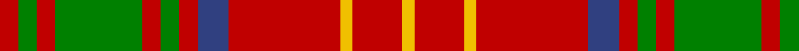

In pattern [RGRGRGRBRYRY](/patterns/rgrgrgrbryry/).

This was sourced from weddslist.  It is a [12 stripes tartan](/stripes/stripes12/).

Original link http://www.weddslist.com/cgi-bin/tartans/pg.pl?source=sts

## Thread count
R/6 G6 R6 G28 R6 G6 R6 B10 R36 Y4 R16 Y/4

## Palette
Each colour and its ΔE from the base-6 reference it is a variant of.

| Colour | Shade | Base | ΔE (OKLab) |
|---|---|---|---|
| B | <code style="background-color:#304080;">#304080</code> `#304080` | B <code style="background-color:#2A418A;">#2A418A</code> | 0.02 |
| G | <code style="background-color:#008000;">#008000</code> `#008000` | G <code style="background-color:#006100;">#006100</code> | 0.10 |
| R | <code style="background-color:#C00000;">#C00000</code> `#C00000` | R <code style="background-color:#CC0000;">#CC0000</code> | 0.03 |
| Y | <code style="background-color:#F0C000;">#F0C000</code> `#F0C000` | Y <code style="background-color:#F2BF00;">#F2BF00</code> | 0.00 |

## Nearest tartans

The nearest existing variants by ΔTartan distance.

1. [Burns Family Tartan Tartan Number: 1539. Earliest known date: pre 2003 Modern family sett discovered by MacKinlay at Messrs Forsyth. Probably dates between 1930-50. There is also a Robert Burns check. (see under R...) See products available Copyright © Blair Urquhart, Comrie, 2015](/setts/s12/r3g3r3g14r3g3r3b5r18y2r8y2~b2c2c80-g006818-rc80000-ye8c000~x2/) — ΔT 0.32
1. [Burns 1930](/setts/s12/r2g2r2g8r2g2r2b2r11y1r4y1~b2c2c80-g006818-rc80000-ye8c000~x4/) — ΔT 0.56
1. [Bruce (Vestiarium)](/setts/s11/w1r8g2r2g6r1g6r2g2r8y1~g006818-rc80000-we0e0e0-ye8c000~x4/) — ΔT 0.70
1. [London, Caledonian](/setts/s13/r9b2r21ba2r2b8r2g2r2g17r2b2r8~b304080-ba5480b0-g008000-rc00000~x2/) — ΔT 0.84
1. [Bruce](/setts/s11/w1r8g2r2g6r1g6r2g2r8y1~g008000-rc00000-we0e0e0-yf0c000~x4/) — ΔT 0.84
1. [MacKinnon 9](/setts/s14/w2r4g2b2r6g4r2b5g2r20g7w2r4w2~b304080-g008000-rc00000-we0e0e0~x2/) — ΔT 0.85
1. [Morrison Old Clan Tartan Tartan Number: 933. Earliest known date: 1745 This sett is very similar to the single green stripe version recorded by Lord Lyon in 1968. The date given by MacKinlay is 1745 whereas Lord Lyon gives 1747. Both setts are clearly based on the same pattern which was found in an old Morrison family bible during demolition work on a Black House in Lewis in 1935. [50%] See products available Copyright © Blair Urquhart, Comrie, 2015](/setts/s10/g6w3g12r12k4r6k4r24g4r6~g006818-k101010-rc80000-we0e0e0/) — ΔT 0.93
1. [MacKinnon 7](/setts/s11/w2r4g8r16b2r3g16r4b2r4w2~b5480b0-g008000-rc00000-we0e0e0~x2/) — ΔT 0.94
1. [Dabney Red (Personal)](/setts/s13/r5b3r24g7ba6r3g3r3g11r6ba3r3b3~b1870a4-ba2c2c80-g006818-rc80000~x2/) — ΔT 0.95
1. [MacKinnon #10](/setts/s11/w2r4g8r16b2r3g16r4b2r4w2~b3c82af-g005020-rdc0000-we0e0e0~x2/) — ΔT 0.97

## Neighbour map

Every grey dot is one of 15726 variants placed by the first two principal components of the ΔTartan feature space (44% of its variance). Red is this tartan; blue dots are its nearest — click one to open its page.

<svg viewBox="0 0 640 380" role="img" style="max-width:100%;height:auto;border:1px solid #e0e0e0;border-radius:4px;display:block" xmlns="http://www.w3.org/2000/svg"><image href="/nn/cloud.v1.png" width="640" height="380"/><a href="/setts/s12/r3g3r3g14r3g3r3b5r18y2r8y2~b2c2c80-g006818-rc80000-ye8c000~x2/"><circle cx="311.9" cy="174.7" r="4" fill="#3465a4"><title>Burns Family Tartan Tartan Number: 1539. Earliest known date: pre 2003 Modern family sett discovered by MacKinlay at Messrs Forsyth. Probably dates between 1930-50. There is also a Robert Burns check. (see under R...) See products available Copyright © Blair Urquhart, Comrie, 2015</title></circle></a><a href="/setts/s12/r2g2r2g8r2g2r2b2r11y1r4y1~b2c2c80-g006818-rc80000-ye8c000~x4/"><circle cx="342.7" cy="168.8" r="4" fill="#3465a4"><title>Burns 1930</title></circle></a><a href="/setts/s11/w1r8g2r2g6r1g6r2g2r8y1~g006818-rc80000-we0e0e0-ye8c000~x4/"><circle cx="304.7" cy="197.3" r="4" fill="#3465a4"><title>Bruce (Vestiarium)</title></circle></a><a href="/setts/s13/r9b2r21ba2r2b8r2g2r2g17r2b2r8~b304080-ba5480b0-g008000-rc00000~x2/"><circle cx="339.9" cy="162.4" r="4" fill="#3465a4"><title>London, Caledonian</title></circle></a><a href="/setts/s11/w1r8g2r2g6r1g6r2g2r8y1~g008000-rc00000-we0e0e0-yf0c000~x4/"><circle cx="300.7" cy="196.5" r="4" fill="#3465a4"><title>Bruce</title></circle></a><a href="/setts/s14/w2r4g2b2r6g4r2b5g2r20g7w2r4w2~b304080-g008000-rc00000-we0e0e0~x2/"><circle cx="294.7" cy="149.2" r="4" fill="#3465a4"><title>MacKinnon 9</title></circle></a><a href="/setts/s10/g6w3g12r12k4r6k4r24g4r6~g006818-k101010-rc80000-we0e0e0/"><circle cx="307.0" cy="196.2" r="4" fill="#3465a4"><title>Morrison Old Clan Tartan Tartan Number: 933. Earliest known date: 1745 This sett is very similar to the single green stripe version recorded by Lord Lyon in 1968. The date given by MacKinlay is 1745 whereas Lord Lyon gives 1747. Both setts are clearly based on the same pattern which was found in an old Morrison family bible during demolition work on a Black House in Lewis in 1935. [50%] See products available Copyright © Blair Urquhart, Comrie, 2015</title></circle></a><a href="/setts/s11/w2r4g8r16b2r3g16r4b2r4w2~b5480b0-g008000-rc00000-we0e0e0~x2/"><circle cx="264.5" cy="180.7" r="4" fill="#3465a4"><title>MacKinnon 7</title></circle></a><a href="/setts/s13/r5b3r24g7ba6r3g3r3g11r6ba3r3b3~b1870a4-ba2c2c80-g006818-rc80000~x2/"><circle cx="298.1" cy="177.3" r="4" fill="#3465a4"><title>Dabney Red (Personal)</title></circle></a><a href="/setts/s11/w2r4g8r16b2r3g16r4b2r4w2~b3c82af-g005020-rdc0000-we0e0e0~x2/"><circle cx="259.3" cy="176.2" r="4" fill="#3465a4"><title>MacKinnon #10</title></circle></a><circle cx="310.9" cy="175.1" r="5" fill="#c00000"/></svg>

ID: /setts/s12/r3g3r3g14r3g3r3b5r18y2r8y2~b304080-g008000-rc00000-yf0c000~x2/
