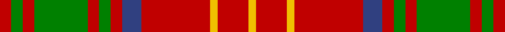

In pattern [RGRGRGRBRYRY](/stripes/rgrgrgrbryry/).

This was sourced from weddslist.  It is a [12 stripe tartan](/stripes/stripes12/).

Original link http://www.weddslist.com/cgi-bin/tartans/pg.pl?source=sts

## Attestations

This cloth appears in 2 source records; the oldest owns this page.

- undated — Burns (weddslist, [record](http://www.weddslist.com/cgi-bin/tartans/pg.pl?source=sts))
- undated — Burns Family Tartan Tartan Number: 1539. Earliest known date: pre 2003 Modern family sett discovered by MacKinlay at Messrs Forsyth. Probably dates between 1930-50. There is also a Robert Burns check. (see under R...) See products available Copyright © Blair Urquhart, Comrie, 2015 (house-of-tartan, [record](http://www.house-of-tartan.scotland.net/house/TartanViewjs.asp?colr=Def&tnam=1539))

## Thread count
R/6 G6 R6 G28 R6 G6 R6 B10 R36 Y4 R16 Y/4

## Palette
Each colour and the base-6 reference it is a variant of.

| Colour | Shade | Base |
|---|---|---|
| B | <code style="background-color:#304080;">#304080</code> `oklch(39.4% 0.109 270.2)` <small>#304080</small> | B <code style="background-color:#2A418A;">#2A418A</code> |
| G | <code style="background-color:#008000;">#008000</code> `oklch(52.0% 0.177 142.5)` <small>#008000</small> | G <code style="background-color:#006100;">#006100</code> |
| R | <code style="background-color:#C00000;">#C00000</code> `oklch(50.7% 0.208 29.2)` <small>#C00000</small> | R <code style="background-color:#CC0000;">#CC0000</code> |
| Y | <code style="background-color:#F0C000;">#F0C000</code> `oklch(82.7% 0.169 90.5)` <small>#F0C000</small> | Y <code style="background-color:#F2BF00;">#F2BF00</code> |

## Nearest tartans

The nearest existing variants by ΔTartan distance.

1. [Burns 1930](/setts/s12/r2g2r2g8r2g2r2db2r11ly1r4ly1~x4/) — ΔT 0.56
1. [Bruce (Vestiarium)](/setts/s11/w1r8g2r2g6r1g6r2g2r8ly1~x4/) — ΔT 0.70
1. [London, Caledonian](/setts/s13/r9db2r21t2r2db8r2g2r2g17r2db2r8~x2/) — ΔT 0.84
1. [MacKinnon 9](/setts/s14/w2r4g2db2r6g4r2db5g2r20g7w2r4w2~x2/) — ΔT 0.85
1. [MacKinnon 7](/setts/s11/w2r4g8r16t2r3g16r4t2r4w2~x2/) — ΔT 0.94
1. [Dabney Red (Personal)](/setts/s13/r5b3r24g7db6r3g3r3g11r6db3r3b3~x2/) — ΔT 0.95
1. [MacKinnon #10](/setts/s11/w2r4dg8r16t2r3dg16r4t2r4w2~x2/) — ΔT 0.97
1. [Morrison](/setts/s9/g5w2g8r9k3r4k3r17g3~x2/) — ΔT 1.00
1. [Peacock, Grahame (Name)](/setts/s11/r10g2r20g16db3g16r3db8r20g2r10~x2/) — ΔT 1.02
1. [Kirk](/setts/s12/r4g21r4k7r34lo3r4~x2/) — ΔT 1.03

## Neighbour map

Every grey dot is one of 14299 variants placed by the first two principal components of the ΔTartan feature space (44% of its variance). Red is this tartan; blue dots are its nearest — click one to open its page.

<svg viewBox="0 0 640 380" role="img" style="max-width:100%;height:auto;border:1px solid #e0e0e0;border-radius:4px;display:block" xmlns="http://www.w3.org/2000/svg"><image href="/nn/cloud.v1.png" width="640" height="380"/><a href="/setts/s12/r2g2r2g8r2g2r2db2r11ly1r4ly1~x4/"><circle cx="342.4" cy="166.6" r="4" fill="#3465a4"><title>Burns 1930</title></circle></a><a href="/setts/s11/w1r8g2r2g6r1g6r2g2r8ly1~x4/"><circle cx="304.8" cy="195.4" r="4" fill="#3465a4"><title>Bruce (Vestiarium)</title></circle></a><a href="/setts/s13/r9db2r21t2r2db8r2g2r2g17r2db2r8~x2/"><circle cx="339.9" cy="161.9" r="4" fill="#3465a4"><title>London, Caledonian</title></circle></a><a href="/setts/s14/w2r4g2db2r6g4r2db5g2r20g7w2r4w2~x2/"><circle cx="295.0" cy="146.5" r="4" fill="#3465a4"><title>MacKinnon 9</title></circle></a><a href="/setts/s11/w2r4g8r16t2r3g16r4t2r4w2~x2/"><circle cx="265.2" cy="179.4" r="4" fill="#3465a4"><title>MacKinnon 7</title></circle></a><a href="/setts/s13/r5b3r24g7db6r3g3r3g11r6db3r3b3~x2/"><circle cx="298.5" cy="177.2" r="4" fill="#3465a4"><title>Dabney Red (Personal)</title></circle></a><a href="/setts/s11/w2r4dg8r16t2r3dg16r4t2r4w2~x2/"><circle cx="259.9" cy="173.5" r="4" fill="#3465a4"><title>MacKinnon #10</title></circle></a><a href="/setts/s9/g5w2g8r9k3r4k3r17g3~x2/"><circle cx="286.1" cy="194.9" r="4" fill="#3465a4"><title>Morrison</title></circle></a><a href="/setts/s11/r10g2r20g16db3g16r3db8r20g2r10~x2/"><circle cx="316.2" cy="198.3" r="4" fill="#3465a4"><title>Peacock, Grahame (Name)</title></circle></a><a href="/setts/s12/r4g21r4k7r34lo3r4~x2/"><circle cx="345.5" cy="175.0" r="4" fill="#3465a4"><title>Kirk</title></circle></a><circle cx="310.9" cy="173.3" r="5" fill="#c00000"/></svg>

ID: /setts/s12/r3g3r3g14r3g3r3db5r18ly2r8ly2~x2/
