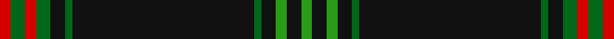

In pattern [GKGKGKGKGRGR](/stripes/gkgkgkgkgrgr/).

This was sourced from tartans-authority.  It is a [12 stripe tartan](/stripes/stripes12/).

Original link http://www.tartansauthority.com/tartan-ferret/display/7637/

## Attestations

This cloth appears in 2 source records; the oldest owns this page.

- 2007 — Ross, Ryan (Personal) (tartans-authority, [record](http://www.tartansauthority.com/tartan-ferret/display/7637/))
- undated — Ross, Ryan (Personal) (register-of-tartans, [record](https://www.tartanregister.gov.uk/tartanDetails.aspx?ref=5652))

## Register references

External register numbers recorded for this tartan.

- Scottish Register of Tartans: [5652](https://www.tartanregister.gov.uk/tartanDetails.aspx?ref=5652)
- Scottish Tartans Authority (ITI): 7637

## Thread count
R/6 Ga8 R6 Ga8 K8 Ga4 K100 Ga4 K8 G6 K8 G/6

## Palette
Each colour and the base-6 reference it is a variant of.

| Colour | Shade | Base |
|---|---|---|
| G | <code style="background-color:#289C18;">#289C18</code> `oklch(60.6% 0.191 141.6)` <small>#289C18</small> | G <code style="background-color:#006100;">#006100</code> |
| Ga | <code style="background-color:#006818;">#006818</code> `oklch(45.0% 0.142 145.0)` <small>#006818</small> | G <code style="background-color:#006100;">#006100</code> |
| K | <code style="background-color:#101010;">#101010</code> `oklch(17.3% 0.000 89.9)` <small>#101010</small> | K <code style="background-color:#000000;">#000000</code> |
| R | <code style="background-color:#D40000;">#D40000</code> `oklch(54.6% 0.224 29.2)` <small>#D40000</small> | R <code style="background-color:#CC0000;">#CC0000</code> |

## Nearest tartans

The nearest existing variants by ΔTartan distance, with this tartan at the top so the swatches line up against it.

ΔTartan

Tartan

Sett

—

<a href="/ttd/edit/#slug=r3g4r3g4k4g2k50g2k4g3k4g3~x2">Ross, Ryan (Personal)</a> <a class="nn-out" href="/setts/s12/r3g4r3g4k4g2k50g2k4g3k4g3~x2/" title="open its dictionary page">↗</a>

0.60

<a href="/ttd/edit/#slug=k50g7k4w2k2ly2k2g7k2g3ly2~x2">Initial City Link</a> <a class="nn-out" href="/setts/s11/k50g7k4w2k2ly2k2g7k2g3ly2~x2/" title="open its dictionary page">↗</a>

0.98

<a href="/ttd/edit/#slug=k50dg7k4w2k2ly2k2dg7k2dg3ly2~x2">Initial City Link #2</a> <a class="nn-out" href="/setts/s11/k50dg7k4w2k2ly2k2dg7k2dg3ly2~x2/" title="open its dictionary page">↗</a>

1.06

<a href="/ttd/edit/#slug=g4k6g4k6g12k75g3k6g14k6w4">Irish Heritage</a> <a class="nn-out" href="/setts/s11/g4k6g4k6g12k75g3k6g14k6w4/" title="open its dictionary page">↗</a>

1.20

<a href="/ttd/edit/#slug=w5k2db14k4r8k4db4k80r6k4r4">American Heritage</a> <a class="nn-out" href="/setts/s11/w5k2db14k4r8k4db4k80r6k4r4/" title="open its dictionary page">↗</a>

1.26

<a href="/ttd/edit/#slug=k48n4k6lb2k2r2k2n10o6k2o3r2~x2">Longmount</a> <a class="nn-out" href="/setts/s12/k48n4k6lb2k2r2k2n10o6k2o3r2~x2/" title="open its dictionary page">↗</a>

1.37

<a href="/ttd/edit/#slug=dg42k10lr2k2r2k2dg10r6k2r3dg2~x2">Dryfe</a> <a class="nn-out" href="/setts/s11/dg42k10lr2k2r2k2dg10r6k2r3dg2~x2/" title="open its dictionary page">↗</a>

1.37

<a href="/ttd/edit/#slug=k49o8k4n6o4n6k4o8k49o2">Harley Davidson</a> <a class="nn-out" href="/setts/s10/k49o8k4n6o4n6k4o8k49o2/" title="open its dictionary page">↗</a>

1.50

<a href="/ttd/edit/#slug=k4g12k3g4k3g3k36g3k2ly3~x2">Reagan (Personal)</a> <a class="nn-out" href="/setts/s10/k4g12k3g4k3g3k36g3k2ly3~x2/" title="open its dictionary page">↗</a>

1.51

<a href="/ttd/edit/#slug=db8r1k6r1lo8r1k45lo1~x2">degli Uberti, Baron of Cartsburn (Personal)</a> <a class="nn-out" href="/setts/s8/db8r1k6r1lo8r1k45lo1~x2/" title="open its dictionary page">↗</a>

1.55

<a href="/ttd/edit/#slug=k2g4k6lr2k31ly2k1ly2k16g20ly1lr2~x2">Entier</a> <a class="nn-out" href="/setts/s12/k2g4k6lr2k31ly2k1ly2k16g20ly1lr2~x2/" title="open its dictionary page">↗</a>

## Neighbour map

Every grey dot is one of 14299 variants placed by the first two principal components of the ΔTartan feature space (44% of its variance). Red is this tartan; blue dots are its nearest — click one to open its page.

<svg viewBox="0 0 640 380" role="img" style="max-width:100%;height:auto;border:1px solid #e0e0e0;border-radius:4px;display:block" xmlns="http://www.w3.org/2000/svg"><image href="/nn/cloud.v1.png" width="640" height="380"/><a href="/setts/s11/k50g7k4w2k2ly2k2g7k2g3ly2~x2/"><circle cx="481.0" cy="117.1" r="4" fill="#3465a4"><title>Initial City Link</title></circle></a><a href="/setts/s11/k50dg7k4w2k2ly2k2dg7k2dg3ly2~x2/"><circle cx="478.3" cy="112.2" r="4" fill="#3465a4"><title>Initial City Link #2</title></circle></a><a href="/setts/s11/g4k6g4k6g12k75g3k6g14k6w4/"><circle cx="502.6" cy="151.7" r="4" fill="#3465a4"><title>Irish Heritage</title></circle></a><a href="/setts/s11/w5k2db14k4r8k4db4k80r6k4r4/"><circle cx="495.6" cy="107.7" r="4" fill="#3465a4"><title>American Heritage</title></circle></a><a href="/setts/s12/k48n4k6lb2k2r2k2n10o6k2o3r2~x2/"><circle cx="431.1" cy="104.8" r="4" fill="#3465a4"><title>Longmount</title></circle></a><a href="/setts/s11/dg42k10lr2k2r2k2dg10r6k2r3dg2~x2/"><circle cx="416.1" cy="138.0" r="4" fill="#3465a4"><title>Dryfe</title></circle></a><a href="/setts/s10/k49o8k4n6o4n6k4o8k49o2/"><circle cx="508.2" cy="154.7" r="4" fill="#3465a4"><title>Harley Davidson</title></circle></a><a href="/setts/s10/k4g12k3g4k3g3k36g3k2ly3~x2/"><circle cx="445.1" cy="172.6" r="4" fill="#3465a4"><title>Reagan (Personal)</title></circle></a><a href="/setts/s8/db8r1k6r1lo8r1k45lo1~x2/"><circle cx="499.8" cy="118.3" r="4" fill="#3465a4"><title>degli Uberti, Baron of Cartsburn (Personal)</title></circle></a><a href="/setts/s12/k2g4k6lr2k31ly2k1ly2k16g20ly1lr2~x2/"><circle cx="406.8" cy="132.1" r="4" fill="#3465a4"><title>Entier</title></circle></a><circle cx="487.7" cy="118.3" r="5" fill="#c00000"/></svg>

ID: /setts/s12/r3g4r3g4k4g2k50g2k4g3k4g3~x2/
