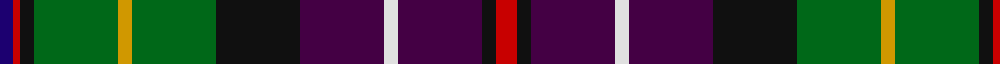

In pattern [BRKGYGKBWBKR](/patterns/brkgygkbwbkr/).

This was sourced from tartans-authority.  It is a [12 stripes tartan](/stripes/stripes12/).

Original link http://www.tartansauthority.com/tartan-ferret/display/555/

## Thread count
DB/4 R2 K4 G24 DY4 G24 K24 DP24 LN4 DP24 K4 R/6

## Palette
Each colour and its ΔE from the base-6 reference it is a variant of.

| Colour | Shade | Base | ΔE (OKLab) |
|---|---|---|---|
| DB | <code style="background-color:#1C0070;">#1C0070</code> `#1C0070` | B <code style="background-color:#2A418A;">#2A418A</code> | 0.14 |
| DP | <code style="background-color:#440044;">#440044</code> `#440044` | B <code style="background-color:#2A418A;">#2A418A</code> | 0.18 |
| DY | <code style="background-color:#D09800;">#D09800</code> `#D09800` | Y <code style="background-color:#F2BF00;">#F2BF00</code> | 0.12 |
| G | <code style="background-color:#006818;">#006818</code> `#006818` | G <code style="background-color:#006100;">#006100</code> | 0.02 |
| K | <code style="background-color:#101010;">#101010</code> `#101010` | K <code style="background-color:#000000;">#000000</code> | 0.17 |
| LN | <code style="background-color:#E0E0E0;">#E0E0E0</code> `#E0E0E0` | W <code style="background-color:#F7F7F7;">#F7F7F7</code> | 0.07 |
| R | <code style="background-color:#C80000;">#C80000</code> `#C80000` | R <code style="background-color:#CC0000;">#CC0000</code> | 0.01 |

## Nearest tartans

The nearest existing variants by ΔTartan distance.

1. [Rust (Personal)](/setts/s12/r3k2b12w2b12k12g12y2g12k2r1ba2~b440044-ba2c2c80-g006818-k101010-rc80000-we0e0e0-yd09800~x2/) — ΔT 0.03
1. [Rust Personal Tartan Tartan Number: 555. Earliest known date: Oman 1983 Amended sett from T.S.D See products available Copyright © Blair Urquhart, Comrie, 2015](/setts/s12/r3k2b12w2b12k12g12y2g12k2r1ba2~b780078-ba2888c4-g006818-k101010-rc80000-we0e0e0-ye8c000~x2/) — ΔT 0.66
1. [Iowa](/setts/s14/r4y3g12k16ga5b20k4w2k4b20ga5k16g12y3~b2c2c80-g006818-ga604000-k101010-rc80000-wf8f8f8-ye8c000~x2/) — ΔT 0.79
1. [Iowa American District Tartan Tartan Number: 6051. Earliest known date: 2004 Iowa has a rich history of Scottish influence in the towns and cities. The Iowa Scottish Heritage Society desired to give to the people of Iowa a tartan that symbolizes the state. Blue for the sky, rivers & lakes, Green for the fields our farmers plant. Black for the rich soil for which we are blessed. White for the snow. Red for the barns and the wild rose. Brown for the earth. Yellow for corn and the Goldfinch. Adopted by the State of Iowa General Assembly, resolution No 149 by Heaton & Whitaker. See products available Copyright © Blair Urquhart, Comrie, 2015](/setts/s14/g12k16ga5b20k4w2k4b20ga5k16g12y3r4y3~b2c2c80-g006818-ga604000-k101010-rc80000-wf8f8f8-ye8c000~x2/) — ΔT 0.79
1. [Nashotah House (Commemorative)](/setts/s13/r2k1ra5k7w2k14b8g15w2g7r5g1y2~b2c2c80-g006818-k101010-rc80000-rab468ac-we0e0e0-yd09800~x2/) — ΔT 0.96
1. [Wisconsin (US State)](/setts/s10/b11r3b2ra3k12g20y2k12b11ya3~b506880-g285800-k101010-rc80000-ra888888-ye8c000-yabc8c00~x2/) — ΔT 1.00
1. [Culloden 1746 Artefact Tartan Tartan Number: 7422. Earliest known date: 1746 Count from the original Culloden coat discovered and later examined by Peter MacDonald on display at the Kelvingrove Museum, Glasgow. See products available Copyright © Blair Urquhart, Comrie, 2015](/setts/s14/r5w1b10wa2k10g10k1y3k1g10k10wa2b10w1~b003c64-g5c6428-k101010-rc80000-w98c8e8-wafcfcfc-ye8c000~x4/) — ΔT 1.01
1. [Allison (MacGregor-Hastie)](/setts/s14/b2k2b16k15y2g16k2g16w2k17ba4r6k3y2~b2c2c80-ba1c0070-g006818-k101010-rd05054-we0e0e0-ye8c000~x2/) — ΔT 1.03
1. [Campbell Hunting](/setts/s10/b4k1w2k3y1r12g1k12g12ra4~b1474b4-g604000-k101010-r888888-rac80000-wf8f8f8-ye8c000~x2/) — ΔT 1.05
1. [Iowa (District)](/setts/s8/r4y3g12k16ga5b20k4w2~b2c2c80-g006818-ga604000-k101010-rc80000-wf8f8f8-ye8c000~x2/) — ΔT 1.09

## Neighbour map

Every grey dot is one of 15726 variants placed by the first two principal components of the ΔTartan feature space (44% of its variance). Red is this tartan; blue dots are its nearest — click one to open its page.

<svg viewBox="0 0 640 380" role="img" style="max-width:100%;height:auto;border:1px solid #e0e0e0;border-radius:4px;display:block" xmlns="http://www.w3.org/2000/svg"><image href="/nn/cloud.v1.png" width="640" height="380"/><a href="/setts/s12/r3k2b12w2b12k12g12y2g12k2r1ba2~b440044-ba2c2c80-g006818-k101010-rc80000-we0e0e0-yd09800~x2/"><circle cx="111.7" cy="130.7" r="4" fill="#3465a4"><title>Rust (Personal)</title></circle></a><a href="/setts/s12/r3k2b12w2b12k12g12y2g12k2r1ba2~b780078-ba2888c4-g006818-k101010-rc80000-we0e0e0-ye8c000~x2/"><circle cx="102.0" cy="122.4" r="4" fill="#3465a4"><title>Rust Personal Tartan Tartan Number: 555. Earliest known date: Oman 1983 Amended sett from T.S.D See products available Copyright © Blair Urquhart, Comrie, 2015</title></circle></a><a href="/setts/s14/r4y3g12k16ga5b20k4w2k4b20ga5k16g12y3~b2c2c80-g006818-ga604000-k101010-rc80000-wf8f8f8-ye8c000~x2/"><circle cx="81.0" cy="138.8" r="4" fill="#3465a4"><title>Iowa</title></circle></a><a href="/setts/s14/g12k16ga5b20k4w2k4b20ga5k16g12y3r4y3~b2c2c80-g006818-ga604000-k101010-rc80000-wf8f8f8-ye8c000~x2/"><circle cx="81.0" cy="138.8" r="4" fill="#3465a4"><title>Iowa American District Tartan Tartan Number: 6051. Earliest known date: 2004 Iowa has a rich history of Scottish influence in the towns and cities. The Iowa Scottish Heritage Society desired to give to the people of Iowa a tartan that symbolizes the state. Blue for the sky, rivers &amp; lakes, Green for the fields our farmers plant. Black for the rich soil for which we are blessed. White for the snow. Red for the barns and the wild rose. Brown for the earth. Yellow for corn and the Goldfinch. Adopted by the State of Iowa General Assembly, resolution No 149 by Heaton &amp; Whitaker. See products available Copyright © Blair Urquhart, Comrie, 2015</title></circle></a><a href="/setts/s13/r2k1ra5k7w2k14b8g15w2g7r5g1y2~b2c2c80-g006818-k101010-rc80000-rab468ac-we0e0e0-yd09800~x2/"><circle cx="87.7" cy="107.6" r="4" fill="#3465a4"><title>Nashotah House (Commemorative)</title></circle></a><a href="/setts/s10/b11r3b2ra3k12g20y2k12b11ya3~b506880-g285800-k101010-rc80000-ra888888-ye8c000-yabc8c00~x2/"><circle cx="96.1" cy="153.2" r="4" fill="#3465a4"><title>Wisconsin (US State)</title></circle></a><a href="/setts/s14/r5w1b10wa2k10g10k1y3k1g10k10wa2b10w1~b003c64-g5c6428-k101010-rc80000-w98c8e8-wafcfcfc-ye8c000~x4/"><circle cx="53.1" cy="125.0" r="4" fill="#3465a4"><title>Culloden 1746 Artefact Tartan Tartan Number: 7422. Earliest known date: 1746 Count from the original Culloden coat discovered and later examined by Peter MacDonald on display at the Kelvingrove Museum, Glasgow. See products available Copyright © Blair Urquhart, Comrie, 2015</title></circle></a><a href="/setts/s14/b2k2b16k15y2g16k2g16w2k17ba4r6k3y2~b2c2c80-ba1c0070-g006818-k101010-rd05054-we0e0e0-ye8c000~x2/"><circle cx="105.1" cy="132.2" r="4" fill="#3465a4"><title>Allison (MacGregor-Hastie)</title></circle></a><a href="/setts/s10/b4k1w2k3y1r12g1k12g12ra4~b1474b4-g604000-k101010-r888888-rac80000-wf8f8f8-ye8c000~x2/"><circle cx="86.5" cy="118.9" r="4" fill="#3465a4"><title>Campbell Hunting</title></circle></a><a href="/setts/s8/r4y3g12k16ga5b20k4w2~b2c2c80-g006818-ga604000-k101010-rc80000-wf8f8f8-ye8c000~x2/"><circle cx="78.4" cy="152.2" r="4" fill="#3465a4"><title>Iowa (District)</title></circle></a><circle cx="111.2" cy="130.6" r="5" fill="#c00000"/></svg>

ID: /setts/s12/r3k2b12w2b12k12g12y2g12k2r1ba2~b440044-ba1c0070-g006818-k101010-rc80000-we0e0e0-yd09800~x2/
