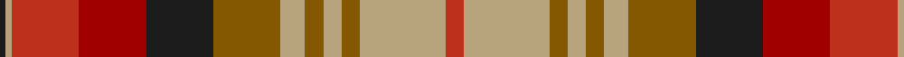

**Bands:** [BYRRBGYGYGYR](/stripes/byrrbgygygyr/) · **Stripes:** [DT LY R R DT Y LY Y LY Y LY R](/stripes/stripes12/) DT LY R R DT Y LY Y LY Y LY R

This was sourced from tartans-authority.  It is a [12 band tartan](/bands/bands12/).

Original link http://www.tartansauthority.com/tartan-ferret/display/8275/

## Thread count
K/2 LG2 R22 DR22 K22 T22 LG8 T6 LG6 T6 LG28 R/6

## Palette
Each colour and its ΔE from the base-6 reference it is a variant of.

| Colour | Shade | Base | ΔE (OKLab) |
|---|---|---|---|
| DR | <code style="background-color:#A00000;">#A00000</code> `#A00000` | R <code style="background-color:#CC0000;">#CC0000</code> | 0.09 |
| K | <code style="background-color:#1C1C1C;">#1C1C1C</code> `#1C1C1C` | B <code style="background-color:#2A418A;">#2A418A</code> | 0.21 |
| LG | <code style="background-color:#B8A47C;">#B8A47C</code> `#B8A47C` | Y <code style="background-color:#F2BF00;">#F2BF00</code> | 0.15 |
| R | <code style="background-color:#BC301C;">#BC301C</code> `#BC301C` | R <code style="background-color:#CC0000;">#CC0000</code> | 0.04 |
| T | <code style="background-color:#845800;">#845800</code> `#845800` | G <code style="background-color:#006100;">#006100</code> | 0.16 |

## Nearest tartans

The nearest existing variants by ΔTartan distance.

1. [Hallowfield Wood](/setts/s12/lo3r10dg4lo8do2lo8m11do16lo4dg4r10lo3~x2/) — ΔT 1.09
1. [Kildare County, Crest Range](/setts/s11/o40k5y48k5r20k5t14k10w4r28t10/) — ΔT 1.15
1. [MacPherson 1](/setts/s15/r13lr4r13g28lr3o26lr10o2dr2o2lr10r14lr4o4r4~x2/) — ΔT 1.17
1. [MacPherson #9](/setts/s15/r13lr4r13dg28lr3dy26lr10dy2dy2dy2lr10r14lr4dy4r4~x2/) — ΔT 1.17
1. [Fitzsimmons Red (Name)](/setts/s10/dy3y2lo18k4r15k4dy6k4lo2y3~x2/) — ΔT 1.31
1. [Kildare County Crest (Fashion)](/setts/s11/lo40k5y48k5r20k5lr14k10w4r28lr10/) — ΔT 1.32
1. [Watret (Artefact)](/setts/s11/db21dp21ly21o2r21lo21ly21db2r2dp2o21~x2/) — ΔT 1.59
1. [Satchidananda (Personal)](/setts/s9/dy18ly4t10w2r20ly5r2w2dy6~x2/) — ΔT 1.59
1. [Brittany National Walking](/setts/s9/t4dy27lo8k4lo8k4lo8r11ly3~x2/) — ΔT 1.61
1. [Unidentified Sett](/setts/s9/lr2dy1r10o12dy10lr6r10dy1lr2~x2/) — ΔT 1.63

## Neighbour map

Every grey dot is one of 14313 variants placed by the first two principal components of the ΔTartan feature space (44% of its variance). Red is this tartan; blue dots are its nearest — click one to open its page.

<svg viewBox="0 0 640 380" role="img" style="max-width:100%;height:auto;border:1px solid #e0e0e0;border-radius:4px;display:block" xmlns="http://www.w3.org/2000/svg"><image href="/nn/cloud.v1.png" width="640" height="380"/><a href="/setts/s12/lo3r10dg4lo8do2lo8m11do16lo4dg4r10lo3~x2/"><circle cx="111.0" cy="185.1" r="4" fill="#3465a4"><title>Hallowfield Wood</title></circle></a><a href="/setts/s11/o40k5y48k5r20k5t14k10w4r28t10/"><circle cx="109.4" cy="142.7" r="4" fill="#3465a4"><title>Kildare County, Crest Range</title></circle></a><a href="/setts/s15/r13lr4r13g28lr3o26lr10o2dr2o2lr10r14lr4o4r4~x2/"><circle cx="166.6" cy="140.3" r="4" fill="#3465a4"><title>MacPherson 1</title></circle></a><a href="/setts/s15/r13lr4r13dg28lr3dy26lr10dy2dy2dy2lr10r14lr4dy4r4~x2/"><circle cx="162.9" cy="140.5" r="4" fill="#3465a4"><title>MacPherson #9</title></circle></a><a href="/setts/s10/dy3y2lo18k4r15k4dy6k4lo2y3~x2/"><circle cx="156.6" cy="174.5" r="4" fill="#3465a4"><title>Fitzsimmons Red (Name)</title></circle></a><a href="/setts/s11/lo40k5y48k5r20k5lr14k10w4r28lr10/"><circle cx="96.8" cy="137.5" r="4" fill="#3465a4"><title>Kildare County Crest (Fashion)</title></circle></a><a href="/setts/s11/db21dp21ly21o2r21lo21ly21db2r2dp2o21~x2/"><circle cx="55.7" cy="142.4" r="4" fill="#3465a4"><title>Watret (Artefact)</title></circle></a><a href="/setts/s9/dy18ly4t10w2r20ly5r2w2dy6~x2/"><circle cx="152.6" cy="153.9" r="4" fill="#3465a4"><title>Satchidananda (Personal)</title></circle></a><a href="/setts/s9/t4dy27lo8k4lo8k4lo8r11ly3~x2/"><circle cx="152.6" cy="169.6" r="4" fill="#3465a4"><title>Brittany National Walking</title></circle></a><a href="/setts/s9/lr2dy1r10o12dy10lr6r10dy1lr2~x2/"><circle cx="215.3" cy="191.1" r="4" fill="#3465a4"><title>Unidentified Sett</title></circle></a><circle cx="136.2" cy="156.6" r="5" fill="#c00000"/></svg>

ID: /setts/s12/r3ly14y3ly3y3ly4y11dt11r11r11ly1dt1~x2/
