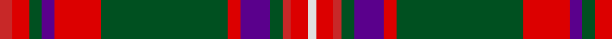

**Bands:** [RRGBRGRBGRRW](/stripes/rrgbrgrbgrrw/) · **Stripes:** [R R DG DP R DG R DP DG R R W](/stripes/stripes12/) R R DG DP R DG R DP DG R R W

This was sourced from register-of-tartans.  It is a [12 band tartan](/bands/bands12/).

Original link https://www.tartanregister.gov.uk/tartanDetails.aspx?ref=2551

## Also known as

This cloth is also recorded under:

- MacKinnon #7

## Register references

External register numbers recorded for this tartan.

- Scottish Register of Tartans: [2551](https://www.tartanregister.gov.uk/tartanDetails.aspx?ref=2551)
- Scottish Tartans World Register: 1639

## Thread count
R/6 Ra8 G6 P6 Ra22 G60 Ra6 P14 G6 R4 Ra8 LN/4

## Palette
Each colour and its ΔE from the base-6 reference it is a variant of.

| Colour | Shade | Base | ΔE (OKLab) |
|---|---|---|---|
| G | <code style="background-color:#005020;">#005020</code> `#005020` | G <code style="background-color:#006100;">#006100</code> | 0.07 |
| LN | <code style="background-color:#E0E0E0;">#E0E0E0</code> `#E0E0E0` | W <code style="background-color:#F7F7F7;">#F7F7F7</code> | 0.07 |
| P | <code style="background-color:#5A008C;">#5A008C</code> `#5A008C` | B <code style="background-color:#2A418A;">#2A418A</code> | 0.13 |
| R | <code style="background-color:#C82828;">#C82828</code> `#C82828` | R <code style="background-color:#CC0000;">#CC0000</code> | 0.03 |
| Ra | <code style="background-color:#DC0000;">#DC0000</code> `#DC0000` | R <code style="background-color:#CC0000;">#CC0000</code> | 0.03 |

## Nearest tartans

The nearest existing variants by ΔTartan distance.

1. [Robbie (Commemorative)](/setts/s13/w1lo2r15db2r2db15r2g15r2db2r15lo2w1~x2/) — ΔT 0.69
1. [Eidart 1990 (Fashion)](/setts/s12/n4r20k2r2k2r3k6o26w3o2w2o4~x2/) — ΔT 0.80
1. [Michael from Appin (Personal)](/setts/s12/db4r24dg2r3dg19ly2r2db8r2dg2w2r2~x2/) — ΔT 0.84
1. [MacKinnon 1](/setts/s12/r3r4g3p3r11g30r3p7g3r2r4w2~x2/) — ΔT 0.96
1. [Stuart/Stewart of Appin #3](/setts/s16/r3k2t2r2dg19r3dg2r2db6r2dg2r21k2t2r2dg2~x2/) — ΔT 0.96
1. [MacKinnon #11](/setts/s14/w3r5dg3dp3r14dg36r3dp8dg3r36dg14r3r5w3~x2/) — ΔT 0.98
1. [Orr, Gerald William (Personal)](/setts/s12/n4lo2n2k5n4k4n8k6n2r32n2w4~x2/) — ΔT 0.99
1. [Stewart of Appin 3](/setts/s16/r3k2t2r2g19r3g2r2db6r2g2r21k2t2r2g2~x2/) — ΔT 1.03
1. [Robertson 1820 - White line](/setts/s13/w1g2r18db2r2db18r2g18r2db2r18g2w1~x2/) — ΔT 1.07
1. [Unidentified Specimen #2](/setts/s10/w1dg1r1dg14r1db6r11dg1r1w1~x4/) — ΔT 1.07

## Neighbour map

Every grey dot is one of 14299 variants placed by the first two principal components of the ΔTartan feature space (44% of its variance). Red is this tartan; blue dots are its nearest — click one to open its page.

<svg viewBox="0 0 640 380" role="img" style="max-width:100%;height:auto;border:1px solid #e0e0e0;border-radius:4px;display:block" xmlns="http://www.w3.org/2000/svg"><image href="/nn/cloud.v1.png" width="640" height="380"/><a href="/setts/s13/w1lo2r15db2r2db15r2g15r2db2r15lo2w1~x2/"><circle cx="259.4" cy="133.1" r="4" fill="#3465a4"><title>Robbie (Commemorative)</title></circle></a><a href="/setts/s12/n4r20k2r2k2r3k6o26w3o2w2o4~x2/"><circle cx="224.8" cy="120.0" r="4" fill="#3465a4"><title>Eidart 1990 (Fashion)</title></circle></a><a href="/setts/s12/db4r24dg2r3dg19ly2r2db8r2dg2w2r2~x2/"><circle cx="270.7" cy="141.6" r="4" fill="#3465a4"><title>Michael from Appin (Personal)</title></circle></a><a href="/setts/s12/r3r4g3p3r11g30r3p7g3r2r4w2~x2/"><circle cx="266.0" cy="120.7" r="4" fill="#3465a4"><title>MacKinnon 1</title></circle></a><a href="/setts/s16/r3k2t2r2dg19r3dg2r2db6r2dg2r21k2t2r2dg2~x2/"><circle cx="256.7" cy="114.6" r="4" fill="#3465a4"><title>Stuart/Stewart of Appin #3</title></circle></a><a href="/setts/s14/w3r5dg3dp3r14dg36r3dp8dg3r36dg14r3r5w3~x2/"><circle cx="253.6" cy="119.0" r="4" fill="#3465a4"><title>MacKinnon #11</title></circle></a><a href="/setts/s12/n4lo2n2k5n4k4n8k6n2r32n2w4~x2/"><circle cx="245.0" cy="106.3" r="4" fill="#3465a4"><title>Orr, Gerald William (Personal)</title></circle></a><a href="/setts/s16/r3k2t2r2g19r3g2r2db6r2g2r21k2t2r2g2~x2/"><circle cx="246.6" cy="112.9" r="4" fill="#3465a4"><title>Stewart of Appin 3</title></circle></a><a href="/setts/s13/w1g2r18db2r2db18r2g18r2db2r18g2w1~x2/"><circle cx="284.9" cy="127.5" r="4" fill="#3465a4"><title>Robertson 1820 - White line</title></circle></a><a href="/setts/s10/w1dg1r1dg14r1db6r11dg1r1w1~x4/"><circle cx="260.0" cy="141.9" r="4" fill="#3465a4"><title>Unidentified Specimen #2</title></circle></a><circle cx="265.9" cy="120.3" r="5" fill="#c00000"/></svg>

ID: /setts/s12/r3r4dg3dp3r11dg30r3dp7dg3r2r4w2~x2/
