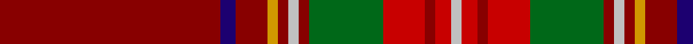

In pattern [RBRYRWRGRRRW](/patterns/rbryrwrgrrrw/).

This was sourced from register-of-tartans.  It is a [12 stripes tartan](/stripes/stripes12/).

Original link https://www.tartanregister.gov.uk/tartanDetails.aspx?ref=4518

## Thread count
DR/84 DB6 DR12 DY4 DR4 N4 DR4 G28 R16 DR4 R6 N/4

## Palette
Each colour and its ΔE from the base-6 reference it is a variant of.

| Colour | Shade | Base | ΔE (OKLab) |
|---|---|---|---|
| DB | <code style="background-color:#1C0070;">#1C0070</code> `#1C0070` | B <code style="background-color:#2A418A;">#2A418A</code> | 0.14 |
| DR | <code style="background-color:#880000;">#880000</code> `#880000` | R <code style="background-color:#CC0000;">#CC0000</code> | 0.15 |
| DY | <code style="background-color:#D09800;">#D09800</code> `#D09800` | Y <code style="background-color:#F2BF00;">#F2BF00</code> | 0.12 |
| G | <code style="background-color:#006818;">#006818</code> `#006818` | G <code style="background-color:#006100;">#006100</code> | 0.02 |
| N | <code style="background-color:#C0C0C0;">#C0C0C0</code> `#C0C0C0` | W <code style="background-color:#F7F7F7;">#F7F7F7</code> | 0.17 |
| R | <code style="background-color:#C80000;">#C80000</code> `#C80000` | R <code style="background-color:#CC0000;">#CC0000</code> | 0.01 |

## Nearest tartans

The nearest existing variants by ΔTartan distance.

1. [McPrato](/setts/s12/r52b12ra9y2ra2g2ra2ga11r7ra2r3b2x2~b2c2c80-g289c18-ga006818-rc80000-ra888888-ye8c000/) — ΔT 0.99
1. [British Caledonian Airways #4](/setts/s12/r68ra5k9g3k3w3k3ga20r9k3r5w4~g8c7038-ga005448-k101010-r800028-ra888888-wc0c0c0/) — ΔT 1.15
1. [Methodist Church](/setts/s12/r6g2r2g3k2r2b16k3g4r34y2r2x2~b1c1c50-g285800-k101010-rb00000-ybc8c00/) — ΔT 1.19
1. [Down, County](/setts/s9/r64b9ra11b4w2y2ba5b2y13x2~b4c0000-ba5c5c5c-r6c2400-rab84c00-wa8ace8-yec8048/) — ΔT 1.20
1. [Drummond of Perth](/setts/s9/r36y1b3ya1g16r8b3ba2y1x2~b000052-ba4367ae-g11450d-raa0000-yaaaaaa-yaaaaa00/) — ΔT 1.27
1. [Drummond of Perth](/setts/s9/r36y1b3ya1g16r8b3ba2y1~b000052-ba4367ae-g11450d-raa0000-yaaaaaa-yaaaaa00/) — ΔT 1.27
1. [Tyrone Irish County Tartan Tartan Number: 2264. Earliest known date: 1993 One of a series of Irish District tartans designed by Polly Wittering of the House of Edgar, with colours reminiscent of the Country with soft warm colours dominating. See products available Copyright © Blair Urquhart, Comrie, 2015](/setts/s12/b50r6g7ga2g2y2g2r14b8g2b9ga3x2~b5c0014-g28200c-ga005448-r9c7c28-yc4c4a4/) — ΔT 1.32
1. [Glendronach Corporate Tartan Tartan Number: 2293. Earliest known date: 1989 A copyright design created for the Glendronach Company. See products available Copyright © Blair Urquhart, Comrie, 2015](/setts/s12/g21r2w1y3r2g5r21y1y1y1r1g8x2~g604000-ra00048-we0e0e0-ye8c000/) — ΔT 1.33
1. [Munro](/setts/s17/r24y1b1r3g16r3b1y1r3b6r3y1b1r16g2ba2g2x2~b000052-ba59110d-g11450d-raa0000-yaaaa00/) — ΔT 1.38
1. [Munro](/setts/s17/r24y1b1r3g16r3b1y1r3b6r3y1b1r16g2ba2g2~b000052-ba59110d-g11450d-raa0000-yaaaa00/) — ΔT 1.38

## Neighbour map

Every grey dot is one of 15726 variants placed by the first two principal components of the ΔTartan feature space (44% of its variance). Red is this tartan; blue dots are its nearest — click one to open its page.

<svg viewBox="0 0 640 380" role="img" style="max-width:100%;height:auto;border:1px solid #e0e0e0;border-radius:4px;display:block" xmlns="http://www.w3.org/2000/svg"><image href="/nn/cloud.v1.png" width="640" height="380"/><a href="/setts/s12/r52b12ra9y2ra2g2ra2ga11r7ra2r3b2x2~b2c2c80-g289c18-ga006818-rc80000-ra888888-ye8c000/"><circle cx="361.5" cy="69.2" r="4" fill="#3465a4"><title>McPrato</title></circle></a><a href="/setts/s12/r68ra5k9g3k3w3k3ga20r9k3r5w4~g8c7038-ga005448-k101010-r800028-ra888888-wc0c0c0/"><circle cx="380.6" cy="85.5" r="4" fill="#3465a4"><title>British Caledonian Airways #4</title></circle></a><a href="/setts/s12/r6g2r2g3k2r2b16k3g4r34y2r2x2~b1c1c50-g285800-k101010-rb00000-ybc8c00/"><circle cx="369.1" cy="113.5" r="4" fill="#3465a4"><title>Methodist Church</title></circle></a><a href="/setts/s9/r64b9ra11b4w2y2ba5b2y13x2~b4c0000-ba5c5c5c-r6c2400-rab84c00-wa8ace8-yec8048/"><circle cx="391.2" cy="92.5" r="4" fill="#3465a4"><title>Down, County</title></circle></a><a href="/setts/s9/r36y1b3ya1g16r8b3ba2y1x2~b000052-ba4367ae-g11450d-raa0000-yaaaaaa-yaaaaa00/"><circle cx="404.3" cy="85.3" r="4" fill="#3465a4"><title>Drummond of Perth</title></circle></a><a href="/setts/s9/r36y1b3ya1g16r8b3ba2y1~b000052-ba4367ae-g11450d-raa0000-yaaaaaa-yaaaaa00/"><circle cx="404.3" cy="85.3" r="4" fill="#3465a4"><title>Drummond of Perth</title></circle></a><a href="/setts/s12/b50r6g7ga2g2y2g2r14b8g2b9ga3x2~b5c0014-g28200c-ga005448-r9c7c28-yc4c4a4/"><circle cx="424.5" cy="111.6" r="4" fill="#3465a4"><title>Tyrone Irish County Tartan Tartan Number: 2264. Earliest known date: 1993 One of a series of Irish District tartans designed by Polly Wittering of the House of Edgar, with colours reminiscent of the Country with soft warm colours dominating. See products available Copyright © Blair Urquhart, Comrie, 2015</title></circle></a><a href="/setts/s12/g21r2w1y3r2g5r21y1y1y1r1g8x2~g604000-ra00048-we0e0e0-ye8c000/"><circle cx="353.9" cy="114.9" r="4" fill="#3465a4"><title>Glendronach Corporate Tartan Tartan Number: 2293. Earliest known date: 1989 A copyright design created for the Glendronach Company. See products available Copyright © Blair Urquhart, Comrie, 2015</title></circle></a><a href="/setts/s17/r24y1b1r3g16r3b1y1r3b6r3y1b1r16g2ba2g2x2~b000052-ba59110d-g11450d-raa0000-yaaaa00/"><circle cx="381.0" cy="92.8" r="4" fill="#3465a4"><title>Munro</title></circle></a><a href="/setts/s17/r24y1b1r3g16r3b1y1r3b6r3y1b1r16g2ba2g2~b000052-ba59110d-g11450d-raa0000-yaaaa00/"><circle cx="381.0" cy="92.8" r="4" fill="#3465a4"><title>Munro</title></circle></a><circle cx="389.9" cy="89.8" r="5" fill="#c00000"/></svg>

ID: /setts/s12/r42b3r6y2r2w2r2g14ra8r2ra3w2x2~b1c0070-g006818-r880000-rac80000-wc0c0c0-yd09800/
