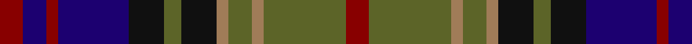

In pattern [RBRBKGKRGRGR](/patterns/rbrbkgkrgrgr/).

This was sourced from tartans-authority.  It is a [12 stripes tartan](/stripes/stripes12/).

Original link http://www.tartansauthority.com/tartan-ferret/display/3070/

## Thread count
DR/8 DB8 DR4 DB24 K12 G6 K12 LT4 G8 LT4 G28 DR/8

## Palette
Each colour and its ΔE from the base-6 reference it is a variant of.

| Colour | Shade | Base | ΔE (OKLab) |
|---|---|---|---|
| DB | <code style="background-color:#1C0070;">#1C0070</code> `#1C0070` | B <code style="background-color:#2A418A;">#2A418A</code> | 0.14 |
| DR | <code style="background-color:#880000;">#880000</code> `#880000` | R <code style="background-color:#CC0000;">#CC0000</code> | 0.15 |
| G | <code style="background-color:#5C6428;">#5C6428</code> `#5C6428` | G <code style="background-color:#006100;">#006100</code> | 0.10 |
| K | <code style="background-color:#101010;">#101010</code> `#101010` | K <code style="background-color:#000000;">#000000</code> | 0.17 |
| LT | <code style="background-color:#A07C58;">#A07C58</code> `#A07C58` | R <code style="background-color:#CC0000;">#CC0000</code> | 0.19 |

## Nearest tartans

The nearest existing variants by ΔTartan distance.

1. [Macallan](/setts/s13/b12r2b4r5b16r2k16y2g16r5g4r2g12x2~b2c4084-g005020-k101010-rdc0000-yc89600/) — ΔT 0.54
1. [Denovan, The Lairdship of (Personal)](/setts/s12/b10ba2b3r4b14r2k14g14r4g3ba2g10x2~b2c2c80-ba780078-g006818-k101010-rc80000/) — ΔT 0.55
1. [Kinloch Anderson](/setts/s12/r4g14y2g4y2k6g3k6b14r2b4r4x2~b2c2c80-g604000-k101010-rc80000-yd87c00/) — ΔT 0.68
1. [Ryukoku University Heian SHS (Corp)](/setts/s10/b5k15r5ba9r2bb2r2bb2ba9k3x2~b2c2c80-ba5c5c5c-bb1c0070-k101010-r888888/) — ΔT 0.78
1. [MacLellan](/setts/s14/b15k8g3r3g5k2y2k2g5r3g3k8b8k8x4~b382074-g2c7854-k181818-rc80000-ye8c000/) — ΔT 0.80
1. [Swankie (Personal)](/setts/s12/r6k20g4ga10b21k4b21ga10g4k20r6b3x2~b1474b4-g8c7038-ga604000-k101010-rc80000/) — ΔT 0.86
1. [Ryukoku University Heian JHS (Corp)](/setts/s10/r4k16ra5b8ra2ba2ra2ba2b8k3x2~b5c5c5c-ba780078-k101010-rb468ac-ra888888/) — ΔT 0.88
1. [Carnegie Family Tartan Tartan Number: 489. Earliest known date: c. 1715 A variant of the MacDonell of Glengarry said to have been adopted by Lord Southesk who was active in the 1715 rebellion. The Glengarry white becomes yellow in the Carnegie. It is possible that this minor difference was caused by the passage of time. See products available Copyright © Blair Urquhart, Comrie, 2015](/setts/s13/b3r1b1r2b6r1k6g6r2g1r1g2y1x2~b2c2c80-g006818-k101010-rc80000-ye8c000/) — ΔT 0.88
1. [Carnegie](/setts/s13/b3r1b1r2b6r1k6g6r2g1r1g2y1x6~b2c2c80-g006818-k101010-rc80000-ye8c000/) — ΔT 0.88
1. [Law Society of Scotland (Corporate)](/setts/s10/r6g3r24b7r4b7k18g4k7g3~b5c8ca8-g006428-k101010-r901c38/) — ΔT 0.90

## Neighbour map

Every grey dot is one of 15726 variants placed by the first two principal components of the ΔTartan feature space (44% of its variance). Red is this tartan; blue dots are its nearest — click one to open its page.

<svg viewBox="0 0 640 380" role="img" style="max-width:100%;height:auto;border:1px solid #e0e0e0;border-radius:4px;display:block" xmlns="http://www.w3.org/2000/svg"><image href="/nn/cloud.v1.png" width="640" height="380"/><a href="/setts/s13/b12r2b4r5b16r2k16y2g16r5g4r2g12x2~b2c4084-g005020-k101010-rdc0000-yc89600/"><circle cx="140.3" cy="183.2" r="4" fill="#3465a4"><title>Macallan</title></circle></a><a href="/setts/s12/b10ba2b3r4b14r2k14g14r4g3ba2g10x2~b2c2c80-ba780078-g006818-k101010-rc80000/"><circle cx="131.4" cy="194.6" r="4" fill="#3465a4"><title>Denovan, The Lairdship of (Personal)</title></circle></a><a href="/setts/s12/r4g14y2g4y2k6g3k6b14r2b4r4x2~b2c2c80-g604000-k101010-rc80000-yd87c00/"><circle cx="136.4" cy="187.6" r="4" fill="#3465a4"><title>Kinloch Anderson</title></circle></a><a href="/setts/s10/b5k15r5ba9r2bb2r2bb2ba9k3x2~b2c2c80-ba5c5c5c-bb1c0070-k101010-r888888/"><circle cx="146.5" cy="197.3" r="4" fill="#3465a4"><title>Ryukoku University Heian SHS (Corp)</title></circle></a><a href="/setts/s14/b15k8g3r3g5k2y2k2g5r3g3k8b8k8x4~b382074-g2c7854-k181818-rc80000-ye8c000/"><circle cx="148.9" cy="192.1" r="4" fill="#3465a4"><title>MacLellan</title></circle></a><a href="/setts/s12/r6k20g4ga10b21k4b21ga10g4k20r6b3x2~b1474b4-g8c7038-ga604000-k101010-rc80000/"><circle cx="123.7" cy="193.1" r="4" fill="#3465a4"><title>Swankie (Personal)</title></circle></a><a href="/setts/s10/r4k16ra5b8ra2ba2ra2ba2b8k3x2~b5c5c5c-ba780078-k101010-rb468ac-ra888888/"><circle cx="156.9" cy="182.9" r="4" fill="#3465a4"><title>Ryukoku University Heian JHS (Corp)</title></circle></a><a href="/setts/s13/b3r1b1r2b6r1k6g6r2g1r1g2y1x2~b2c2c80-g006818-k101010-rc80000-ye8c000/"><circle cx="100.3" cy="180.0" r="4" fill="#3465a4"><title>Carnegie Family Tartan Tartan Number: 489. Earliest known date: c. 1715 A variant of the MacDonell of Glengarry said to have been adopted by Lord Southesk who was active in the 1715 rebellion. The Glengarry white becomes yellow in the Carnegie. It is possible that this minor difference was caused by the passage of time. See products available Copyright © Blair Urquhart, Comrie, 2015</title></circle></a><a href="/setts/s13/b3r1b1r2b6r1k6g6r2g1r1g2y1x6~b2c2c80-g006818-k101010-rc80000-ye8c000/"><circle cx="100.3" cy="180.0" r="4" fill="#3465a4"><title>Carnegie</title></circle></a><a href="/setts/s10/r6g3r24b7r4b7k18g4k7g3~b5c8ca8-g006428-k101010-r901c38/"><circle cx="162.4" cy="183.6" r="4" fill="#3465a4"><title>Law Society of Scotland (Corporate)</title></circle></a><circle cx="129.4" cy="194.2" r="5" fill="#c00000"/></svg>

ID: /setts/s12/r4g14ra2g4ra2k6g3k6b12r2b4r4x2~b1c0070-g5c6428-k101010-r880000-raa07c58/
