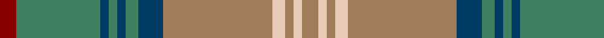

**Bands:** [RGBGBGBRWRWR](/stripes/rgbgbgbrwrwr/) · **Stripes:** [R G DT G DT G DT O LB O LB O](/stripes/stripes12/) R G DT G DT G DT O LB O LB O

This was sourced from tartans-authority.  It is a [12 band tartan](/bands/bands12/).

Original link http://www.tartansauthority.com/tartan-ferret/display/3180/

## Attestations

This cloth appears in 2 source records; the oldest owns this page.

- 1990 — Dorcas (Fashion) (tartans-authority, [record](http://www.tartansauthority.com/tartan-ferret/display/3180/))
- undated — Dorcas (WCWM) (register-of-tartans, [record](https://www.tartanregister.gov.uk/tartanDetails.aspx?ref=4884))

## Register references

External register numbers recorded for this tartan.

- Scottish Register of Tartans: [4884](https://www.tartanregister.gov.uk/tartanDetails.aspx?ref=4884)
- Scottish Tartans Authority (ITI): 3180

## Thread count
DR/8 G40 DB4 G4 DB4 G6 DB12 LT52 LR6 LT4 LR4 LT/8

## Palette
Each colour and its ΔE from the base-6 reference it is a variant of.

| Colour | Shade | Base | ΔE (OKLab) |
|---|---|---|---|
| DB | <code style="background-color:#003C64;">#003C64</code> `#003C64` | B <code style="background-color:#2A418A;">#2A418A</code> | 0.08 |
| DR | <code style="background-color:#880000;">#880000</code> `#880000` | R <code style="background-color:#CC0000;">#CC0000</code> | 0.15 |
| G | <code style="background-color:#408060;">#408060</code> `#408060` | G <code style="background-color:#006100;">#006100</code> | 0.14 |
| LR | <code style="background-color:#E8CCB8;">#E8CCB8</code> `#E8CCB8` | W <code style="background-color:#F7F7F7;">#F7F7F7</code> | 0.12 |
| LT | <code style="background-color:#A07C58;">#A07C58</code> `#A07C58` | R <code style="background-color:#CC0000;">#CC0000</code> | 0.19 |

## Nearest tartans

The nearest existing variants by ΔTartan distance.

1. [Hawaiian](/setts/s14/t4r1ly1t12do4y10ly1r3~x4/) — ΔT 1.12
1. [Tasmanian](/setts/s11/m2lr1dg12y1dg1y1dg3y4m3y4ly2~x4/) — ΔT 1.14
1. [Hebridean Granite](/setts/s14/lr4o4k4o18k3n36w3n36k3o18k4o4lr4o3~x2/) — ΔT 1.24
1. [Harmony 5](/setts/s12/g9r3g4o3g3o4g3dp11o30r3o4g3~x2/) — ΔT 1.29
1. [Cochrane Hunting](/setts/s15/g46r6g6r2g8r2g6r2g6do36r2y47r6y24lo6/) — ΔT 1.30
1. [Unidentified (Woven sample)](/setts/s18/r2t2dy3t14do1t1y7dy3t2dy3do7t3y2t3y16r2dy3t2~x2/) — ΔT 1.36
1. [Hebridean Granite Fashion Tartan Tartan Number: 6821. Earliest known date: 2005 For a new House of Edgar collection. Intended to emulate the gray morning suit perhaps. See products available Copyright © Blair Urquhart, Comrie, 2015](/setts/s8/o3lr4o4do4o18do3n36w3~x2/) — ΔT 1.36
1. [Tasmanian](/setts/s11/r5lp2y24lr2y2lr2y6lr8r6lr8ly4~x2/) — ΔT 1.37
1. [Great Glen (Fashion)](/setts/s17/dt5o4dt4o38n34dt4n4lb2n2ly2n4dt4n34o38dt4o4dt2/) — ΔT 1.38
1. [Lyon, Jeffrey M (Hunting) (Personal)](/setts/s10/t27dt2t2dt16g5r5lo2dt2dy14dt2~x2/) — ΔT 1.39

## Neighbour map

Every grey dot is one of 14299 variants placed by the first two principal components of the ΔTartan feature space (44% of its variance). Red is this tartan; blue dots are its nearest — click one to open its page.

<svg viewBox="0 0 640 380" role="img" style="max-width:100%;height:auto;border:1px solid #e0e0e0;border-radius:4px;display:block" xmlns="http://www.w3.org/2000/svg"><image href="/nn/cloud.v1.png" width="640" height="380"/><a href="/setts/s14/t4r1ly1t12do4y10ly1r3~x4/"><circle cx="238.8" cy="168.1" r="4" fill="#3465a4"><title>Hawaiian</title></circle></a><a href="/setts/s11/m2lr1dg12y1dg1y1dg3y4m3y4ly2~x4/"><circle cx="268.3" cy="168.4" r="4" fill="#3465a4"><title>Tasmanian</title></circle></a><a href="/setts/s14/lr4o4k4o18k3n36w3n36k3o18k4o4lr4o3~x2/"><circle cx="300.0" cy="154.0" r="4" fill="#3465a4"><title>Hebridean Granite</title></circle></a><a href="/setts/s12/g9r3g4o3g3o4g3dp11o30r3o4g3~x2/"><circle cx="271.4" cy="174.8" r="4" fill="#3465a4"><title>Harmony 5</title></circle></a><a href="/setts/s15/g46r6g6r2g8r2g6r2g6do36r2y47r6y24lo6/"><circle cx="265.0" cy="134.9" r="4" fill="#3465a4"><title>Cochrane Hunting</title></circle></a><a href="/setts/s18/r2t2dy3t14do1t1y7dy3t2dy3do7t3y2t3y16r2dy3t2~x2/"><circle cx="229.1" cy="149.4" r="4" fill="#3465a4"><title>Unidentified (Woven sample)</title></circle></a><a href="/setts/s8/o3lr4o4do4o18do3n36w3~x2/"><circle cx="303.0" cy="173.3" r="4" fill="#3465a4"><title>Hebridean Granite Fashion Tartan Tartan Number: 6821. Earliest known date: 2005 For a new House of Edgar collection. Intended to emulate the gray morning suit perhaps. See products available Copyright © Blair Urquhart, Comrie, 2015</title></circle></a><a href="/setts/s11/r5lp2y24lr2y2lr2y6lr8r6lr8ly4~x2/"><circle cx="293.0" cy="176.1" r="4" fill="#3465a4"><title>Tasmanian</title></circle></a><a href="/setts/s17/dt5o4dt4o38n34dt4n4lb2n2ly2n4dt4n34o38dt4o4dt2/"><circle cx="322.4" cy="131.3" r="4" fill="#3465a4"><title>Great Glen (Fashion)</title></circle></a><a href="/setts/s10/t27dt2t2dt16g5r5lo2dt2dy14dt2~x2/"><circle cx="219.3" cy="157.4" r="4" fill="#3465a4"><title>Lyon, Jeffrey M (Hunting) (Personal)</title></circle></a><circle cx="269.3" cy="153.0" r="5" fill="#c00000"/></svg>

ID: /setts/s12/r4g20dt2g2dt2g3dt6o26lb3o2lb2o4~x2/
