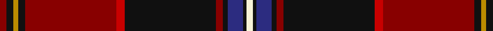

In pattern [RKYKRRKRKBKW](/patterns/rkykrrkrkbkw/).

This was sourced from tartans-authority.  It is a [12 stripes tartan](/stripes/stripes12/).

Original link http://www.tartansauthority.com/tartan-ferret/display/7017/

## Thread count
DR/4 K4 DY3 K4 DR54 R5 K54 DR4 K3 DB9 K2 LY/4

## Palette
Each colour and its ΔE from the base-6 reference it is a variant of.

| Colour | Shade | Base | ΔE (OKLab) |
|---|---|---|---|
| DB | <code style="background-color:#2C2C80;">#2C2C80</code> `#2C2C80` | B <code style="background-color:#2C4084;">#2C4084</code> | 0.05 |
| DR | <code style="background-color:#880000;">#880000</code> `#880000` | R <code style="background-color:#C80000;">#C80000</code> | 0.14 |
| DY | <code style="background-color:#BC8C00;">#BC8C00</code> `#BC8C00` | Y <code style="background-color:#E8C000;">#E8C000</code> | 0.16 |
| K | <code style="background-color:#101010;">#101010</code> `#101010` | K <code style="background-color:#000000;">#000000</code> | 0.17 |
| LY | <code style="background-color:#F8F4D8;">#F8F4D8</code> `#F8F4D8` | W <code style="background-color:#F4F4F0;">#F4F4F0</code> | 0.03 |
| R | <code style="background-color:#C80000;">#C80000</code> `#C80000` | R <code style="background-color:#C80000;">#C80000</code> | 0.00 |

ID: /setts/s12/r4k4y3k4r54ra5k54r4k3b9k2w4-b2c2c80-k101010-r880000-rac80000-wf8f4d8-ybc8c00/
