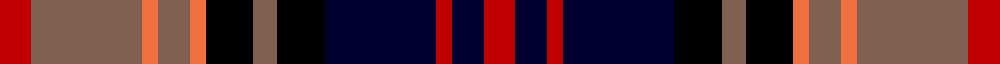

In pattern [RKRKKRKRRRRR](/stripes/rkrkkrkrrrrr/).

This was sourced from weddslist.  It is a [12 stripe tartan](/stripes/stripes12/).

Original link http://www.weddslist.com/cgi-bin/tartans/pg.pl?source=sts

## Thread count
R/8 LT28 O4 LT8 O4 K12 LT6 K12 DB28 R4 DB8 R/8

## Palette
Each colour and the base-6 reference it is a variant of.

| Colour | Shade | Base |
|---|---|---|
| DB | <code style="background-color:#000030;">#000030</code> `oklch(14.0% 0.097 264.1)` <small>#000030</small> | K <code style="background-color:#000000;">#000000</code> |
| K | <code style="background-color:#000000;">#000000</code> `oklch(0.0% 0.000 0.0)` <small>#000000</small> | K <code style="background-color:#000000;">#000000</code> |
| LT | <code style="background-color:#806050;">#806050</code> `oklch(51.7% 0.049 47.8)` <small>#806050</small> | R <code style="background-color:#CC0000;">#CC0000</code> |
| O | <code style="background-color:#F07040;">#F07040</code> `oklch(69.0% 0.170 40.2)` <small>#F07040</small> | R <code style="background-color:#CC0000;">#CC0000</code> |
| R | <code style="background-color:#C00000;">#C00000</code> `oklch(50.7% 0.208 29.2)` <small>#C00000</small> | R <code style="background-color:#CC0000;">#CC0000</code> |

## Nearest tartans

The nearest existing variants by ΔTartan distance, with this tartan at the top so the swatches line up against it.

ΔTartan

Tartan

Sett

—

<a href="/ttd/edit/#slug=r4o14o2o4o2k6o3k6k14r2k4r4~x2">Kinloch Anderson Limited</a> <a class="nn-out" href="/setts/s12/r4o14o2o4o2k6o3k6k14r2k4r4~x2/" title="open its dictionary page">↗</a>

0.75

<a href="/ttd/edit/#slug=db2r4k7r8g10k4ly2k8db4r4db14r2~x2">Unidentified, pattern</a> <a class="nn-out" href="/setts/s12/db2r4k7r8g10k4ly2k8db4r4db14r2~x2/" title="open its dictionary page">↗</a>

0.87

<a href="/ttd/edit/#slug=r8g2r2g6r4k8db12w2r2w2db12k5~x2">Glengarry Highland Games</a> <a class="nn-out" href="/setts/s12/r8g2r2g6r4k8db12w2r2w2db12k5~x2/" title="open its dictionary page">↗</a>

0.88

<a href="/ttd/edit/#slug=db3r1db1r2db6r1k6dg6r2dg1r1dg2ly1~x2">Carnegie</a> <a class="nn-out" href="/setts/s13/db3r1db1r2db6r1k6dg6r2dg1r1dg2ly1~x2/" title="open its dictionary page">↗</a>

0.89

<a href="/ttd/edit/#slug=r20g3r3g13r6k10db14w3r3w3db14k12~x2">Glengarry Highland Games</a> <a class="nn-out" href="/setts/s12/r20g3r3g13r6k10db14w3r3w3db14k12~x2/" title="open its dictionary page">↗</a>

0.99

<a href="/ttd/edit/#slug=db2r4k7r8dg10k4ly2k8db4r4db14r2~x2">Unidentified pattern</a> <a class="nn-out" href="/setts/s12/db2r4k7r8dg10k4ly2k8db4r4db14r2~x2/" title="open its dictionary page">↗</a>

1.04

<a href="/ttd/edit/#slug=r4o14w2o4w2k6o3k6db14r2db4r4~x2">Kinloch Anderson, dress</a> <a class="nn-out" href="/setts/s12/r4o14w2o4w2k6o3k6db14r2db4r4~x2/" title="open its dictionary page">↗</a>

1.05

<a href="/ttd/edit/#slug=m5k15lr5n9lr2dp2lr2dp2n9k3~x2">Ryukoku University Heian Junior Corporate Tartan Tartan Number: 10716. Earliest known date: 12 October 2012 This tartan represents the school's hope for its students' future. It is inspired by the colours of the clouds whilst the sun is rising. Beyond the clouds there is a light of hope which is purple. See products available Copyright © Blair Urquhart, Comrie, 2015</a> <a class="nn-out" href="/setts/s10/m5k15lr5n9lr2dp2lr2dp2n9k3~x2/" title="open its dictionary page">↗</a>

1.07

<a href="/ttd/edit/#slug=dg6r2dg2r3dg12lb2k10r2db12r3db2r2db6">MacDonald of Clanranald D</a> <a class="nn-out" href="/setts/s13/dg6r2dg2r3dg12lb2k10r2db12r3db2r2db6/" title="open its dictionary page">↗</a>

1.12

<a href="/ttd/edit/#slug=r4dg6o3dg10k14n6r18n6k4n2~x2">Cartier, Sir George Etienne</a> <a class="nn-out" href="/setts/s10/r4dg6o3dg10k14n6r18n6k4n2~x2/" title="open its dictionary page">↗</a>

1.14

<a href="/ttd/edit/#slug=lo2k1r6k2db7k2db7k2r7k1lb2~x4">Mount Isla</a> <a class="nn-out" href="/setts/s11/lo2k1r6k2db7k2db7k2r7k1lb2~x4/" title="open its dictionary page">↗</a>

## Neighbour map

Every grey dot is one of 14299 variants placed by the first two principal components of the ΔTartan feature space (44% of its variance). Red is this tartan; blue dots are its nearest — click one to open its page.

<svg viewBox="0 0 640 380" role="img" style="max-width:100%;height:auto;border:1px solid #e0e0e0;border-radius:4px;display:block" xmlns="http://www.w3.org/2000/svg"><image href="/nn/cloud.v1.png" width="640" height="380"/><a href="/setts/s12/db2r4k7r8g10k4ly2k8db4r4db14r2~x2/"><circle cx="69.5" cy="184.8" r="4" fill="#3465a4"><title>Unidentified, pattern</title></circle></a><a href="/setts/s12/r8g2r2g6r4k8db12w2r2w2db12k5~x2/"><circle cx="94.8" cy="182.2" r="4" fill="#3465a4"><title>Glengarry Highland Games</title></circle></a><a href="/setts/s13/db3r1db1r2db6r1k6dg6r2dg1r1dg2ly1~x2/"><circle cx="85.3" cy="179.6" r="4" fill="#3465a4"><title>Carnegie</title></circle></a><a href="/setts/s12/r20g3r3g13r6k10db14w3r3w3db14k12~x2/"><circle cx="81.9" cy="181.4" r="4" fill="#3465a4"><title>Glengarry Highland Games</title></circle></a><a href="/setts/s12/db2r4k7r8dg10k4ly2k8db4r4db14r2~x2/"><circle cx="91.7" cy="192.9" r="4" fill="#3465a4"><title>Unidentified pattern</title></circle></a><a href="/setts/s12/r4o14w2o4w2k6o3k6db14r2db4r4~x2/"><circle cx="45.5" cy="153.8" r="4" fill="#3465a4"><title>Kinloch Anderson, dress</title></circle></a><a href="/setts/s10/m5k15lr5n9lr2dp2lr2dp2n9k3~x2/"><circle cx="99.2" cy="174.6" r="4" fill="#3465a4"><title>Ryukoku University Heian Junior Corporate Tartan Tartan Number: 10716. Earliest known date: 12 October 2012 This tartan represents the school's hope for its students' future. It is inspired by the colours of the clouds whilst the sun is rising. Beyond the clouds there is a light of hope which is purple. See products available Copyright © Blair Urquhart, Comrie, 2015</title></circle></a><a href="/setts/s13/dg6r2dg2r3dg12lb2k10r2db12r3db2r2db6/"><circle cx="92.9" cy="183.6" r="4" fill="#3465a4"><title>MacDonald of Clanranald D</title></circle></a><a href="/setts/s10/r4dg6o3dg10k14n6r18n6k4n2~x2/"><circle cx="111.5" cy="193.6" r="4" fill="#3465a4"><title>Cartier, Sir George Etienne</title></circle></a><a href="/setts/s11/lo2k1r6k2db7k2db7k2r7k1lb2~x4/"><circle cx="143.1" cy="193.6" r="4" fill="#3465a4"><title>Mount Isla</title></circle></a><circle cx="97.7" cy="174.0" r="5" fill="#c00000"/></svg>

ID: /setts/s12/r4o14o2o4o2k6o3k6k14r2k4r4~x2/
