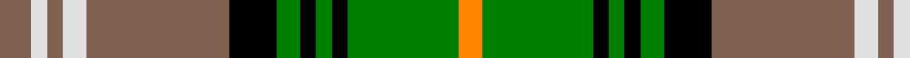

In pattern [RWRWRKGKGKGY](/patterns/rwrwrkgkgkgy/).

This was sourced from weddslist.  It is a [12 stripes tartan](/stripes/stripes12/).

Original link http://www.weddslist.com/cgi-bin/tartans/pg.pl?source=sts

## Thread count
LT/8 LN4 LT4 LN6 LT36 K12 G6 K4 G4 K4 G28 O/6

## Palette
Each colour and its ΔE from the base-6 reference it is a variant of.

| Colour | Shade | Base | ΔE (OKLab) |
|---|---|---|---|
| G | <code style="background-color:#008000;">#008000</code> `#008000` | G <code style="background-color:#006100;">#006100</code> | 0.10 |
| K | <code style="background-color:#000000;">#000000</code> `#000000` | K <code style="background-color:#000000;">#000000</code> | 0.00 |
| LN | <code style="background-color:#E0E0E0;">#E0E0E0</code> `#E0E0E0` | W <code style="background-color:#F7F7F7;">#F7F7F7</code> | 0.07 |
| LT | <code style="background-color:#806050;">#806050</code> `#806050` | R <code style="background-color:#CC0000;">#CC0000</code> | 0.17 |
| O | <code style="background-color:#FF8500;">#FF8500</code> `#FF8500` | Y <code style="background-color:#F2BF00;">#F2BF00</code> | 0.14 |

## Nearest tartans

The nearest existing variants by ΔTartan distance.

1. [Praetorian, Green (Fashion)](/setts/s14/w1k1y1g8k1ya1w8ya1k8ya1w1g8ya1w1x6~g285800-k101010-we0e0e0-ye8c000-yaa0a0a0/) — ΔT 0.77
1. [Cochrane, -1974](/setts/s13/g22r4g2r2g2r4g12k12r2b10r4b4y3x2~b304080-g008000-k000000-rc00000-yf0c000/) — ΔT 0.79
1. [Dorcas Check](/setts/s12/g4w2g2w3g18k6ga3k2ga2k2ga14y3x2~g603800-ga006400-k101010-wffffff-yd87c00/) — ΔT 0.82
1. [Blair, dress](/setts/s13/b1r1b8k3g8r1g1r1g8k3w10r1w1x4~b304080-g008000-k000000-rc00000-we0e0e0/) — ΔT 0.99
1. [Antrim Irish County Tartan Tartan Number: 2282. Earliest known date: 1993 One of a series of Irish District tartans designed by Polly Wittering of the House of Edgar, with colours reminiscent of the Country with soft warm colours dominating. See products available Copyright © Blair Urquhart, Comrie, 2015](/setts/s10/g5b2g17y2ba5y2r5ba17g2y4x2~b043c48-ba101448-g4c9864-rb03000-yf4bc3c/) — ΔT 1.02
1. [MacCandlish Arisaid Green](/setts/s11/w3k1g12k1g1k2g1k6wa12k1y1x4~g006818-k101010-w98c8e8-wac0c0c0-yd09800/) — ΔT 1.03
1. [Limerick](/setts/s11/b6y4b3ba2b5ba2b3ba2g15r3ba2x2~b401000-ba304080-g008000-rc00000-yf0c000/) — ΔT 1.04
1. [MacInnes, dress](/setts/s13/g4w24g3k3g3k3g24k4w4k4b24g8r4x2~b304080-g008000-k000000-rc00000-we0e0e0/) — ΔT 1.07
1. [Blair Dress Clan Tartan Tartan Number: 483. Earliest known date: 1988 Approved by the Clan Blair Society. Registered STS 1988. White introduced to the existing Blair sett. See products available Copyright © Blair Urquhart, Comrie, 2015](/setts/s13/b1r1b8k3g8r1g1r1g8k3w10r1w1x4~b2c2c80-g006818-k101010-rc80000-we0e0e0/) — ΔT 1.09
1. [O'Farrell (Name)](/setts/s13/w2y14ya3k6w2k2w2k2g8y6k2y3w1x2~g006818-k101010-we0e0e0-ya08858-yae8c000/) — ΔT 1.10

## Neighbour map

Every grey dot is one of 15726 variants placed by the first two principal components of the ΔTartan feature space (44% of its variance). Red is this tartan; blue dots are its nearest — click one to open its page.

<svg viewBox="0 0 640 380" role="img" style="max-width:100%;height:auto;border:1px solid #e0e0e0;border-radius:4px;display:block" xmlns="http://www.w3.org/2000/svg"><image href="/nn/cloud.v1.png" width="640" height="380"/><a href="/setts/s14/w1k1y1g8k1ya1w8ya1k8ya1w1g8ya1w1x6~g285800-k101010-we0e0e0-ye8c000-yaa0a0a0/"><circle cx="124.1" cy="131.2" r="4" fill="#3465a4"><title>Praetorian, Green (Fashion)</title></circle></a><a href="/setts/s13/g22r4g2r2g2r4g12k12r2b10r4b4y3x2~b304080-g008000-k000000-rc00000-yf0c000/"><circle cx="175.0" cy="144.5" r="4" fill="#3465a4"><title>Cochrane, -1974</title></circle></a><a href="/setts/s12/g4w2g2w3g18k6ga3k2ga2k2ga14y3x2~g603800-ga006400-k101010-wffffff-yd87c00/"><circle cx="169.1" cy="152.8" r="4" fill="#3465a4"><title>Dorcas Check</title></circle></a><a href="/setts/s13/b1r1b8k3g8r1g1r1g8k3w10r1w1x4~b304080-g008000-k000000-rc00000-we0e0e0/"><circle cx="103.0" cy="133.3" r="4" fill="#3465a4"><title>Blair, dress</title></circle></a><a href="/setts/s10/g5b2g17y2ba5y2r5ba17g2y4x2~b043c48-ba101448-g4c9864-rb03000-yf4bc3c/"><circle cx="153.0" cy="161.4" r="4" fill="#3465a4"><title>Antrim Irish County Tartan Tartan Number: 2282. Earliest known date: 1993 One of a series of Irish District tartans designed by Polly Wittering of the House of Edgar, with colours reminiscent of the Country with soft warm colours dominating. See products available Copyright © Blair Urquhart, Comrie, 2015</title></circle></a><a href="/setts/s11/w3k1g12k1g1k2g1k6wa12k1y1x4~g006818-k101010-w98c8e8-wac0c0c0-yd09800/"><circle cx="139.5" cy="127.0" r="4" fill="#3465a4"><title>MacCandlish Arisaid Green</title></circle></a><a href="/setts/s11/b6y4b3ba2b5ba2b3ba2g15r3ba2x2~b401000-ba304080-g008000-rc00000-yf0c000/"><circle cx="138.5" cy="172.6" r="4" fill="#3465a4"><title>Limerick</title></circle></a><a href="/setts/s13/g4w24g3k3g3k3g24k4w4k4b24g8r4x2~b304080-g008000-k000000-rc00000-we0e0e0/"><circle cx="108.7" cy="138.7" r="4" fill="#3465a4"><title>MacInnes, dress</title></circle></a><a href="/setts/s13/b1r1b8k3g8r1g1r1g8k3w10r1w1x4~b2c2c80-g006818-k101010-rc80000-we0e0e0/"><circle cx="112.1" cy="135.9" r="4" fill="#3465a4"><title>Blair Dress Clan Tartan Tartan Number: 483. Earliest known date: 1988 Approved by the Clan Blair Society. Registered STS 1988. White introduced to the existing Blair sett. See products available Copyright © Blair Urquhart, Comrie, 2015</title></circle></a><a href="/setts/s13/w2y14ya3k6w2k2w2k2g8y6k2y3w1x2~g006818-k101010-we0e0e0-ya08858-yae8c000/"><circle cx="163.7" cy="130.2" r="4" fill="#3465a4"><title>O'Farrell (Name)</title></circle></a><circle cx="147.6" cy="143.2" r="5" fill="#c00000"/></svg>

ID: /setts/s12/r4w2r2w3r18k6g3k2g2k2g14y3x2~g008000-k000000-r806050-we0e0e0-yff8500/
