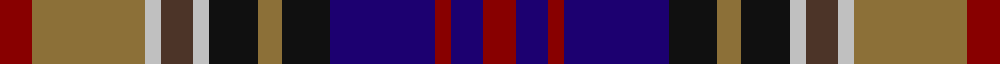

This page is one **sett** — a single exact thread-count. It belongs to the [tartan](/tartans/dr4lt14n2t4n2k6lt3k6db13dr2db4dr4/)
(the same proportion at any scale), whose colour order is pattern [RBRBKGKWBWGR](/stripes/rbrbkgkwbwgr/).

Sourced from register-of-tartans.  It is a [12 stripe tartan](/stripes/stripes12/).

Original link https://www.tartanregister.gov.uk/tartanDetails.aspx?ref=1989

## Also known as

This cloth is also recorded under:

- Kinloch Anderson Old Dress

2 attestations — the source records this cloth was collapsed from (oldest owns this page)

<ul>
<li>01/11/1997 — Kinloch Anderson Old Dress (register-of-tartans, <a href="https://www.tartanregister.gov.uk/tartanDetails.aspx?ref=1989">record</a>)</li>
<li>pre 2002 — Kinloch Anderson Dress (Corporate) (tartans-authority, <a href="http://www.tartansauthority.com/tartan-ferret/display/2406/">record</a>)</li>
</ul>

## Register references

External register numbers recorded for this tartan.

- Scottish Register of Tartans: [1989](https://www.tartanregister.gov.uk/tartanDetails.aspx?ref=1989)
- Scottish Tartans Authority (ITI): 2406
- Scottish Tartans World Register: 2406

## Thread count
DR/8 LT28 N4 T8 N4 K12 LT6 K12 DB26 DR4 DB8 DR/8

## Palette
Each colour and the base-6 reference it is a variant of.

| Colour | Shade | Base |
|---|---|---|
| DB | <code style="background-color:#1C0070;">#1C0070</code> `oklch(26.3% 0.162 277.1)` <small>#1C0070</small> | B <code style="background-color:#2A418A;">#2A418A</code> |
| DR | <code style="background-color:#880000;">#880000</code> `oklch(39.4% 0.162 29.2)` <small>#880000</small> | R <code style="background-color:#CC0000;">#CC0000</code> |
| K | <code style="background-color:#101010;">#101010</code> `oklch(17.3% 0.000 89.9)` <small>#101010</small> | K <code style="background-color:#000000;">#000000</code> |
| LT | <code style="background-color:#8C7038;">#8C7038</code> `oklch(56.0% 0.082 83.0)` <small>#8C7038</small> | G <code style="background-color:#006100;">#006100</code> |
| N | <code style="background-color:#C0C0C0;">#C0C0C0</code> `oklch(80.8% 0.000 89.9)` <small>#C0C0C0</small> | W <code style="background-color:#F7F7F7;">#F7F7F7</code> |
| T | <code style="background-color:#4C3428;">#4C3428</code> `oklch(34.9% 0.040 47.5)` <small>#4C3428</small> | B <code style="background-color:#2A418A;">#2A418A</code> |

## Nearest tartans

The nearest existing variants by ΔTartan distance, with this tartan at the top so the swatches line up against it.

ΔTartan

Tartan

Sett

—

<a href="/ttd/edit/#slug=r4y14lb2do4lb2k6y3k6db13r2db4r4~x2">Kinloch Anderson Old Dress</a> <a class="nn-out" href="/setts/s12/r4y14lb2do4lb2k6y3k6db13r2db4r4~x2/" title="open its dictionary page">↗</a>

0.65

<a href="/ttd/edit/#slug=r6db9k2db2k2db9k10ly4n17r5k2r5w4~x2">Alberta Caledonia (Corporate)</a> <a class="nn-out" href="/setts/s13/r6db9k2db2k2db9k10ly4n17r5k2r5w4~x2/" title="open its dictionary page">↗</a>

0.65

<a href="/ttd/edit/#slug=r6db24r3db12r7db12k3dg8ly3dg8k3">South Australia #2</a> <a class="nn-out" href="/setts/s11/r6db24r3db12r7db12k3dg8ly3dg8k3/" title="open its dictionary page">↗</a>

0.74

<a href="/ttd/edit/#slug=db6r2db2r4db14r2g12r2g3w2g3k11dp9g2dp6w2~x2">Haughey (Personal)</a> <a class="nn-out" href="/setts/s16/db6r2db2r4db14r2g12r2g3w2g3k11dp9g2dp6w2~x2/" title="open its dictionary page">↗</a>

0.81

<a href="/ttd/edit/#slug=db6r2db2r4db14r2dg12r2dg3w2dg3dy11dp9dg2dp6w2~x2">Haughey (Personal)</a> <a class="nn-out" href="/setts/s16/db6r2db2r4db14r2dg12r2dg3w2dg3dy11dp9dg2dp6w2~x2/" title="open its dictionary page">↗</a>

0.87

<a href="/ttd/edit/#slug=r13w2r13k3r13g21db3k18db9k2db2k2db15w2~x2">Tawain Scottish (Commemorative)</a> <a class="nn-out" href="/setts/s14/r13w2r13k3r13g21db3k18db9k2db2k2db15w2~x2/" title="open its dictionary page">↗</a>

0.97

<a href="/ttd/edit/#slug=do8y8do4y28k12dt6k12r4dt8r4dt29lr6">Kinloch Anderson Castle Grey</a> <a class="nn-out" href="/setts/s12/do8y8do4y28k12dt6k12r4dt8r4dt29lr6/" title="open its dictionary page">↗</a>

0.98

<a href="/ttd/edit/#slug=db8r2db3r4db13w2dr13w2g13r4g4ly2g8~x2">Bowie (Dalgety) Family Tartan Tartan Number: 434. Earliest known date: 1970-80 The name Bowie or Buie is associated with Argyllshire and the islands of Jura, Uist and Bute. The design comes from J. Dalgety, a weaving manufacturer who specializes in tartan. The date of the tartan is assumed. See products available Copyright © Blair Urquhart, Comrie, 2015</a> <a class="nn-out" href="/setts/s13/db8r2db3r4db13w2dr13w2g13r4g4ly2g8~x2/" title="open its dictionary page">↗</a>

0.98

<a href="/ttd/edit/#slug=r4o14w2o4w2k6o3k6db14r2db4r4~x2">Kinloch Anderson, dress</a> <a class="nn-out" href="/setts/s12/r4o14w2o4w2k6o3k6db14r2db4r4~x2/" title="open its dictionary page">↗</a>

0.99

<a href="/ttd/edit/#slug=db2r2db2w1db8k8dg8r2dg2ly2~x2">Logan Rogers</a> <a class="nn-out" href="/setts/s10/db2r2db2w1db8k8dg8r2dg2ly2~x2/" title="open its dictionary page">↗</a>

0.99

<a href="/ttd/edit/#slug=r3db16m2db2m12k8g12k12w3~x2">Celtic Women International</a> <a class="nn-out" href="/setts/s9/r3db16m2db2m12k8g12k12w3~x2/" title="open its dictionary page">↗</a>

## Neighbour map

Every grey dot is one of 14299 variants placed by the first two principal components of the ΔTartan feature space (44% of its variance). Red is this tartan; blue dots are its nearest — click one to open its page.

<svg viewBox="0 0 640 380" role="img" style="max-width:100%;height:auto;border:1px solid #e0e0e0;border-radius:4px;display:block" xmlns="http://www.w3.org/2000/svg"><image href="/nn/cloud.v1.png" width="640" height="380"/><a href="/setts/s13/r6db9k2db2k2db9k10ly4n17r5k2r5w4~x2/"><circle cx="56.1" cy="151.4" r="4" fill="#3465a4"><title>Alberta Caledonia (Corporate)</title></circle></a><a href="/setts/s11/r6db24r3db12r7db12k3dg8ly3dg8k3/"><circle cx="86.0" cy="175.9" r="4" fill="#3465a4"><title>South Australia #2</title></circle></a><a href="/setts/s16/db6r2db2r4db14r2g12r2g3w2g3k11dp9g2dp6w2~x2/"><circle cx="54.7" cy="149.1" r="4" fill="#3465a4"><title>Haughey (Personal)</title></circle></a><a href="/setts/s16/db6r2db2r4db14r2dg12r2dg3w2dg3dy11dp9dg2dp6w2~x2/"><circle cx="68.5" cy="159.5" r="4" fill="#3465a4"><title>Haughey (Personal)</title></circle></a><a href="/setts/s14/r13w2r13k3r13g21db3k18db9k2db2k2db15w2~x2/"><circle cx="72.6" cy="139.8" r="4" fill="#3465a4"><title>Tawain Scottish (Commemorative)</title></circle></a><a href="/setts/s12/do8y8do4y28k12dt6k12r4dt8r4dt29lr6/"><circle cx="110.3" cy="174.3" r="4" fill="#3465a4"><title>Kinloch Anderson Castle Grey</title></circle></a><a href="/setts/s13/db8r2db3r4db13w2dr13w2g13r4g4ly2g8~x2/"><circle cx="83.0" cy="168.9" r="4" fill="#3465a4"><title>Bowie (Dalgety) Family Tartan Tartan Number: 434. Earliest known date: 1970-80 The name Bowie or Buie is associated with Argyllshire and the islands of Jura, Uist and Bute. The design comes from J. Dalgety, a weaving manufacturer who specializes in tartan. The date of the tartan is assumed. See products available Copyright © Blair Urquhart, Comrie, 2015</title></circle></a><a href="/setts/s12/r4o14w2o4w2k6o3k6db14r2db4r4~x2/"><circle cx="45.5" cy="153.8" r="4" fill="#3465a4"><title>Kinloch Anderson, dress</title></circle></a><a href="/setts/s10/db2r2db2w1db8k8dg8r2dg2ly2~x2/"><circle cx="104.6" cy="176.0" r="4" fill="#3465a4"><title>Logan Rogers</title></circle></a><a href="/setts/s9/r3db16m2db2m12k8g12k12w3~x2/"><circle cx="66.2" cy="180.4" r="4" fill="#3465a4"><title>Celtic Women International</title></circle></a><circle cx="63.8" cy="168.6" r="5" fill="#c00000"/></svg>

ID: /setts/s12/r4y14lb2do4lb2k6y3k6db13r2db4r4~x2/
