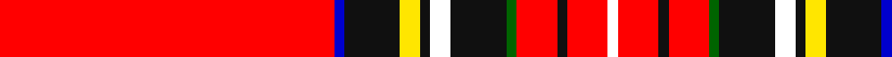

In pattern [RBKYKWKGRKRW](/stripes/rbkykwkgrkrw/).

This was sourced from register-of-tartans.  It is a [12 stripe tartan](/stripes/stripes12/).

Original link https://www.tartanregister.gov.uk/tartanDetails.aspx?ref=10682

## Also known as

This cloth is also recorded under:

- Tilted Kilt

## Attestations

This cloth appears in 3 source records; the oldest owns this page.

- 15/03/2006 — TIlted Kilt (register-of-tartans, [record](https://www.tartanregister.gov.uk/tartanDetails.aspx?ref=10682))
- 15/03/2006 — Tilted Kilt (Corporate) (tartans-authority, [record](http://www.tartansauthority.com/tartan-ferret/display/10682/))
- undated — TIlted Kilt Corporate Tartan Tartan Number: 10682. Earliest known date: 23 August 2012 The Tilted Kilt is a Celtic-themed pub franchise based in Tempe, Arizona, USA. The tartan is used in staff costume and throughout brand presence. It was designed and the first 2000 metres of it produced by Marton Mills (England). A further 2000-plus metres have since been produced. It has appeared in advertisments, on television and on race cars, boats and other applications. It has also been included in the Tilted Kilt trade dress registration in the US Patent Office. See products available Copyright © Blair Urquhart, Comrie, 2015 (house-of-tartan, [record](http://www.house-of-tartan.scotland.net/house/TartanViewjs.asp?colr=Def&tnam=10682))

## Register references

External register numbers recorded for this tartan.

- Scottish Register of Tartans: [10682](https://www.tartanregister.gov.uk/tartanDetails.aspx?ref=10682)

## Thread count
R/66 B2 K11 Y4 K2 W4 K11 G2 R8 K2 R8 W/2

## Palette
Each colour and its ΔE from the base-6 reference it is a variant of.

| Colour | Shade | Base | ΔE (OKLab) |
|---|---|---|---|
| B | <code style="background-color:#0000CD;">#0000CD</code> `#0000CD` | B <code style="background-color:#2A418A;">#2A418A</code> | 0.14 |
| G | <code style="background-color:#006400;">#006400</code> `#006400` | G <code style="background-color:#006100;">#006100</code> | 0.01 |
| K | <code style="background-color:#101010;">#101010</code> `#101010` | K <code style="background-color:#000000;">#000000</code> | 0.17 |
| R | <code style="background-color:#FF0000;">#FF0000</code> `#FF0000` | R <code style="background-color:#CC0000;">#CC0000</code> | 0.11 |
| W | <code style="background-color:#FFFFFF;">#FFFFFF</code> `#FFFFFF` | W <code style="background-color:#F7F7F7;">#F7F7F7</code> | 0.02 |
| Y | <code style="background-color:#FFE600;">#FFE600</code> `#FFE600` | Y <code style="background-color:#F2BF00;">#F2BF00</code> | 0.10 |

## Nearest tartans

The nearest existing variants by ΔTartan distance.

1. [Conroy](/setts/s8/r64k10ly4r5w2k2db3ly4~x2/) — ΔT 1.19
1. [Scottish Banner, The](/setts/s11/b1k2ly5k2r31b3ly1w1db2k1ly1~x2/) — ΔT 1.22
1. [Conroy Family Tartan Tartan Number: 1626. Earliest known date: 1986 See products available Copyright © Blair Urquhart, Comrie, 2015](/setts/s8/r64k10ly4m5w2k2db3ly4~x2/) — ΔT 1.37
1. [Stewart/Stuart, Royal](/setts/s12/r87db8k11ly2k3w2k3g13r11k2r5w3/) — ΔT 1.41
1. [MacKintosh/MacPherson](/setts/s13/r36dg8ly1k6t4k1t1k1t4r11w1k1r1~x2/) — ΔT 1.47
1. [Braemar Castle](/setts/s9/r52k5ly5lo5do5k2r6k1ly2~x2/) — ΔT 1.50
1. [Brittish Lions Corporate Tartan Tartan Number: 6636. Earliest known date: 2005 March Designed for the British Lions rugby team and unveiled in New York in April at the 2005 Tartan Day celebrations. Originally called Lion's Pride this tartan has a shield and other emblems woven into the red squares./Threadcount and colours aren't 100% original. Generated manually./ See products available Copyright © Blair Urquhart, Comrie, 2015](/setts/s12/r70w2r1w4r1k2dt9k1ly2r1g9w3~x2/) — ΔT 1.56
1. [Stewart Royal](/setts/s12/r36db4k6ly1k1lb1k1dg8r4k1r2lb1/) — ΔT 1.57
1. [MacKintosh, MacPherson](/setts/s13/r36g8ly1k6t4k1t1k1t4r11w1k1r1~x2/) — ΔT 1.61
1. [Royal Stewart - 1819](/setts/s12/r134db10k14ly2k3w3k3g21r11k3r4w2/) — ΔT 1.69

## Neighbour map

Every grey dot is one of 14299 variants placed by the first two principal components of the ΔTartan feature space (44% of its variance). Red is this tartan; blue dots are its nearest — click one to open its page.

<svg viewBox="0 0 640 380" role="img" style="max-width:100%;height:auto;border:1px solid #e0e0e0;border-radius:4px;display:block" xmlns="http://www.w3.org/2000/svg"><image href="/nn/cloud.v1.png" width="640" height="380"/><a href="/setts/s8/r64k10ly4r5w2k2db3ly4~x2/"><circle cx="420.2" cy="53.7" r="4" fill="#3465a4"><title>Conroy</title></circle></a><a href="/setts/s11/b1k2ly5k2r31b3ly1w1db2k1ly1~x2/"><circle cx="358.6" cy="24.9" r="4" fill="#3465a4"><title>Scottish Banner, The</title></circle></a><a href="/setts/s8/r64k10ly4m5w2k2db3ly4~x2/"><circle cx="437.7" cy="60.0" r="4" fill="#3465a4"><title>Conroy Family Tartan Tartan Number: 1626. Earliest known date: 1986 See products available Copyright © Blair Urquhart, Comrie, 2015</title></circle></a><a href="/setts/s12/r87db8k11ly2k3w2k3g13r11k2r5w3/"><circle cx="448.7" cy="31.6" r="4" fill="#3465a4"><title>Stewart/Stuart, Royal</title></circle></a><a href="/setts/s13/r36dg8ly1k6t4k1t1k1t4r11w1k1r1~x2/"><circle cx="384.7" cy="39.9" r="4" fill="#3465a4"><title>MacKintosh/MacPherson</title></circle></a><a href="/setts/s9/r52k5ly5lo5do5k2r6k1ly2~x2/"><circle cx="470.4" cy="52.7" r="4" fill="#3465a4"><title>Braemar Castle</title></circle></a><a href="/setts/s12/r70w2r1w4r1k2dt9k1ly2r1g9w3~x2/"><circle cx="470.8" cy="14.7" r="4" fill="#3465a4"><title>Brittish Lions Corporate Tartan Tartan Number: 6636. Earliest known date: 2005 March Designed for the British Lions rugby team and unveiled in New York in April at the 2005 Tartan Day celebrations. Originally called Lion's Pride this tartan has a shield and other emblems woven into the red squares./Threadcount and colours aren't 100% original. Generated manually./ See products available Copyright © Blair Urquhart, Comrie, 2015</title></circle></a><a href="/setts/s12/r36db4k6ly1k1lb1k1dg8r4k1r2lb1/"><circle cx="378.7" cy="34.0" r="4" fill="#3465a4"><title>Stewart Royal</title></circle></a><a href="/setts/s13/r36g8ly1k6t4k1t1k1t4r11w1k1r1~x2/"><circle cx="372.1" cy="38.3" r="4" fill="#3465a4"><title>MacKintosh, MacPherson</title></circle></a><a href="/setts/s12/r134db10k14ly2k3w3k3g21r11k3r4w2/"><circle cx="485.3" cy="23.1" r="4" fill="#3465a4"><title>Royal Stewart - 1819</title></circle></a><circle cx="402.8" cy="24.0" r="5" fill="#c00000"/></svg>

ID: /setts/s12/r66db2k11ly4k2w4k11g2r8k2r8w2/
