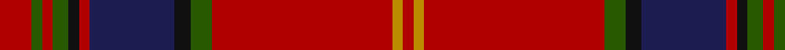

In pattern [RGRGKRBKGRYR](/stripes/rgrgkrbkgryr/).

This was sourced from register-of-tartans.  It is a [12 stripe tartan](/stripes/stripes12/).

Original link https://www.tartanregister.gov.uk/tartanDetails.aspx?ref=2941

## Attestations

This cloth appears in 2 source records; the oldest owns this page.

- 01/09/2005 — Methodist Church (register-of-tartans, [record](https://www.tartanregister.gov.uk/tartanDetails.aspx?ref=2941))
- 2005 September — Methodist Church (Corporate) (tartans-authority, [record](http://www.tartansauthority.com/tartan-ferret/display/6794/))

## Register references

External register numbers recorded for this tartan.

- Scottish Register of Tartans: [2941](https://www.tartanregister.gov.uk/tartanDetails.aspx?ref=2941)
- Scottish Tartans Authority (ITI): 6794

## Thread count
DR/12 G4 DR4 G6 K4 DR4 DB32 K6 G8 DR68 DY4 DR/4

## Palette
Each colour and its ΔE from the base-6 reference it is a variant of.

| Colour | Shade | Base | ΔE (OKLab) |
|---|---|---|---|
| DB | <code style="background-color:#1C1C50;">#1C1C50</code> `#1C1C50` | B <code style="background-color:#2A418A;">#2A418A</code> | 0.14 |
| DR | <code style="background-color:#B00000;">#B00000</code> `#B00000` | R <code style="background-color:#CC0000;">#CC0000</code> | 0.06 |
| DY | <code style="background-color:#BC8C00;">#BC8C00</code> `#BC8C00` | Y <code style="background-color:#F2BF00;">#F2BF00</code> | 0.16 |
| G | <code style="background-color:#285800;">#285800</code> `#285800` | G <code style="background-color:#006100;">#006100</code> | 0.03 |
| K | <code style="background-color:#101010;">#101010</code> `#101010` | K <code style="background-color:#000000;">#000000</code> | 0.17 |

## Nearest tartans

The nearest existing variants by ΔTartan distance.

1. [Munro](/setts/s17/r24ly1db1r3dg16r3db1ly1r3db6r3ly1db1r16dg2dr2dg2~x2/) — ΔT 1.01
1. [Chisholm VS](/setts/s10/r6lr1r24db6dg2k1dg2k1dg12r1~x2/) — ΔT 1.05
1. [Chisholm VS](/setts/s10/r6lr1r24db6dg2k1dg2k1dg12r1/) — ΔT 1.05
1. [Glendronach Corporate Tartan Tartan Number: 2293. Earliest known date: 1989 A copyright design created for the Glendronach Company. See products available Copyright © Blair Urquhart, Comrie, 2015](/setts/s12/dy21m2w1ly3m2dy5m21ly1ly1ly1m1dy8~x2/) — ΔT 1.08
1. [MacEdward](/setts/s10/r6ly1r24g6db2k1db2k1db12r1~x2/) — ΔT 1.10
1. [Tyrone Irish County Tartan Tartan Number: 2264. Earliest known date: 1993 One of a series of Irish District tartans designed by Polly Wittering of the House of Edgar, with colours reminiscent of the Country with soft warm colours dominating. See products available Copyright © Blair Urquhart, Comrie, 2015](/setts/s12/dr50o6dy7dg2dy2ly2dy2o14dr8dy2dr9dg3~x2/) — ΔT 1.13
1. [Wcwm 1286-9](/setts/s12/r42db3r6lo2r2lb2r2g14r8r2r3lb2~x2/) — ΔT 1.19
1. [Mair (Personal)](/setts/s12/r23g3ly1g3r2db18r2w1g3r2db2r23~x2/) — ΔT 1.19
1. [British Caledonian Airways #4](/setts/s12/r68o5k9y3k3lb3k3dg20r9k3r5lb4/) — ΔT 1.21
1. [MacDonell of Keppoch](/setts/s10/dg2r2db1r24b1db6r3dg12r4db1~x2/) — ΔT 1.21

## Neighbour map

Every grey dot is one of 14299 variants placed by the first two principal components of the ΔTartan feature space (44% of its variance). Red is this tartan; blue dots are its nearest — click one to open its page.

<svg viewBox="0 0 640 380" role="img" style="max-width:100%;height:auto;border:1px solid #e0e0e0;border-radius:4px;display:block" xmlns="http://www.w3.org/2000/svg"><image href="/nn/cloud.v1.png" width="640" height="380"/><a href="/setts/s17/r24ly1db1r3dg16r3db1ly1r3db6r3ly1db1r16dg2dr2dg2~x2/"><circle cx="381.1" cy="93.3" r="4" fill="#3465a4"><title>Munro</title></circle></a><a href="/setts/s10/r6lr1r24db6dg2k1dg2k1dg12r1~x2/"><circle cx="350.0" cy="115.8" r="4" fill="#3465a4"><title>Chisholm VS</title></circle></a><a href="/setts/s10/r6lr1r24db6dg2k1dg2k1dg12r1/"><circle cx="350.0" cy="115.8" r="4" fill="#3465a4"><title>Chisholm VS</title></circle></a><a href="/setts/s12/dy21m2w1ly3m2dy5m21ly1ly1ly1m1dy8~x2/"><circle cx="353.9" cy="117.1" r="4" fill="#3465a4"><title>Glendronach Corporate Tartan Tartan Number: 2293. Earliest known date: 1989 A copyright design created for the Glendronach Company. See products available Copyright © Blair Urquhart, Comrie, 2015</title></circle></a><a href="/setts/s10/r6ly1r24g6db2k1db2k1db12r1~x2/"><circle cx="343.7" cy="106.6" r="4" fill="#3465a4"><title>MacEdward</title></circle></a><a href="/setts/s12/dr50o6dy7dg2dy2ly2dy2o14dr8dy2dr9dg3~x2/"><circle cx="424.7" cy="114.2" r="4" fill="#3465a4"><title>Tyrone Irish County Tartan Tartan Number: 2264. Earliest known date: 1993 One of a series of Irish District tartans designed by Polly Wittering of the House of Edgar, with colours reminiscent of the Country with soft warm colours dominating. See products available Copyright © Blair Urquhart, Comrie, 2015</title></circle></a><a href="/setts/s12/r42db3r6lo2r2lb2r2g14r8r2r3lb2~x2/"><circle cx="389.5" cy="91.9" r="4" fill="#3465a4"><title>Wcwm 1286-9</title></circle></a><a href="/setts/s12/r23g3ly1g3r2db18r2w1g3r2db2r23~x2/"><circle cx="390.1" cy="102.3" r="4" fill="#3465a4"><title>Mair (Personal)</title></circle></a><a href="/setts/s12/r68o5k9y3k3lb3k3dg20r9k3r5lb4/"><circle cx="381.2" cy="87.7" r="4" fill="#3465a4"><title>British Caledonian Airways #4</title></circle></a><a href="/setts/s10/dg2r2db1r24b1db6r3dg12r4db1~x2/"><circle cx="398.2" cy="136.1" r="4" fill="#3465a4"><title>MacDonell of Keppoch</title></circle></a><circle cx="369.2" cy="113.9" r="5" fill="#c00000"/></svg>

ID: /setts/s12/r6dg2r2dg3k2r2db16k3dg4r34lo2r2~x2/
