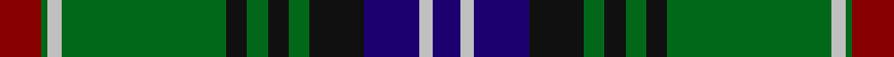

In pattern [BWBKGKGKGWGR](/stripes/bwbkgkgkgwgr/).

This was sourced from register-of-tartans.  It is a [12 stripe tartan](/stripes/stripes12/).

Original link https://www.tartanregister.gov.uk/tartanDetails.aspx?ref=1953

## Register references

External register numbers recorded for this tartan.

- Scottish Register of Tartans: [1953](https://www.tartanregister.gov.uk/tartanDetails.aspx?ref=1953)
- Scottish Tartans Authority (ITI): 4113

## Thread count
DR/12 G2 N4 G48 K6 G6 K6 G6 K16 DB16 N4 DB/8

## Palette
Each colour and the base-6 reference it is a variant of.

| Colour | Shade | Base |
|---|---|---|
| DB | <code style="background-color:#1C0070;">#1C0070</code> `oklch(26.3% 0.162 277.1)` <small>#1C0070</small> | B <code style="background-color:#2A418A;">#2A418A</code> |
| DR | <code style="background-color:#880000;">#880000</code> `oklch(39.4% 0.162 29.2)` <small>#880000</small> | R <code style="background-color:#CC0000;">#CC0000</code> |
| G | <code style="background-color:#006818;">#006818</code> `oklch(45.0% 0.142 145.0)` <small>#006818</small> | G <code style="background-color:#006100;">#006100</code> |
| K | <code style="background-color:#101010;">#101010</code> `oklch(17.3% 0.000 89.9)` <small>#101010</small> | K <code style="background-color:#000000;">#000000</code> |
| N | <code style="background-color:#C0C0C0;">#C0C0C0</code> `oklch(80.8% 0.000 89.9)` <small>#C0C0C0</small> | W <code style="background-color:#F7F7F7;">#F7F7F7</code> |

## Nearest tartans

The nearest existing variants by ΔTartan distance, with this tartan at the top so the swatches line up against it.

ΔTartan

Tartan

Sett

—

<a href="/ttd/edit/#slug=r6g1lb2g24k3g3k3g3k8db8lb2db4~x2">Kerby/Kirby</a> <a class="nn-out" href="/setts/s12/r6g1lb2g24k3g3k3g3k8db8lb2db4~x2/" title="open its dictionary page">↗</a>

0.40

<a href="/ttd/edit/#slug=g6w2g24k12db3k2db2k2db12r1db1r3~x2">Sutherland (Clan)</a> <a class="nn-out" href="/setts/s12/g6w2g24k12db3k2db2k2db12r1db1r3~x2/" title="open its dictionary page">↗</a>

0.61

<a href="/ttd/edit/#slug=g19r1g2r2g15r1dt13w1db2r2db21r1w3~x2">Ontario (Official)</a> <a class="nn-out" href="/setts/s13/g19r1g2r2g15r1dt13w1db2r2db21r1w3~x2/" title="open its dictionary page">↗</a>

0.92

<a href="/ttd/edit/#slug=g3db1g1db12k2db2k2db3k12g24w3~x2">Selby</a> <a class="nn-out" href="/setts/s11/g3db1g1db12k2db2k2db3k12g24w3~x2/" title="open its dictionary page">↗</a>

0.96

<a href="/ttd/edit/#slug=k4w1db26k5db5k32g23k2r4k2g13k1~x2">Young, Melvina (Artefact)</a> <a class="nn-out" href="/setts/s12/k4w1db26k5db5k32g23k2r4k2g13k1~x2/" title="open its dictionary page">↗</a>

0.97

<a href="/ttd/edit/#slug=db6k3r2k3dg31k6dg2k6lo13k2dg2~x2">Rourke-Frew Hunting</a> <a class="nn-out" href="/setts/s11/db6k3r2k3dg31k6dg2k6lo13k2dg2~x2/" title="open its dictionary page">↗</a>

0.99

<a href="/ttd/edit/#slug=g3n5k4n33g12k4w2k18lo3~x2">Smoke Showing (UFES)</a> <a class="nn-out" href="/setts/s9/g3n5k4n33g12k4w2k18lo3~x2/" title="open its dictionary page">↗</a>

1.03

<a href="/ttd/edit/#slug=k20y3db10g3db5g25k1g1w3g1k1g25db5g3db10y1db2~x4">Blairgowrie</a> <a class="nn-out" href="/setts/s17/k20y3db10g3db5g25k1g1w3g1k1g25db5g3db10y1db2~x4/" title="open its dictionary page">↗</a>

1.03

<a href="/ttd/edit/#slug=k44ly2dg27ly2dg16w8dg16w2dg8~x2">Crumlish (2015)</a> <a class="nn-out" href="/setts/s9/k44ly2dg27ly2dg16w8dg16w2dg8~x2/" title="open its dictionary page">↗</a>

1.05

<a href="/ttd/edit/#slug=k4g35lo1k18g3db18r3g3r3~x2">Mackay, John W. (Personal)</a> <a class="nn-out" href="/setts/s9/k4g35lo1k18g3db18r3g3r3~x2/" title="open its dictionary page">↗</a>

1.06

<a href="/ttd/edit/#slug=dy12o2k2o42k13g25o6k2r4k10~x2">Dinwoodie (Name)</a> <a class="nn-out" href="/setts/s10/dy12o2k2o42k13g25o6k2r4k10~x2/" title="open its dictionary page">↗</a>

## Neighbour map

Every grey dot is one of 14299 variants placed by the first two principal components of the ΔTartan feature space (44% of its variance). Red is this tartan; blue dots are its nearest — click one to open its page.

<svg viewBox="0 0 640 380" role="img" style="max-width:100%;height:auto;border:1px solid #e0e0e0;border-radius:4px;display:block" xmlns="http://www.w3.org/2000/svg"><image href="/nn/cloud.v1.png" width="640" height="380"/><a href="/setts/s12/g6w2g24k12db3k2db2k2db12r1db1r3~x2/"><circle cx="241.6" cy="123.1" r="4" fill="#3465a4"><title>Sutherland (Clan)</title></circle></a><a href="/setts/s13/g19r1g2r2g15r1dt13w1db2r2db21r1w3~x2/"><circle cx="237.1" cy="122.7" r="4" fill="#3465a4"><title>Ontario (Official)</title></circle></a><a href="/setts/s11/g3db1g1db12k2db2k2db3k12g24w3~x2/"><circle cx="211.4" cy="124.5" r="4" fill="#3465a4"><title>Selby</title></circle></a><a href="/setts/s12/k4w1db26k5db5k32g23k2r4k2g13k1~x2/"><circle cx="222.4" cy="109.3" r="4" fill="#3465a4"><title>Young, Melvina (Artefact)</title></circle></a><a href="/setts/s11/db6k3r2k3dg31k6dg2k6lo13k2dg2~x2/"><circle cx="250.4" cy="140.1" r="4" fill="#3465a4"><title>Rourke-Frew Hunting</title></circle></a><a href="/setts/s9/g3n5k4n33g12k4w2k18lo3~x2/"><circle cx="240.3" cy="148.3" r="4" fill="#3465a4"><title>Smoke Showing (UFES)</title></circle></a><a href="/setts/s17/k20y3db10g3db5g25k1g1w3g1k1g25db5g3db10y1db2~x4/"><circle cx="276.0" cy="113.2" r="4" fill="#3465a4"><title>Blairgowrie</title></circle></a><a href="/setts/s9/k44ly2dg27ly2dg16w8dg16w2dg8~x2/"><circle cx="227.4" cy="152.4" r="4" fill="#3465a4"><title>Crumlish (2015)</title></circle></a><a href="/setts/s9/k4g35lo1k18g3db18r3g3r3~x2/"><circle cx="294.5" cy="134.1" r="4" fill="#3465a4"><title>Mackay, John W. (Personal)</title></circle></a><a href="/setts/s10/dy12o2k2o42k13g25o6k2r4k10~x2/"><circle cx="229.1" cy="135.8" r="4" fill="#3465a4"><title>Dinwoodie (Name)</title></circle></a><circle cx="245.2" cy="126.7" r="5" fill="#c00000"/></svg>

ID: /setts/s12/r6g1lb2g24k3g3k3g3k8db8lb2db4~x2/
