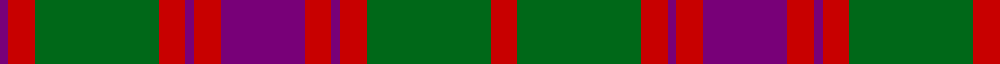

In pattern [BRGRBRBRBRGR](/patterns/brgrbrbrbrgr/).

This was sourced from register-of-tartans.  It is a [12 stripes tartan](/stripes/stripes12/).

Original link https://www.tartanregister.gov.uk/tartanDetails.aspx?ref=4685

## Thread count
P/4 R12 G56 R12 P4 R12 P38 R12 P4 R12 G56 R/12

## Palette
Each colour and its ΔE from the base-6 reference it is a variant of.

| Colour | Shade | Base | ΔE (OKLab) |
|---|---|---|---|
| DG | <code style="background-color:#003820;">#003820</code> `#003820` | G <code style="background-color:#006100;">#006100</code> | 0.15 |
| DP | <code style="background-color:#440044;">#440044</code> `#440044` | B <code style="background-color:#2A418A;">#2A418A</code> | 0.18 |
| G | <code style="background-color:#006818;">#006818</code> `#006818` | G <code style="background-color:#006100;">#006100</code> | 0.02 |
| P | <code style="background-color:#780078;">#780078</code> `#780078` | B <code style="background-color:#2A418A;">#2A418A</code> | 0.17 |
| R | <code style="background-color:#C80000;">#C80000</code> `#C80000` | R <code style="background-color:#CC0000;">#CC0000</code> | 0.01 |

## Nearest tartans

The nearest existing variants by ΔTartan distance.

1. [Frasers Highlanders (Military?)](/setts/s12/r28g2r2g2b12g18r2g18b12r15g2r3x2~b1c1c50-g006818-rc80000/) — ΔT 0.60
1. [Nithsdale District Tartan Tartan Number: 533. Earliest known date: 1930 Nithsdale, the valley of the River Nith, stretches over 50 miles, north and south, through the the length of Dumfriesshire to the sea, an area with historic connections with the Johnstons and Maxwells. The tartan was designed by Arthur Galt of Messrs Hugh Galt and Sons Ltd., Barrhill, Glasgow, for Councillor John Hannay. See products available Copyright © Blair Urquhart, Comrie, 2015](/setts/s10/b10r2g2r6g16r1g2r1g3r6x2~b2c2c80-g006818-rc80000/) — ΔT 0.72
1. [Stewart of Urrard Clan Tartan Tartan Number: 898. Earliest known date: pre 1930 A kilt in this material was brought into the Scottish Tartans Museum in Comrie which could be dated to before 1930. It belonged to a member of the Stewart Society at that time. The threadcount and the name were documented by Mackinlay, who studied and collected tartans between 1930 and 1950. See products available Copyright © Blair Urquhart, Comrie, 2015](/setts/s14/g6r2g2r18b9r3g3r3b9r3g24r2g2r4x2~b2c2c80-g006818-rc80000/) — ΔT 0.72
1. [Stuart/Stewart of Urrard](/setts/s14/g6r2g2r18b9r3g3r3b9r3g24r2g2r4x2~b2c4084-g005020-rdc0000/) — ΔT 0.75
1. [Nithsdale (3 colours) (District)](/setts/s10/b10r2g2r6g16r1g2r1g3r6x4~b202060-g006818-rc80000/) — ΔT 0.75
1. [Stewart of Urrard (Clan?)](/setts/s14/g6r2g2r18b9r3g3r3b9r3g24r2g2r4x2~b440044-g006818-rc80000/) — ΔT 0.80
1. [Drummond](/setts/s12/b24r7g7r39b4r2b2r5g42r7b6r7x2~b304080-g008000-rc00000/) — ΔT 0.81
1. [Inverness, Fencibles](/setts/s12/b10r1b1r1g10r13g2r13g10b10r1b1x2~b304080-g008000-rc00000/) — ΔT 0.85
1. [Stewart of Urrard](/setts/s14/g6r2g2r18b9r3g3r3b9r3g24r2g2r4x2~b304080-g008000-rc00000/) — ΔT 0.91
1. [Robertson, Curtain](/setts/s13/r3g2r19b2r3b20r3g20r3b2r19g2r3x4~b304080-g008000-rc00000/) — ΔT 0.91

## Neighbour map

Every grey dot is one of 15726 variants placed by the first two principal components of the ΔTartan feature space (44% of its variance). Red is this tartan; blue dots are its nearest — click one to open its page.

<svg viewBox="0 0 640 380" role="img" style="max-width:100%;height:auto;border:1px solid #e0e0e0;border-radius:4px;display:block" xmlns="http://www.w3.org/2000/svg"><image href="/nn/cloud.v1.png" width="640" height="380"/><a href="/setts/s12/r28g2r2g2b12g18r2g18b12r15g2r3x2~b1c1c50-g006818-rc80000/"><circle cx="272.0" cy="180.1" r="4" fill="#3465a4"><title>Frasers Highlanders (Military?)</title></circle></a><a href="/setts/s10/b10r2g2r6g16r1g2r1g3r6x2~b2c2c80-g006818-rc80000/"><circle cx="303.2" cy="184.6" r="4" fill="#3465a4"><title>Nithsdale District Tartan Tartan Number: 533. Earliest known date: 1930 Nithsdale, the valley of the River Nith, stretches over 50 miles, north and south, through the the length of Dumfriesshire to the sea, an area with historic connections with the Johnstons and Maxwells. The tartan was designed by Arthur Galt of Messrs Hugh Galt and Sons Ltd., Barrhill, Glasgow, for Councillor John Hannay. See products available Copyright © Blair Urquhart, Comrie, 2015</title></circle></a><a href="/setts/s14/g6r2g2r18b9r3g3r3b9r3g24r2g2r4x2~b2c2c80-g006818-rc80000/"><circle cx="269.7" cy="171.5" r="4" fill="#3465a4"><title>Stewart of Urrard Clan Tartan Tartan Number: 898. Earliest known date: pre 1930 A kilt in this material was brought into the Scottish Tartans Museum in Comrie which could be dated to before 1930. It belonged to a member of the Stewart Society at that time. The threadcount and the name were documented by Mackinlay, who studied and collected tartans between 1930 and 1950. See products available Copyright © Blair Urquhart, Comrie, 2015</title></circle></a><a href="/setts/s14/g6r2g2r18b9r3g3r3b9r3g24r2g2r4x2~b2c4084-g005020-rdc0000/"><circle cx="269.8" cy="170.2" r="4" fill="#3465a4"><title>Stuart/Stewart of Urrard</title></circle></a><a href="/setts/s10/b10r2g2r6g16r1g2r1g3r6x4~b202060-g006818-rc80000/"><circle cx="300.8" cy="184.0" r="4" fill="#3465a4"><title>Nithsdale (3 colours) (District)</title></circle></a><a href="/setts/s14/g6r2g2r18b9r3g3r3b9r3g24r2g2r4x2~b440044-g006818-rc80000/"><circle cx="271.6" cy="169.4" r="4" fill="#3465a4"><title>Stewart of Urrard (Clan?)</title></circle></a><a href="/setts/s12/b24r7g7r39b4r2b2r5g42r7b6r7x2~b304080-g008000-rc00000/"><circle cx="306.2" cy="152.0" r="4" fill="#3465a4"><title>Drummond</title></circle></a><a href="/setts/s12/b10r1b1r1g10r13g2r13g10b10r1b1x2~b304080-g008000-rc00000/"><circle cx="250.0" cy="187.6" r="4" fill="#3465a4"><title>Inverness, Fencibles</title></circle></a><a href="/setts/s14/g6r2g2r18b9r3g3r3b9r3g24r2g2r4x2~b304080-g008000-rc00000/"><circle cx="267.7" cy="171.2" r="4" fill="#3465a4"><title>Stewart of Urrard</title></circle></a><a href="/setts/s13/r3g2r19b2r3b20r3g20r3b2r19g2r3x4~b304080-g008000-rc00000/"><circle cx="319.6" cy="179.2" r="4" fill="#3465a4"><title>Robertson, Curtain</title></circle></a><circle cx="304.0" cy="178.6" r="5" fill="#c00000"/></svg>

ID: /setts/s12/r6g28r6b2r6b19r6b2r6g28r6b2x2~b780078-g006818-rc80000/
